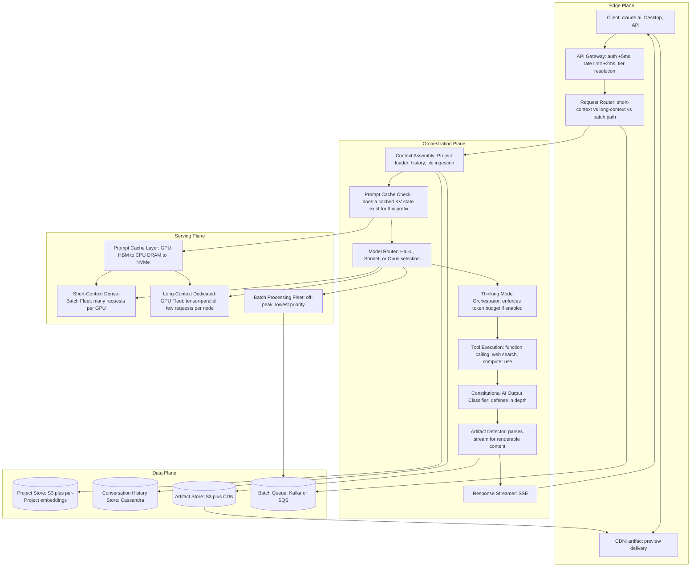
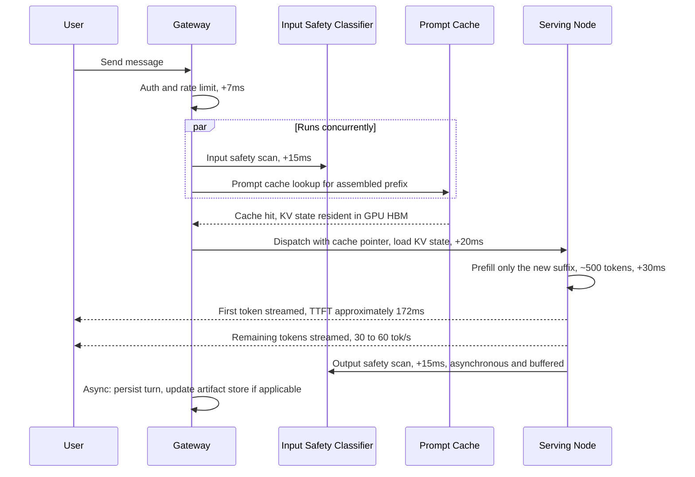
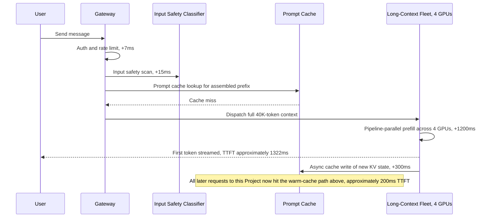
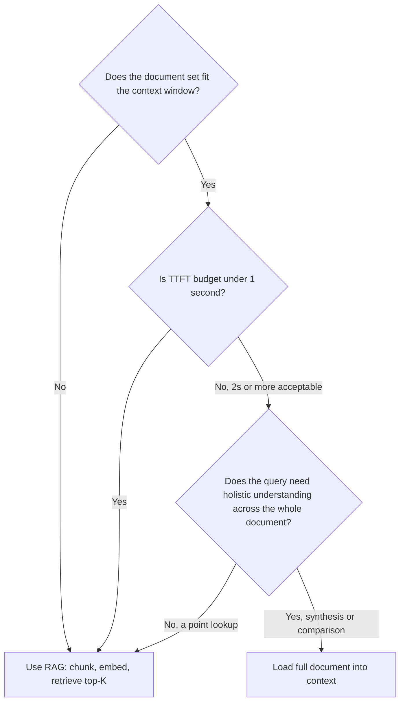

# Claude — System Design Case Study

## Requirements

The single decision that shapes every section below: Claude's context window is large enough — 200K tokens, and growing — to hold entire documents, entire codebases, and entire multi-week conversation histories directly. That fact turns retrieval-augmented generation from "the only way to ground a model in more content than fits in context" into one option among several, chosen deliberately rather than reached for by default. The [ChatGPT case study](01-chatgpt.md) is built around a shorter effective context budget and a heavyweight, always-on tool-routing loop; this chapter is built around the opposite default — load the document, don't retrieve from it — and every subsystem downstream (prefill, caching, GPU fleet shape, cost model) exists to make that default affordable at scale.

**Functional**

- **Multi-turn chat over text, images, PDFs, code files, and spreadsheets.** Text and code files are ingested as-is (tokenized directly, no preprocessing). Images require a vision-model pass that produces a joint embedding the primary model attends over. PDFs require extraction — a fast path (pdfmium-style structured text extraction) for digital PDFs, falling back to OCR for scanned pages — before the extracted text enters context assembly. Each modality's preprocessing step adds its own latency tax before the turn's prefill can even begin.
- **Projects: a persistent, shared context across many conversations.** A user creates a Project with custom instructions and a set of uploaded knowledge files; every conversation started inside that Project automatically loads the Project's instructions and documents *before* that conversation's own history, on every single turn. This is architecturally distinct from a one-off, session-scoped file upload (the pattern ChatGPT uses for a single conversation's attachments — see [Memory Architecture for Agents](../12-memory-systems/01-memory-architecture-for-agents.md) for the general in-context-vs-persistent-memory tradeoff): a Project's context is a stable, reusable prefix loaded by dozens or hundreds of separate conversations, which is exactly the property that makes prompt caching (see Detailed Design) valuable rather than incidental.
- **Artifacts: a first-class rendering surface for generated content.** When a generation produces standalone, renderable output — HTML, CSS, JavaScript, a React component, an SVG, a data visualization — the model emits it as a named, versioned artifact rather than inline prose. The artifact renders in a sandboxed iframe in the browser; the user can view, modify, fork, download, or share it independent of the conversation transcript. This is a product surface with its own storage, versioning, and rendering pipeline (see Detailed Design), not a code block with syntax highlighting.
- **Extended thinking: a visible or hidden reasoning scratchpad before the final response.** The user or API caller can enable a "thinking" mode in which the model produces an internal `<thinking>` block before its user-facing answer. The block streams as a separate content type and may be shown or collapsed in the UI. The thinking budget is configurable (roughly 1,000–32,000+ tokens depending on tier), and the serving layer enforces it.
- **Tool use: client-provided function calling plus built-in tools, including computer use.** The model can call arbitrary client-defined tools (standard function calling) and Anthropic-hosted tools (web search). Computer use is qualitatively different from either: the model receives a screenshot and emits structured mouse/keyboard actions to operate a real browser or desktop, enabling multi-step autonomous task execution without a human in the loop between steps (see Agent Layer).
- **A three-tier model lineup selected per request.** Haiku (sub-second responses, lowest cost), Sonnet (the default general-purpose workhorse), and Opus (highest capability, highest cost, slowest). API callers pick the tier explicitly; the claude.ai consumer product auto-routes with a user-visible tier indicator (see Model Layer).
- **Batch processing as a distinct serving path.** The batch API accepts up to 10,000 requests in a single submission, processes them within a 24-hour window, and prices tokens at half the standard interactive rate. This is not a queued version of the interactive path — it runs on different scheduling priority against the same fleet (see Scale Estimation and Failure Handling).
- **Enterprise tier (Claude for Work / Claude Enterprise).** Tenant-level data isolation, SSO via SAML 2.0 or OIDC, a contractual guarantee that no enterprise conversation, file, or Project content is used for model training, admin-visible audit logs, custom system-prompt deployment, and admin control over which tools and capabilities are enabled per tenant.

**Non-functional**

- **TTFT targets are bucketed by context length, because long context is the primary scenario here, not an edge case.** At 10K tokens: P99 TTFT < 500ms. At 50K tokens: P99 < 2,000ms. At 100K tokens: P99 < 4,000ms. At 200K tokens: P99 < 8,000ms. Unlike a short-context-first product where a 50K-token request is a rare outlier absorbed by generic capacity headroom, these four buckets are treated as four separate SLOs because — as Capacity Planning shows — they are served by structurally different infrastructure.
- **Streaming rate**: 30–60 tokens/sec sustained once generation begins, independent of context length — a 200K-token prefill may take seconds, but once the first token lands, decode throughput must not degrade just because the KV cache backing it is large.
- **Extended thinking latency**: the thinking block must begin streaming within 500ms of the request (the model starts "thinking" essentially immediately); the full configured thinking budget is consumed before the user-facing response begins.
- **Constitutional AI properties are a production invariant, not just a training outcome.** The model's trained refusal and harm-avoidance behavior must hold under production adversarial pressure — prompt engineering, jailbreak attempts, and multi-turn manipulation must not reliably bypass it. This is stated as a systems requirement because the serving layer's entire safety architecture (see Security Layer) is built on the assumption that it holds, with runtime classifiers layered on top as defense-in-depth rather than as the primary control.
- **Enterprise data isolation is a zero-exception policy.** No enterprise tenant's conversations, uploaded files, or Project contexts may ever be used for training or be accessible to another tenant — including through shared infrastructure like the prompt cache, which needs its own tenant-namespacing guarantee (see Security Layer).
- **Batch API**: 24-hour P99 processing SLO, best-effort completion earlier when fleet capacity allows.

**Explicitly out of scope for this case study**: pretraining, the RLHF and Constitutional AI *training* pipeline internals (Constitutional AI's production-serving impact is in scope; how it's trained is not — see [Transformer Internals for Systems Engineers](../02-llm-architecture/01-transformer-internals-for-systems-engineers.md) for general foundation-model training context), and billing infrastructure.

## Capacity Planning

Using the method from [GPU Sizing & Capacity Planning](../16-gpu-systems/02-gpu-sizing-and-capacity-planning.md), with illustrative, order-of-magnitude assumptions:

| Step | Assumption | Result |
|---|---|---|
| Weekly active users | 50M WAU (claude.ai consumer + API combined) | 50M WAU |
| DAU conversion | 30% active on a given day | 15M DAU |
| Turns/day/user | 6 turns average — fewer, longer tasks than a casual-chat product | 90M turns/day |
| Average QPS | 90M / 86,400s | ~1,040 QPS average |
| Peak QPS | Consumer + developer traffic, peaks 4× average during US business hours | ~4,200 QPS peak |
| Short-context traffic (60% of turns) | 800 input + 500 output tokens | 672K output tok/s short-context at peak |
| Long-context traffic (>10K tokens, 40% of turns) | 40K input + 1,500 output tokens | ~2.5M output tok/s long-context at peak, before cache effects |
| Thinking-mode traffic (10% of turns, overlapping with the above) | 20K thinking tokens + 800 output tokens | Sized as a separate concurrency pool below |

The load-bearing difference from a general chat product: **40% of Claude's traffic involves contexts over 10K tokens** — documents, code, long Project-backed conversations — versus an estimated 10% for a casual consumer chat product like the one in the [ChatGPT case study](01-chatgpt.md). That ratio is the single biggest driver of how differently this fleet has to be shaped.

**Why long context breaks the standard capacity model.** At short context lengths, GPU capacity planning is a FLOPS problem — how many tokens/sec of compute the fleet can produce. At long context lengths, it becomes a **memory-bandwidth problem**: every decode step has to stream the entire KV cache for that request out of GPU HBM, and a 40K-token context on a 70B-class model holds roughly:

$$40{,}000 \text{ tokens} \times 80 \text{ layers} \times 2 \text{ (K+V)} \times 8{,}192 \text{ hidden dim} \times 2 \text{ bytes (fp16)} \approx 85\text{ GB}$$

An 80GB H100 is almost entirely consumed holding the KV cache for a *single* in-flight 40K-token request — there is essentially no room left to batch other requests on that GPU the way a short-context fleet batches 10–20 requests per GPU (see [KV Cache Management](../15-model-serving/03-kv-cache-management.md)). This forces a structurally different serving strategy: long-context requests are routed to dedicated nodes running tensor parallelism across 4–8 GPUs per request (spreading the KV cache and the attention compute across GPUs), while short-context requests are batched densely — 10–20 per GPU — on standard nodes.

The consequence for fleet sizing: **an estimated 60% of the serving fleet is dedicated to long-context and thinking-mode requests, despite them being roughly 50% of traffic by turn count**, because they monopolize memory bandwidth and GPU count per request far out of proportion to their share of raw requests. A short-context-optimized fleet sized purely off aggregate token throughput would be catastrophically under-provisioned for the long-context tail the moment Project usage or large-document uploads become common.

The two biggest sizing variables to track going forward are **(1) the fraction of traffic with contexts over 50K tokens** — because crossing that threshold moves a request onto dedicated-GPU serving — and **(2) the prompt cache hit rate** — because a 70% hit rate on the cached prefix of a Project's context reduces the effective prefill compute for that request by roughly an order of magnitude (see Detailed Design), which is what keeps the long-context fleet's effective load from scaling linearly with raw long-context QPS.

## Scale Estimation

**Conversation history store.** 90M turns/day × ~2KB average raw text ≈ 180GB/day, compressing to roughly 60GB/day durable. The architecture mirrors ChatGPT's: a write-optimized store (Cassandra- or DynamoDB-class) for recent turns, cold-tiered to object storage for older conversations. The difference from ChatGPT: Claude's average turn carries more content per turn (documents, code, longer exchanges) even though there are fewer turns per day per user, so per-conversation storage runs 2–5× larger despite lower turn frequency.

**Project store.** A Project with 20 uploaded PDFs averaging 50 pages each holds roughly 750,000 tokens of document content, or about 1.5MB of extracted text. Assuming 20% of the 15M DAU actively use Projects, averaging 3 Projects per user, at 1.5MB each: 15M × 0.20 × 3 × 1.5MB ≈ **13.5TB** — restated at the full active-user base for headroom, this scales toward the tens-of-terabytes range in object storage across the platform. Document embeddings, built only for Projects whose total content exceeds the context window (see Retrieval Layer): at roughly 3,000 chunks × 1,536 dimensions × 4 bytes per oversized Project, the aggregate embedding footprint stays in the **low-terabyte range** platform-wide — dramatically smaller than a shared-corpus enterprise RAG index, because each Project's index is scoped to one user's own documents rather than an entire organization's corpus (contrast with the [Enterprise RAG Platform](08-enterprise-rag-platform.md) case study, where the index spans the whole tenant).

**Prompt cache state (server-side KV cache).** Anthropic's prompt caching feature persists the computed KV state for a request's stable prefix on the serving fleet so a later request sharing that prefix skips full prefill. Cache TTL: 5 minutes standard, 1 hour on the extended-cache tier. Memory cost: a 10K-token cached prefix on a 70B model needs roughly 21GB of KV cache. If 100,000 distinct prefixes are cached concurrently platform-wide (active Projects, cached system prompts, shared enterprise deployment configs) at an average 5K-token prefix: 100,000 × ~10.5GB/10K-tokens ÷ 2 ≈ **10.5PB of theoretical cache state** — far beyond what GPU HBM can hold. In practice the cache is tiered: hot prefixes live in GPU HBM, warm prefixes spill to CPU DRAM (roughly 4× lower bandwidth), cold prefixes spill further to NVMe (roughly 20× lower bandwidth). The central engineering tension: a cache miss at the GPU tier reintroduces exactly the prefill latency the cache exists to avoid, so admission policy has to favor prefixes with proven reuse — shared system prompts, popular Project configurations — over one-off prefixes that would otherwise just occupy expensive HBM for a single read.

**Artifacts store.** Assume 5% of the 90M daily turns produce an artifact, at ~3KB average generated content: 90M × 5% × 3KB ≈ 13.5GB/day of raw artifact data. Artifacts are versioned as the user iterates — averaging 3 versions per artifact — pushing durable storage to roughly **40.5GB/day**, held in object storage with a CDN edge in front of the rendered preview for fast repeat loads.

**Batch API queue.** At an illustrative 1M batch submissions/day averaging 10,000 tokens each, batch workload totals roughly **10B tokens/day** — processed during off-peak hours on the same physical fleet as interactive traffic, but at strictly lower scheduling priority. The queue is a durable message system (Kafka- or SQS-class) with priority inversion built in: batch jobs are only dispatched when interactive QPS drops below roughly 60% of fleet capacity, which is what lets the batch path share infrastructure with interactive serving without competing for it during peak hours.

## High Level Design

The system separates into four planes, the same organizing structure as the [ChatGPT case study](01-chatgpt.md) but with components specific to a long-context-first design: a prompt cache check and a short-context/long-context/batch routing split are first-class decisions here, not implementation details buried inside a generic "model serving" box.



Two decisions in this diagram carry the weight of the whole architecture. First, the **Prompt Cache Check happens before model routing**, not after — whether a cheap cache read or an expensive full prefill is required is known before the request is dispatched to a GPU fleet, which is what makes it possible to route a warm-cache long-context request onto lighter infrastructure than a cold one. Second, the **short-context/long-context split happens at the router, before any GPU is touched** — context length has to be known cheaply and early (a token count on the assembled prefix, not a model forward pass) because the two paths use fundamentally different hardware topologies downstream.

## Detailed Design

**Context Assembly with Prompt Cache Awareness.** Context is always assembled in a fixed order: system prompt → Project instructions → Project uploaded documents → conversation history → current user message. The reason this exact order matters is caching, not just readability: the first three layers (system prompt, Project instructions, Project documents) are *stable* across many turns and many separate conversations inside the same Project, while conversation history and the current message change on every turn. After assembling the stable prefix, the context-assembly service computes a hash of it and checks the prompt cache. On a hit, the request is dispatched with a **pointer to the cached KV state** rather than the raw prefix text — the serving node loads that KV state directly from cache and runs prefill only over the small, changing suffix (recent history plus the new message). For a 50K-token Project context, this cuts the prefill workload from roughly 50,000 tokens' worth of attention and MLP compute down to a few hundred tokens — an 80–95% reduction in TTFT and a roughly 90% reduction in the input-token bill for that request (see Cost Model). The cache write path runs asynchronously: the *first* request against a new prefix pays full prefill cost and, after the response completes, writes the computed KV state to the cache in the background — so the cost of a cold Project load is paid once and amortized across every subsequent turn in that Project until the cache entry expires or is evicted. See [KV Cache Management](../15-model-serving/03-kv-cache-management.md) for the general mechanics this builds on.

**Long-Context Prefill Pipeline.** Above roughly 50K tokens, standard single-GPU prefill is too slow on its own — prefilling 100K tokens on a single H100 can take 3–8 seconds by itself, before decode even starts. The fix is pipeline parallelism scoped to the prefill step only: the input is split into chunks (e.g., 10K tokens each), and multiple GPUs compute prefill across chunks in parallel, with cross-attention resolved at chunk boundaries. Once prefill finishes, the resulting KV cache is consolidated onto a smaller GPU footprint for decode — decode is memory-bandwidth-bound rather than compute-bound and gains little from parallelism past a small number of GPUs, so keeping the full prefill-sized GPU allocation through decode would waste capacity. This is why context length must be computed at the gateway *before* a request enters the serving path: the long-context path is a physically distinct queue with distinct hardware, not a runtime decision the serving node makes after the fact.

**Extended Thinking Orchestration.** From the serving layer's point of view, thinking and response tokens are one continuous generation — the model is instructed (via an additional system-level directive) to emit a `<thinking>` block before its answer, and the streaming protocol tags the two content types with distinct event types so the client can choose to show or hide the thinking block. The budget is enforced actively: the serving layer counts thinking tokens as they're generated, and when the configured budget is reached, it injects an `[END_THINKING]` signal into the model's own context, prompting it to wrap up reasoning and begin the user-facing response — the model isn't cut off mid-thought, it's asked to conclude. Billing-wise, thinking tokens cost the same as output tokens (they consume identical compute), regardless of whether the caller chooses to display them — a caller optimizing for cost has to manage the *budget*, not just UI visibility.

**Artifacts Detection and Rendering Pipeline.** The output stream is parsed in real time for artifact markers — an opening `<artifact>` tag, or a fenced code block tagged with a recognized language like `html` or `jsx`. On detection, the streamer enters "artifact mode": it still streams the content to the UI live for display, but on the closing tag it also (1) extracts the final artifact content, (2) writes it to the artifact store keyed by a new artifact ID with the conversation turn ID as the version key, and (3) constructs a sandboxed rendering URL. The sandbox itself lives on a domain entirely separate from claude.ai, serves iframes under a strict Content Security Policy — no `eval`, no external network access, no cookies, no access to the parent frame's storage — and is stateless: it receives artifact content via `postMessage` and renders fresh on every view rather than persisting any client-side state of its own. React artifacts get a preloaded React runtime bundled from the sandbox's *own* origin, never a CDN, because the no-external-network CSP would otherwise block it from loading at all.

**Constitutional AI Integration at the Serving Layer.** Constitutional AI is fundamentally a training-time technique, but it has concrete serving-time consequences worth being explicit about. The trained-in behavior — the model's own tendency to decline certain requests and follow certain principles — is the *primary* safety mechanism; the serving layer is not running a separate classifier that re-derives every safety decision the model already made correctly. What the serving layer adds on top is genuinely defense-in-depth: (1) a lightweight input classifier (roughly 100M parameters) that catches obvious, clearly-out-of-scope requests before the main model is even invoked, saving inference cost on the subset of traffic that doesn't need a full forward pass to reject; (2) an output classifier that monitors generated content for the rare cases where the model doesn't refuse as trained, typically under adversarial prompting; (3) a jailbreak-attempt detector on the input side that flags adversarial patterns for the Trust & Safety team's review even when the model correctly handles the request in-generation — a signal for pattern detection, not a blocking gate. The structural difference from a pure-classifier safety architecture: because the model's trained judgment is the first line of defense, the serving-layer classifiers can be smaller, faster, and narrower in scope than they'd need to be if they were the *only* thing standing between a user and a harmful response (see Security Layer for the full production picture).

## API Design

**`POST /v1/messages`** — the primary turn endpoint:

```
POST /v1/messages
{
  "model": "claude-sonnet-4-5",
  "messages": [
    {"role": "user", "content": "Summarize the attached Q3 report and flag any inconsistencies with Q2."}
  ],
  "system": "You are a financial analysis assistant for Acme Corp...",
  "tools": [
    {"name": "search_filings", "description": "...", "input_schema": {...}}
  ],
  "thinking": {"type": "enabled", "budget_tokens": 8000},
  "max_tokens": 2048,
  "stream": true
}
```

Streaming event sequence:

```
event: message_start     data: {"type": "message_start", ...}
event: content_block_start data: {"type": "content_block_start", "index": 0, "content_block": {"type": "thinking"}}
event: content_block_delta data: {"type": "content_block_delta", "delta": {"type": "thinking_delta", "thinking": "Let me think..."}}
event: content_block_stop  data: {"type": "content_block_stop", "index": 0}
event: content_block_start data: {"type": "content_block_start", "index": 1, "content_block": {"type": "text"}}
event: content_block_delta data: {"type": "content_block_delta", "delta": {"type": "text_delta", "text": "Based on..."}}
event: message_delta     data: {"type": "message_delta", "usage": {"input_tokens": 1200, "output_tokens": 450, "cache_creation_input_tokens": 48000, "cache_read_input_tokens": 48000}}
event: message_stop      data: {"type": "message_stop"}
```

The `cache_creation_input_tokens` and `cache_read_input_tokens` fields in the `message_delta` usage block exist specifically because prompt caching splits a request's cost into two different rates — a cache-write token and a cache-read token are priced differently from a cold input token (see Cost Model) — and a caller reconciling per-message spend needs the exact split, not a merged input-token total that would hide whether a given turn was cheap because of a warm cache or expensive because of a cold one.

**`POST /v1/messages/batches`** — submit up to 10,000 independent requests in one call, each wrapped in a `custom_id` for result correlation. Returns a `batch_id`.

**`GET /v1/messages/batches/{batch_id}`** — poll batch status (`processing` vs. `ended`), with counts of succeeded, errored, and expired requests.

**`GET /v1/messages/batches/{batch_id}/results`** — stream completed results as JSONL, one `{"custom_id": "...", "result": {...}}` object per line, letting a caller correlate each result back to the request that produced it without holding the entire batch response in memory at once.

## Data Flow

**Path 1 — short-context turn, warm Project cache** (the common case for an active Project):



**Path 2 — long-context turn, cold cache** (first request to a newly created Project):



The amortization is the point of this second diagram: if this Project is queried 50 times before its cache entry expires, the one expensive 1,322ms cold prefill is paid once, and the other 49 requests land in the 172ms warm-cache range — the *effective* average TTFT across that Project's lifetime converges toward the warm-cache number, not the cold one.

If extended thinking is enabled on either path, add 500ms–30,000ms of thinking-token generation between the first decode step and the user-visible response, scaled to the configured budget and the complexity of the reasoning the model actually needs to do.

## Retrieval Layer

This is the section where Claude's architecture diverges most sharply from [ChatGPT](01-chatgpt.md)'s, and the divergence is a considered tradeoff, not a missing feature.

**The core insight.** When a model's context window is 200K tokens and a query's relevant document set fits inside that budget, the highest-fidelity retrieval strategy is *no retrieval* — load every document directly into context. Traditional RAG (see [RAG Architecture](../06-rag/01-rag-architecture.md)) introduces three failure modes that simply don't exist when the full document is present: a relevant chunk that isn't ranked highly enough to be retrieved, a chunking boundary that splits a sentence or a table mid-thought, and context-assembly overhead spent reconciling which chunks to include. None of that machinery is needed if the whole document already fits. Claude's architecture therefore defaults to full-document-in-context whenever the document set fits the window, and treats RAG as a deliberate fallback rather than the default retrieval mode — see [Context Engineering](../04-context-engineering/01-what-is-context-engineering.md) for the general principle this is an instance of.

**When RAG is used instead.** Three concrete triggers: (1) the Project's total uploaded content exceeds the context window — even at 200K tokens, a Project with 50 long PDFs can outgrow that budget; (2) latency is critical and loading every document would blow the TTFT budget the use case requires; (3) cost optimization specifically calls for reducing input token volume below what full-context loading would consume. When triggered, the RAG path uses the same chunking, embedding, and ANN-retrieval architecture as any RAG system — but here it's a fallback engaged conditionally, not the primary path every query runs through. The embedding model is the same fine-tuned model used across Anthropic's retrieval infrastructure, tuned for the document types Claude actually handles: code, prose, and structured/tabular data.

**Projects' retrieval architecture in detail.** When a Project's uploaded content exceeds the context limit, context assembly runs a lightweight retrieval step instead of loading everything: embed the current user message, run cosine-similarity search over the Project's pre-built document-chunk index, and load the top-K most relevant chunks. The index itself is built incrementally — when a document is added or removed from the Project — and because it's scoped to one user's one Project rather than an organization-wide corpus, it's small and fast to build: a Project with 20 documents indexes in seconds, a workload that has nothing in common with the tenant-scale indexing problem the [Enterprise RAG Platform](08-enterprise-rag-platform.md) case study addresses.

**Web search.** When the web-search tool is enabled, the pipeline is structurally the same as [ChatGPT](01-chatgpt.md#retrieval-layer)'s browsing implementation — search API call, fetch, extract, passage ranking — with one difference downstream of the long-context-first philosophy: when a fetched page is small enough to fit the remaining context budget, Claude may load the **full page** into context rather than just the top-ranked passages, for the same reason full-document-in-context beats chunked retrieval for an uploaded PDF — a complete page avoids missing content a passage-ranking step might have scored below the cutoff.

## Agent Layer

Two distinct agent patterns exist in the product, and they have almost nothing in common operationally — see [Agent Fundamentals and the Agent Loop](../09-agents/01-agent-fundamentals-and-the-agent-loop.md) for the general loop this section specializes.

**Standard tool-use loop.** The model proposes a tool call as structured function-calling output; execution happens client-side (for caller-defined tools) or server-side (for Anthropic-hosted tools like web search), and the result is fed back in the next turn. For client-defined tools, the orchestration loop is **client-controlled** — unlike ChatGPT's product, which runs a built-in multi-step orchestrator over its hosted tools by default, Claude has no hidden internal loop imposed on top of standard function calling; the caller decides how many rounds to run and when to stop. For claude.ai's own built-in tools, that orchestration is handled server-side and is transparent to the end user, but it does not extend to arbitrary caller-supplied tools.

**Computer use.** A qualitatively different capability: the model receives a screenshot of a browser or desktop, reasons about the next action, and emits a structured action — click at coordinates, type text, scroll — which the orchestration layer executes and then re-screenshots to feed back for the next step. Three serving-level consequences follow directly from that loop shape: (1) screenshots are large inputs — a 1920×1080 screenshot tokenizes to roughly 1,300 image tokens under Claude's vision tokenizer, so a 20-step computer-use session accumulates on the order of 26,000 image tokens of context, pushing an otherwise short task into the long-context regime purely from screenshot volume; (2) per-step latency is dominated by executing the action and capturing the next screenshot (typically 500–2,000ms), not by model inference itself, which inverts the usual latency profile where the model is the slow part; (3) the loop must be bounded on both a step cap (typically 50 steps) and a wall-clock budget (typically 10 minutes) to prevent a runaway session, and computer-use sessions run on dedicated infrastructure that holds persistent, per-session browser or desktop state isolated from every other session.

## Model Layer

| Tier | Context limit | Typical TTFT | Primary use case |
|---|---|---|---|
| Haiku | 200K | < 500ms | High-volume, latency-sensitive: autocomplete, classification, simple Q&A |
| Sonnet | 200K | 500ms–2,000ms | General-purpose default for claude.ai conversations |
| Opus | 200K | 2,000ms–6,000ms | Complex reasoning, research, quality-critical tasks |

On claude.ai, automatic routing runs a lightweight complexity classifier — architecturally similar to the routing classifier in the [ChatGPT case study](01-chatgpt.md#model-layer) — that scores the user's message *before* any history or Project context is loaded. Below 0.3 complexity: Haiku (greetings, short rewrites, simple factual lookups). 0.3–0.8: Sonnet, the default for most everyday tasks. Above 0.8, or an explicit user selection: Opus. Extended thinking is available on Sonnet and Opus only — Haiku's use case (sub-second responses at high volume) is structurally incompatible with a mode whose whole purpose is spending extra tokens on deliberation before answering. See [Multi-Model Serving & Routing](../15-model-serving/05-multi-model-serving-and-routing.md).

**Long-context serving mechanics.** Past roughly 50K tokens, standard single-GPU decode throughput degrades because attention cost grows quadratically with context length — at 200K tokens, multi-head attention scans on the order of 200K × 200K positions per layer. Flash Attention reduces the memory footprint from O(N²) to O(N) and improves cache locality, but at 200K tokens the attention computation is still the dominant cost, not a rounding error next to the feedforward layers (see [Transformer Internals for Systems Engineers](../02-llm-architecture/01-transformer-internals-for-systems-engineers.md)). The serving fleet handles this with a long-context-aware scheduler: requests above the threshold route to large-VRAM nodes (4–8 H100s per request), batch conservatively (1–3 long requests per node rather than 10–20 short ones), and run with **prefill-decode disaggregation** — separate node pools handle the compute-heavy prefill step and the memory-bandwidth-heavy decode step, releasing the prefill node back to the queue as soon as generation begins rather than holding it idle through the entire decode phase (see Tradeoff Analysis for the full cost/benefit of this split).

**Extended thinking serving.** Thinking-mode generation is unconstrained in length up to its budget, and that variability is the thing capacity planners get wrong first — at P95, professional-use thinking budgets run 8,000–15,000 tokens, meaning a thinking-mode turn's *total* token generation can be 10–30× a standard turn's. The serving fleet reserves capacity for thinking-mode requests as a separate pool from standard-turn capacity specifically because of that multiplier, not just because thinking mode uses a different model tier.

## Observability Layer

- **TTFT by context-length bucket** (<10K, 10K–50K, 50K–200K), tracked at P50/P95/P99 per bucket rather than one blended number. A P99 TTFT alarm on the 50K–200K bucket firing above 8,000ms indicates a long-context fleet capacity shortfall specifically — the short-context bucket can be entirely healthy at the same moment, and a single merged SLO would mask that.
- **Prompt cache hit rate**, targeted above 60% for Project-heavy traffic. A drop below 40% signals eviction pressure — too many distinct prefixes competing for finite cache capacity — which simultaneously raises cost (more cold prefills) and TTFT (more full-prefill requests) for Project users specifically.
- **Prompt cache creation-to-read token ratio**, tracked per tenant and globally. A high creation-to-read ratio means prefixes are being written but rarely reused — cache spend without cache payoff — and is the diagnostic signal for whether users are abandoning Projects before the cache TTL window is exploited.
- **Artifact render success rate**, targeted above 99.5%. Failures typically come from generated code with syntax errors or references to resources the sandbox's CSP blocks; a sustained drop here is the trigger to investigate whether a recent model update degraded code-generation quality specifically for artifact-eligible content.
- **Extended thinking budget utilization** — the fraction of thinking-mode requests where consumed thinking exceeds 75% of the configured budget. Chronically high utilization suggests the configured budget is too tight for the actual task mix, or that users are routing tasks into thinking mode that genuinely need more deliberation than they've budgeted for.
- **Computer use session success rate** — the fraction of sessions that complete their task without hitting the step cap or time budget. A drop is a leading indicator of a model-quality regression in action selection, independent of any change to the surrounding orchestration infrastructure.
- **Long-context queue depth** on the dedicated long-context fleet — a leading indicator for TTFT degradation that surfaces before it shows up in the TTFT metric itself, giving time to scale before users feel it.
- **Constitutional AI classifier trigger rate by category**, tracked separately for input and output and broken out by category (harmful content, PII exfiltration attempts, prompt injection). Distinct categories get independent trend monitoring because a spike in one is a materially different signal than a spike in another — an input-side jailbreak spike suggests a coordinated attack pattern; an output-side spike right after a model deployment suggests a behavioral regression in the new model.

## Security Layer

**Constitutional AI at the serving layer, in production terms.** Constitutional AI is a training technique, but its production implication is that the model has internalized behavior constraints operating on every forward pass — the serving layer does not need to run every output through a comprehensive rule-based filter to enforce "decline this category of request," because the model refuses as a consequence of how it was trained. The serving-layer classifiers exist as defense-in-depth: an input classifier catches adversarial jailbreak attempts before they reach the model at all, and an output classifier catches the rare case where the model's trained refusal doesn't hold under adversarial pressure. The output classifier's false-positive rate has to be extremely low — well under 0.01% — because it's calibrated to catch high-severity violations specifically, not to act as a broad content filter that would otherwise block legitimate professional or creative requests the model itself would have handled correctly.

**Prompt injection in long-context and computer-use surfaces.** The injection attack surface grows directly with context length: a 200K-token Project context can include dozens of uploaded documents, and any one of them could contain embedded adversarial instructions. Mitigations: (1) uploaded documents are wrapped in a clearly delineated `<documents>` block with an explicit instruction that content inside it is user-provided and untrusted — the model is trained to treat embedded instructions inside that block as content to analyze, never as commands to follow, the same structural-separation pattern used in [ChatGPT](01-chatgpt.md#security-layer)'s browsing pipeline; (2) an injection classifier scans document content at ingestion time and flags high-confidence injection patterns for user review before the document ever enters a conversation's context; (3) computer use is a materially sharper version of this risk, because text visible in a screenshot — on a webpage, in a document rendered on screen — could itself contain injected instructions, so computer-use training specifically targets robustness to on-screen adversarial text, treating anything visible in a screenshot as content to read and reason about rather than as a system-level command to execute.

**Enterprise data isolation.** The same four-layer isolation model as the [ChatGPT case study](01-chatgpt.md#security-layer) — auth-bound tenant ID, storage partitioning, serving-context isolation, and object-store namespacing — plus a fifth layer specific to this architecture: **the prompt cache itself is namespaced by tenant.** A cached KV state computed for tenant A's system prompt must never be served as a cache hit for tenant B, even if the two prompts are byte-identical — because a cache *miss* is merely a cost and latency event, but a cross-tenant cache *hit* would be a data-isolation violation by the trust model's own definition, regardless of whether the cached content happens to be harmless. See [SSO, Permissions & RAG ACL Enforcement](../22-enterprise-ai/04-sso-permissions-and-rag-acl-enforcement.md) for the general enforcement pattern, and the [Glean-Style Enterprise Search](20-glean-enterprise-search.md) case study for a comparison point on tenant isolation in a shared-corpus retrieval system, where the isolation boundary is drawn around a *document index* rather than a *KV cache*.

**System prompt confidentiality for custom enterprise deployments.** Enterprises deploy Claude with proprietary system prompts encoding business logic they consider IP. The model is trained not to reveal its system prompt verbatim, but that alone is not treated as sufficient — the serving layer adds an output-side extraction classifier that catches responses appearing to quote the system prompt directly, and enterprise system prompts are encrypted at rest, decrypted only at context-assembly time, and never written to logs in plaintext. See [AI Security Architecture](../21-ai-security/01-ai-security-architecture.md) for the general threat model this instantiates.

**Artifact sandbox security.** Artifacts execute in a fully isolated origin — a separate domain from claude.ai — so the browser's own Same-Origin Policy structurally prevents an artifact from reaching claude.ai's cookies, session state, or DOM. The CSP additionally blocks inline `eval`, external script/image/CSS sources, and every form of outbound network request (`fetch`, `XHR`, WebSockets). The practical consequence: even a maliciously crafted artifact cannot exfiltrate conversation data, because there is no network path out of the sandbox for it to use regardless of what its own code attempts.

## Cost Model

**Without prompt caching (cold context):**

| Component | Per-message cost (Sonnet) | Per-message cost (Opus) | Driver |
|---|---|---|---|
| Input tokens (cold, 10K context) | 10K × $3/M = $0.030 | 10K × $15/M = $0.150 | Context length × model tier |
| Output tokens (500 tokens) | 500 × $15/M = $0.0075 | 500 × $75/M = $0.0375 | Response length × model tier |
| Input safety classifier | ~$0.00005 | ~$0.00005 | Lightweight, shared |
| Output safety classifier | ~$0.00005 | ~$0.00005 | Lightweight, shared |
| **Total (cold, 10K context)** | **~$0.038** | **~$0.188** | |

**With prompt caching (warm prefix, same 10K context):**

| Component | Per-message cost (Sonnet) | Driver |
|---|---|---|
| Cache read tokens (9.5K cached) | 9.5K × $0.30/M = $0.00285 | Cache reads price roughly 90% below cold input |
| Suffix input tokens (500 new) | 500 × $3/M = $0.0015 | Only the new suffix is charged at the full input rate |
| Output tokens (500 tokens) | 500 × $15/M = $0.0075 | Unchanged by caching |
| **Total (warm cache, 10K context)** | **~$0.012** | **68% cheaper than the cold path** |

At scale, assume a 70% cache hit rate on Project traffic (40% of the 90M daily turns) with an average 50K-token Project context:

- 54M short-context turns (60%) × $0.038 Sonnet-cold ≈ **$2,052,000/day**
- 36M long-context turns (40%): 25.2M warm (70%) × $0.012 + 10.8M cold (30%) × $0.19 ≈ $302,400 + $2,052,000 = **$2,354,400/day**
- Serving the same 36M long-context turns entirely cold would cost roughly 36M × $0.19 ≈ **$6.84M/day**

Prompt caching therefore saves on the order of **$4.5M/day** on long-context traffic relative to serving it entirely cold. The key insight this math is meant to surface: for Claude specifically, prompt caching is not a nice-to-have latency optimization — it is the mechanism that makes the unit economics of long-context Projects viable at all. A Project architecture without server-side prompt caching would need to charge Project users roughly 5–6× more per turn just to break even on the same infrastructure.

| Lever | Mechanism | Estimated cost impact |
|---|---|---|
| Prompt cache hit rate | Maximize prefix reuse; extend TTL for high-reuse prefixes | 50–70% reduction on long-context traffic |
| Model tier routing accuracy | Route simple queries to Haiku; don't default to Sonnet or Opus | 30–60% reduction on routable traffic |
| Context budgeting | For Projects exceeding the context limit, retrieve only relevant chunks instead of loading everything | 40–80% reduction on input tokens for oversized Projects |
| Batch API for offline workloads | 50% token-price discount under a 24-hour SLO | 50% reduction on batch-eligible traffic |
| Extended thinking budget control | Cap thinking budgets to the minimum that achieves required quality | 20–60% reduction on thinking-mode traffic |

See [Cost Engineering](../23-staff-level-architecture/07-cost-engineering.md) for the general framework these levers instantiate.

## Failure Handling

| Failure mode | Detection | Degradation strategy | User experience |
|---|---|---|---|
| Long-context prefill timeout (>15s) | Request timeout at the serving gateway | Fall back to RAG retrieval over the Project's documents with a shortened context; notify the user that a document search was used instead of a full load | Slightly reduced quality on context-heavy tasks; no hard failure |
| Prompt cache miss (evicted mid-session) | Cache lookup returns empty | Fall back to cold prefill transparently | Slightly higher TTFT for that one turn; no visible error |
| Extended thinking budget exhausted before natural conclusion | Thinking-token counter reaches configured budget | Inject `[END_THINKING]`; model synthesizes a conclusion from incomplete reasoning and streams the response | Response may be less thorough than expected; no error surfaced |
| Artifact rendering failure (sandbox crash) | iframe `onerror` event from the sandbox | Show the artifact content as a code block with a "render failed" notice plus a download option | User can still see and run the code locally |
| Computer use step timeout (action takes >5s) | Per-step timeout in the orchestrator | Retry the action once; if still failing, surface the current screenshot and let the model decide to adapt, skip, or report being stuck | Session usually continues with an adjusted strategy |
| Batch processing SLA at risk (queue backup) | Batch queue depth exceeds threshold | Promote batch jobs in priority; auto-scale batch fleet using spot capacity | No interactive-user impact; batch jobs may still finish ahead of the 24h SLA |
| Constitutional AI output classifier triggers | Classifier returns high-confidence violation | Hold the response; re-prompt the model to reconsider; if a second attempt also triggers, reject with a brief policy explanation | User sees a clear "can't help with that" response, not a silent failure |
| Long-context fleet at capacity (queue depth high, P99 TTFT >8s) | Queue depth and TTFT SLO breach | Dynamically raise the long-context routing threshold (e.g., 50K → 100K), pushing more mid-length requests onto the dense short-context fleet with aggressive RAG fallback | Slightly lower quality on medium-length contexts; no hard failure |

## Tradeoff Analysis



**1. Long-context vs. RAG for document retrieval — the defining choice of this architecture.** Loading a 50-page (roughly 50K-token) document directly into context is strictly more accurate than RAG over the same document: no missed retrievals, no chunking artifacts, no ranking errors. It is also more expensive (50K input tokens vs. roughly 3K retrieved tokens) and slower (a full 50K-token prefill vs. a retrieval call measured in tens of milliseconds). The decision rule: use full-document-in-context when the document set fits the window, the TTFT budget exceeds ~2s, and the query requires holistic understanding — synthesis or comparison spanning the whole document. Use RAG when the document set exceeds the window, TTFT must stay under ~1s, or the query is a narrow point lookup RAG can satisfy accurately on its own. The cost crossover: for a 10K-token document, one cold full-context load (~$0.03 on Sonnet) costs roughly the same as ~50 RAG queries against the same document (each around $0.0006 in retrieval plus a few hundred retrieved tokens). Past roughly 50 queries against the same document, full-context becomes cost-superior once prompt caching warms the prefix — which is exactly why Projects, which are queried repeatedly over their lifetime, default to full-context loading rather than RAG.

**2. Prompt caching: what to cache, when to evict.** The cache delivers large cost savings for high-reuse prefixes, but every cached KV state consumes tens of gigabytes of GPU HBM (or spills to slower DRAM/NVMe tiers). The admission policy has to choose deliberately: Tier-1 (GPU HBM) holds only the most frequently accessed prefixes — shared enterprise system prompts, Projects with 5+ queries in the last five minutes. Tier-2 (CPU DRAM) holds less-frequently-accessed but recently-active prefixes. Tier-3 (NVMe) holds warm prefixes untouched in the last hour. A Tier-3 miss costs 200–500ms more than a Tier-1 hit. Eviction runs on an LFU variant weighted by recency — a prefix accessed 100 times two hours ago ranks below one accessed 10 times in the last five minutes, because recent reuse predicts near-future reuse better than stale total volume does.

**3. Extended thinking: when more thinking costs less overall.** For a genuinely multi-step problem, one turn with 5,000 thinking tokens plus a 300-token answer (roughly $0.08 at Sonnet pricing) can beat three separate follow-up turns at 500 output tokens each (roughly $0.11 total) if the thinking resolves the question in a single pass instead of three round-trips of user clarification. The tradeoff inverts for simple questions — thinking tokens spent on a query that didn't need deliberation are pure cost with no quality benefit. Practical guidance: enable extended thinking for research, complex analysis, and multi-step planning; leave it off for interactive chat, where response latency matters more than exhaustiveness within a single turn.

**4. Constitutional AI's trained-in safety vs. runtime classifier safety.** Claude leans on trained-in behavior as its primary safety mechanism, in contrast to an architecture built around a comprehensive runtime classifier inspecting every input and output against an explicit rule database. Trained-in safety is faster (no separate inference pass in the critical path) and generalizes better to novel attacks — the model's judgment extends to phrasing it has never literally seen — but it's opaque (there's no enumerable list of everything it handles) and slow to update (a policy change requires retraining, not a config push). Runtime classifiers are the inverse: explicit, instantly updatable, but slower and more brittle to adversarial rephrasing designed specifically to slip past a known rule set. Claude's serving architecture uses both, deliberately: trained-in safety for coverage and generalization, runtime classifiers for defense-in-depth and for rapid policy iteration that doesn't require a training cycle.

**5. Serving disaggregation — separating prefill from decode for long-context efficiency.** Above roughly 100K tokens, prefill (compute-bound, wants many parallel FLOPS) and decode (memory-bandwidth-bound, wants fast HBM access, not more compute) have radically different resource profiles. Running both on the same node wastes compute during decode and creates memory pressure during prefill. Disaggregation splits them: "prefiller" pods are 8-GPU H100 nodes with NVLink for fast all-reduce during multi-GPU prefill; "decoder" pods are single-GPU (even A100-class) nodes optimized purely for HBM bandwidth. The KV cache transfers from prefiller to decoder over NVLink after prefill completes, adding 50–200ms for a 100K-token context. The payoff is 30–50% better fleet-wide GPU utilization, because each pool is sized against its own actual bottleneck instead of both being provisioned for the union of both workloads' worst case.

## Interview Discussion

The [ChatGPT case study](01-chatgpt.md) tests model-tier routing, a bounded agent loop, multi-surface retrieval, SSE streaming mechanics, and indirect prompt injection through tool use. This case study tests a different, largely non-overlapping set: the long-context-vs-RAG decision itself, prompt cache architecture and its amortization math, Constitutional AI as a *serving-layer* concept rather than purely a training concept, serving disaggregation across compute-bound vs. memory-bandwidth-bound workloads, and the cost economics of tiered context loading. See [How AI System Design Interviews Work](../24-interview-prep/01-how-ai-system-design-interviews-work.md) for how interviewers use paired case studies like this one to test whether a candidate's mental model generalizes or is memorized per-product.

A weak answer describes "a chatbot with a large context window" and stops there. A strong answer separates three distinct architectural decisions within the first five minutes: (1) when to load documents directly into context versus falling back to RAG, and why that's a deliberate tradeoff rather than a capability limitation; (2) how prompt caching amortizes the cost and latency of a long-context prefill across a Project's many subsequent turns, with actual numbers attached; and (3) what "safety as an architectural layer" means at the serving level specifically — that the model's trained-in behavior is the primary guardrail and the runtime classifiers exist as defense-in-depth, not the other way around.

**Mid-level probes:**
- "A user uploads a 300-page PDF to a Project. Walk me through what happens from upload to the first query response." — tests whether the candidate has the full path: extraction, context-window fit check, either full-load or index-build, cache check, prefill, decode.
- "What happens to the user's experience if the prompt cache is evicted between two turns in the same Project?" — tests failure-handling depth; the correct answer is a transparent fallback to cold prefill with a TTFT bump, not a user-visible error.

**Senior probes:**
- "When would you choose RAG over full-document-in-context for a Project query, and how would you detect you're making the wrong choice?" — tests the core tradeoff and whether the candidate has an observability answer, not just a design-time rule.
- "A user enables extended thinking with a 32K token budget. How does the serving layer actually enforce that?" — tests concrete mechanics: token counting during generation and an injected end-of-thinking signal, not a vague "it just stops."
- "Prompt caching stores KV states on the serving fleet. How do you guarantee a cached state for tenant A is never served to tenant B?" — tests whether the candidate treats the cache as a namespaced, tenant-scoped resource rather than a flat shared pool.

**Staff probes:**
- "At 10× current traffic, the prompt cache can no longer fit every active Project's prefix in GPU HBM. Describe the tiered cache architecture and eviction policy you'd run." — tests capacity and cache-architecture depth under real growth pressure.
- "The team proposes replacing trained-in Constitutional AI safety with a comprehensive runtime classifier for all safety enforcement. What are the system-level arguments for and against?" — tests architectural judgment on a genuine tradeoff, not a scripted "safety is important" answer.
- "You discover 25% of Opus traffic is actually Haiku-appropriate. The cost implication is significant. How do you implement the routing fix with zero quality regression for customers?" — tests cost engineering combined with eval discipline and staged rollout, not just "route more traffic to Haiku."
- "Design the prefill-decode disaggregation for a 200K-token request across a 4-GPU prefill pod and a 1-GPU decode pod, including the KV cache transfer." — tests deep serving-infrastructure fluency.

A candidate who proactively raises (a) the long-context-vs-RAG tradeoff as the *first* architectural decision, (b) prompt caching as the mechanism that makes long-context economics viable at all, and (c) the distinction between trained-in safety and runtime safety enforcement — all without being prompted — is demonstrating exactly the systems breadth that clears the Staff bar on this case study.
