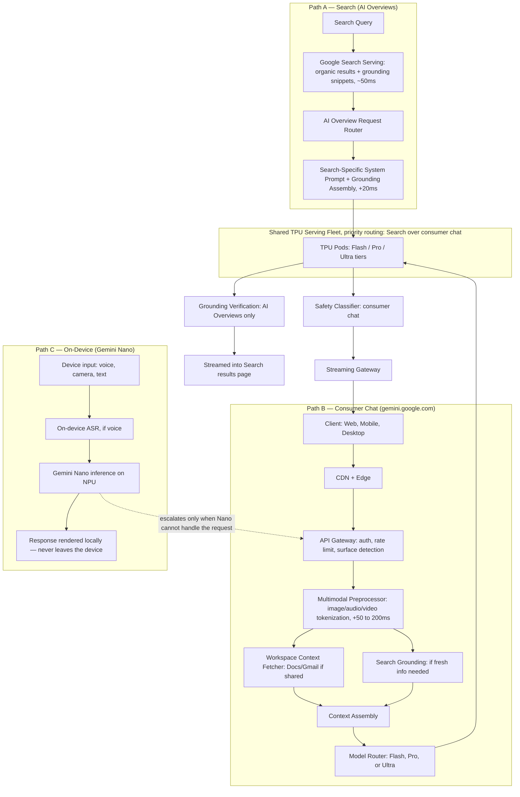
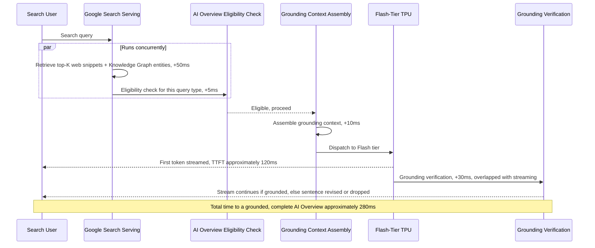
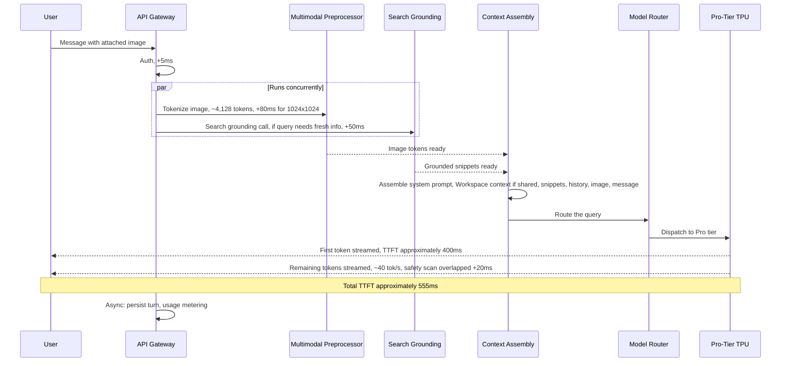
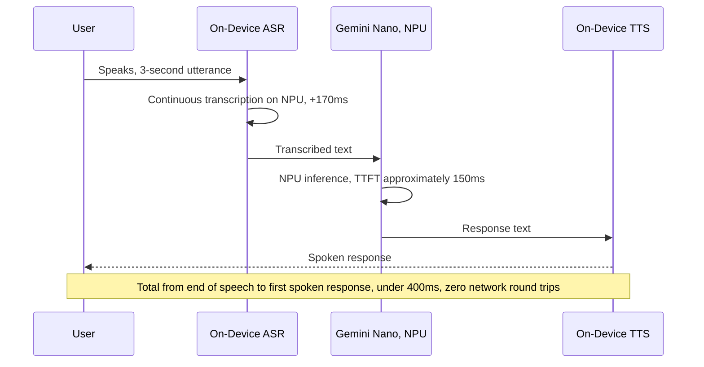
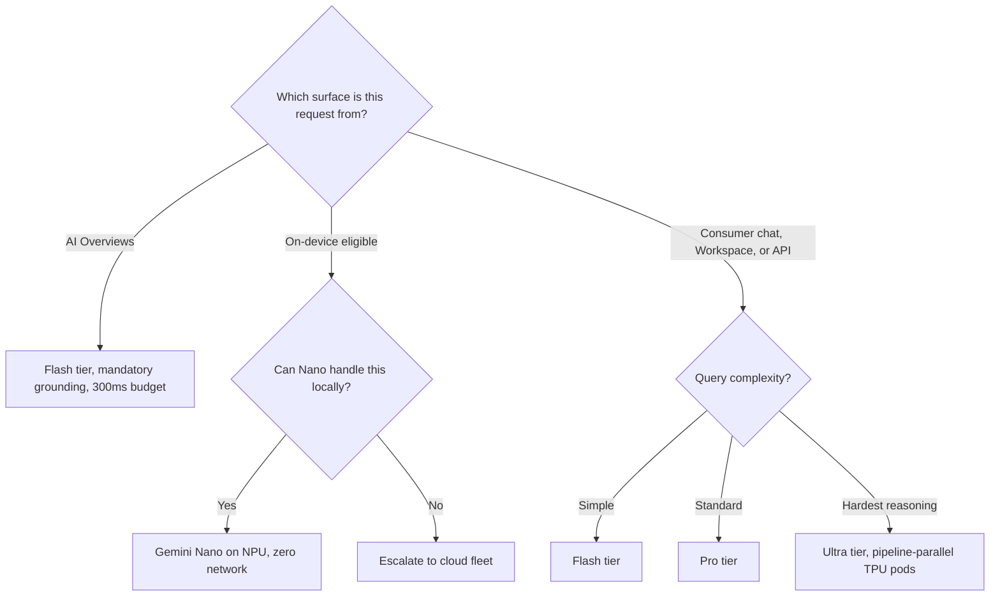

# Gemini — System Design Case Study

## Requirements

The single fact that reorganizes every section below: Gemini is not a chat product with a model behind it — it is one model family deployed across six product surfaces whose latency budgets, quality bars, and context shapes have almost nothing in common with one another. The [ChatGPT case study](01-chatgpt.md) is built around a bounded agent loop serving one consumer/API surface pair; the [Claude case study](02-claude.md) is built around long-context-first economics for one consumer/API surface pair. This chapter has no single anchor surface to build around — the highest-QPS surface (AI Overviews, embedded in Google Search) has a stricter latency budget than any chatbot on the market, the lowest-QPS surface (Gemini Nano on a Pixel phone) has no network path to a data center at all, and the two share nothing but a model family. Four forces explain nearly every design decision that follows: **(1)** Gemini is natively multimodal — trained jointly on text, image, audio, and video from the start, not adapted onto a text-only model after the fact; **(2)** Google Search's proprietary retrieval infrastructure is available to Gemini as a first-class grounding source, not something Gemini has to rebuild; **(3)** Google owns the TPU silicon Gemini serves on, which changes the cost and capacity structure in ways no GPU-renting competitor can match; **(4)** the same model family has to serve a dozen product surfaces simultaneously, from a Search results page viewed by billions to a phone with no signal.

**Functional**

- **Surface 1 — gemini.google.com (consumer chat).** Multi-turn conversation with natively multimodal input — text, images, audio, video, PDFs, code files, and spreadsheets are all handled by the same model, not routed to separate modality-specific adapters. Web search grounded generation, where Google Search is a first-class retrieval source rather than an optional browsing tool. Image generation via Imagen, invoked as an external tool. Sandboxed code execution. Workspace integration, letting a user pull Gmail context, a Google Doc, or a Calendar event directly into the conversation. Multi-tier model selection — Flash for fast responses, Pro for most tasks, Ultra for the hardest tasks.
- **Surface 2 — AI Overviews and AI Mode (Google Search).** The highest-scale surface by orders of magnitude. AI Overviews appear above the organic results for informational queries, and the functional requirement is tightly constrained: a grounded, cited, accurate answer generated in under 300ms total turn time — matching the latency users associate with Google Search — with inline citations pointing to supporting sources. No tool use, no multi-turn, no memory: every AI Overview is a single-turn generation grounded on the same search results that produced the organic links below it. AI Mode, the full-page AI conversation experience, is a superset that allows multi-turn conversation and more complex queries, but the grounding requirement remains mandatory.
- **Surface 3 — Workspace (Gmail, Docs, Sheets, Slides, Meet).** Gemini is embedded as an assistant inside each Workspace product, and each surface supplies a different context payload and expects a different output shape: Gmail provides the email thread and the user's sent-mail style and expects a draft reply in that style; Docs provides the document content and cursor position and expects an inserted paragraph or section; Sheets provides the active range, headers, and existing formulas and expects valid formula syntax; Slides provides the current deck structure and expects a new slide with bullets or layout suggestions; Meet provides a live or recorded transcript and expects structured notes with action items.
- **Surface 4 — Gemini API (Google AI Studio and Vertex AI).** Developer and enterprise access to the Gemini family via REST/gRPC. Full multimodal capability, function calling, system prompts, streaming and batch modes, context caching — a Vertex AI feature that persists the KV cache of a long shared prefix, analogous to Anthropic's prompt caching (see [Claude — Detailed Design](02-claude.md#detailed-design)) — and Grounding with Google Search as an optional parameter. Two flavors: Google AI Studio for developer prototyping (free, rate-limited) and Vertex AI for enterprise (IAM, VPC Service Controls, CMEK, and a contractual no-training-on-customer-data guarantee).
- **Surface 5 — Gemini Nano (on-device, Android/Pixel).** A 3.25B-parameter, int4-quantized model that runs entirely on the phone's NPU — Google's Tensor chip on Pixel, Qualcomm's NPU elsewhere — with no network round trip. Capabilities: real-time voice assistant queries, on-screen content understanding, Smart Reply, Summarize in Recorder, and Gboard writing suggestions. The privacy guarantee is architectural, not policy: for Nano-tier features, user queries and responses never leave the device.
- **Surface 6 — Deep Research and Project Astra (agentic surfaces).** Deep Research is a multi-step web research agent that plans and fans out many parallel search queries and synthesizes the results into a cited report, grounded on Google Search's full index. Project Astra is a real-time multimodal agent that processes a live camera feed and audio and answers questions about what it sees at conversational latency.

**Non-functional**

Gemini has no single blended latency SLO — the differences across surfaces are architectural, not incidental, so each surface gets its own target:

| Surface | TTFT target | Why |
|---|---|---|
| AI Overviews (Search) | < 300ms total turn time | Search users measure latency in milliseconds; an AI response slower than typical search latency degrades the core Search product |
| Consumer chat (Flash tier) | < 600ms | Standard interactive chat, matching ChatGPT's fast tier |
| Consumer chat (Ultra tier) | < 3,000ms | Users accept higher latency for a "deep thinking" mode |
| Workspace | < 3,000ms | Office productivity tooling; users tolerate drafting latency |
| API (Flash) | < 500ms | Developer/enterprise interactive latency SLO |
| Gemini Nano (on-device) | < 200ms | No network hop; NPU throughput is the only constraint |

**Explicitly out of scope for this case study**: pretraining and TPU *training* infrastructure (only serving TPU infrastructure is in scope), Imagen's internal architecture (Imagen is invoked as a tool, not described internally), and billing and payments.

## Capacity Planning

This is the section that most distinguishes this chapter from every other case study in this book: the scale of AI Overviews alone exceeds any chatbot product by orders of magnitude, using the method from [GPU Sizing & Capacity Planning](../16-gpu-systems/02-gpu-sizing-and-capacity-planning.md) with illustrative, order-of-magnitude assumptions.

**AI Overviews.**

| Step | Calculation | Result |
|---|---|---|
| Global searches/day | Given | 8.5B/day |
| AI Overview trigger rate | ~25% of informational queries have sufficient index coverage | 2.1B AI Overview generations/day |
| Average QPS | 2.1B / 86,400s | ~24,300 QPS average |
| Peak-to-average ratio | Search traffic peaks across US, European, and Asian waking hours simultaneously — a genuinely global peak, sharper than any single-region consumer product | ~3× average |
| Peak QPS | 24,300 × 3 | ~73,000 QPS peak |
| Tokens per AI Overview | 2,000 grounding input tokens (retrieved snippets + Knowledge Graph entities + query context) + 400 output tokens | 2,400 tokens/AI Overview |
| Peak token volume | 73,000 × 2,400 | ~175M tokens/second peak |

For comparison, OpenAI's estimated peak throughput across all of ChatGPT is in the tens of millions of tokens per second — AI Overviews alone exceeds that by roughly one order of magnitude, on a single surface most users don't even register as "using an AI model."

**Consumer Gemini chat.** 50M WAU × 30% DAU conversion = 15M DAU × 6 messages/session = 90M messages/day = ~1,042 QPS average, peaking 4× to ~4,168 QPS. At 1,500 input tokens (multimodal context) + 500 output tokens per message, peak token volume is 4,168 × 2,000 ≈ **8.3M tokens/second** — meaningful, but dwarfed by AI Overviews.

**Workspace Gemini.** Google Workspace has 3B+ registered users, ~8% with Gemini features enabled = 240M Workspace Gemini users, of which ~10% are active on a given day = 24M DAU × 3 Gemini interactions/day = 72M calls/day = ~833 QPS average, peaking 2× (business hours only, unlike globally-distributed Search or consumer chat) to ~1,666 QPS. At 5,000 input tokens (document or email context) + 500 output tokens, peak token volume is 1,666 × 5,500 ≈ **9.2M tokens/second**.

**TPU fleet sizing.**

| Component | Peak token volume |
|---|---|
| AI Overviews | ~175M tok/s |
| Consumer chat | ~8.3M tok/s |
| Workspace | ~9.2M tok/s |
| API traffic (estimate) | ~20M tok/s |
| **Aggregate peak demand** | **~212M tokens/second** |

A single TPU v4 chip serves roughly 2,000–5,000 output tokens/second depending on model size and batching; a 128-chip TPU v4 pod slice achieves ~256K–640K tok/s. At ~400K tok/s per pod slice, 212M ÷ 400K ≈ **530 pod slices** active at peak, or 530 × 128 ≈ **68,000 TPU v4 chips** — before geographic redundancy. Google's total TPU fleet across all workloads runs into the hundreds of thousands of chips, of which AI serving is a major but not exclusive consumer.

The key insight this arithmetic surfaces: **AI Overviews is the reason Google needed to build AI serving infrastructure at this scale.** A general-purpose chatbot product alone — consumer chat plus API traffic — would need roughly 1–2% of the TPU capacity AI Overviews demands. Google's AI infrastructure advantage is not primarily "a better chatbot" — it is having already built and paid for the serving infrastructure needed to AI-power Search, and then amortizing that fixed investment across every other Gemini surface.

## Scale Estimation

**Google Search index as the AI Overviews retrieval backend.** Google's index covers over 100 petabytes of crawled and indexed web content. AI Overviews retrieval is not a separate vector index — it calls Google's existing search serving infrastructure through an internal API that returns top-K ranked snippets, Knowledge Graph entities, local results, real-time news, and image results: the same infrastructure that populates organic results, extended with a retrieval API surface. The AI Overviews system does not own this index, it *consumes* it — which means AI Overviews inherits Google's full search quality (PageRank, freshness, spam filtering, entity disambiguation) without the recall and precision limitations of a custom-built vector DB, a retrieval quality no chatbot competitor can replicate by building standard RAG over a crawled web corpus.

**Multimodal token volumes.** A 1024×1024 image, tokenized via a SigLIP-style visual encoder in 256×256 patches, produces 16 patches × ~258 tokens/patch ≈ **4,128 image tokens** — comparable to a moderate-length text turn from a single high-resolution image. A 5-minute video at 1 fps yields 300 keyframes × 258 tokens/frame ≈ 77,400 image tokens, plus audio spectrogram tokenization at ~50 tokens/second × 300s ≈ 15,000 audio tokens, for **~92,400 tokens** total — the concrete reason the 1M+ context window exists: video reasoning tasks need it, not long documents. Real-time speech (Gemini Nano) tokenizes at ~80 tokens/second, so a 30-second voice query is ~2,400 audio tokens. See [Tokenization & Vocabulary](../02-llm-architecture/02-tokenization-and-vocabulary.md) and [Context Windows & Positional Encoding](../02-llm-architecture/03-context-windows-and-positional-encoding.md).

**On-device model storage.** Gemini Nano at 3.25B parameters, int4-quantized: 3.25B × 0.5 bytes/parameter = **1.6GB**, comfortably within any modern phone's storage. The MediaPipe-based inference engine adds ~100MB, for a total on-device footprint of ~1.7GB. Weight updates ship as silent OTA packages (~1.6GB when weights change), staged and installed in the background. See [On-Device & Edge Inference](../15-model-serving/06-on-device-and-edge-inference.md).

**Context caching for the Vertex AI API.** Vertex AI's context caching stores the KV cache of a shared prefix on Google's serving infrastructure — not the caller's — with a 1-hour minimum TTL, longer than Anthropic's 5-minute default (see [KV Cache Management](../15-model-serving/03-kv-cache-management.md)). A 1M-token cached context at Gemini Pro's KV cache density (1M tokens × 80 layers × 2 for K+V × hidden dim × 2 bytes) runs roughly **250–600GB of KV cache state per cached context**, managed across a fleet of TPU pods dedicated to context-cache serving, with admission favoring prefixes with proven reuse.

**Workspace document context storage.** A shared Google Doc is tokenized and injected into context at assembly time — it is not stored in a separate vector index. A 50-page Doc is ≈25,000 tokens; a 50-message Gmail thread is ≈10,000 tokens — both comfortably inside the model's context window without chunking. This is why Workspace avoids RAG for most enterprise document tasks entirely: the documents are typically small enough to fit in context, and the 1M-token window makes even a 300-page report in-context queryable.

**AI Overviews latency budget.** To hit < 300ms total turn time: Search retrieval completes in < 100ms (Google's search serving is optimized for ~50ms P99), grounding context assembly is < 20ms (template assembly with no embedding calls, since retrieval is lexical + structured, not vector-based), model inference to first token is < 150ms, output safety scanning is < 20ms overlapped with streaming, leaving a ~10ms buffer for a ~300ms total. That budget is precisely why AI Overviews runs on the Flash-tier model rather than Pro or Ultra, even though Ultra would produce a better answer — see [Latency Engineering](../23-staff-level-architecture/08-latency-engineering.md).

## High Level Design

Three distinct serving paths share one model infrastructure. Path A (Search) and Path B (consumer chat) converge on the same TPU fleet with priority routing; Path C (on-device) never touches the cloud unless the request exceeds what Nano can handle.



Two properties carry the weight of this diagram. First, **AI Overviews and consumer chat compete for the same TPU capacity**, but they are not peers in that competition — Search gets priority routing over consumer chat, because an AI Overview failure degrades Google's core revenue product, while a slow consumer-chat response degrades a much smaller-revenue surface. Second, **Path C is architecturally severed from Paths A and B** — Gemini Nano's entire value proposition (offline capability, on-device privacy, sub-200ms latency) collapses the moment a request has to leave the device, so the escalation path to the cloud fleet is the exception, not a fallback baked into every Nano request.

## Detailed Design

**Native multimodal input processing.** The fundamental difference from a bolt-on multimodal architecture (GPT-4V's original design, for instance) is where cross-modal understanding gets learned. A bolt-on system runs a separate vision encoder (CLIP-style) that produces a visual embedding concatenated with text embeddings, and a language model trained primarily on text learns to treat that embedding as extra context via a transfer-learning step. Gemini's native architecture instead trains text, image, audio, and video tokens through the same model simultaneously — there is no separate encoder handing off to a frozen backbone; the attention layers learn cross-modal relationships during pretraining itself. Each modality still needs its own preprocessing before tokens can be interleaved into context: images are resized across a set of resolution scales (a thumbnail pass at 224×224 for broad understanding, high-resolution 1024×1024 patches when detail matters), with each 256×256 patch producing a fixed number of visual tokens via a learned patch-embedding layer (4,128 tokens for a 1024×1024 image, per Scale Estimation); audio is converted to a mel spectrogram and patched similarly to images, at roughly 80 tokens/second, with speech-to-text never run as a separate step — Gemini processes audio tokens directly, which is why it can reason about tone of voice, not just transcribed words; video is keyframe-extracted at 1–4 fps (higher for fast motion, lower for static content) with each frame processed as an image and the audio track tokenized in parallel, interleaved in temporal order so the model can answer questions like "what changed between minute 2 and minute 5"; PDFs and documents are rendered page-by-page as images with OCR text overlaid, letting the model read charts, tables, and handwritten text that text-only extraction would miss.

**Search grounding pipeline.** Standard RAG bounds retrieval quality by whatever embedding model, crawl freshness, chunking strategy, and cosine-similarity ranking the application developer built. Google Search grounding instead invokes Google's own search serving infrastructure, which layers hundreds of signals beyond semantic similarity on top of retrieval: PageRank-derived authority, freshness weighting, entity disambiguation against the Knowledge Graph's 500 billion facts about people, places, organizations, and concepts, geographic personalization, and spam/trust filtering. The pipeline for an AI Overview runs in six steps: query understanding decomposes a multi-faceted question into one or more search subqueries; a search-serving call retrieves top-K web snippets, Knowledge Graph entities, image results, and local results per subquery; snippet selection filters and re-ranks retrieved content specifically for generation relevance, since not every snippet relevant to the search is relevant to the generative answer; grounding context assembly structures selected snippets into the model's context with source metadata (URL, title, publication date); generation produces the AI Overview with inline citation markers; and grounding verification runs a post-generation NLI-style entailment check against every factual claim, revising or dropping any sentence the retrieved evidence doesn't support. Because the grounding documents are the same documents that power organic search, an AI Overview's factual claims are bounded above by Google's search index quality — hallucination risk isn't eliminated, but the verification step catches most violations before delivery.

**Multi-surface context assembly.** Each surface supplies a different context payload that must be assembled in a surface-specific way, so the context assembly service maintains one context template per surface, each defining the surface's system prompt (the assistant's role, output-format constraints, and style guidelines for that surface specifically), the context injection order (for Workspace surfaces: document content first, then conversation history, then the current request), and the output format specification, enforced via function calling for structured outputs like Sheets formulas, Meet action items, or Slides layouts. The Workspace context fetcher retrieves a shared Google Doc via the Drive API scoped to the authenticated user's OAuth token, so Gemini's servers can only read documents the user has actively shared into the conversation — and critically, that fetched content is assembled into context per-request and discarded after the response streams, never persisted beyond the duration of one request, which is the key data-handling property for Workspace (see Security Layer).

**TPU serving infrastructure.** GPUs and TPUs both accelerate matrix multiplication, but their interconnect topology differs in ways that shape serving architecture. GPUs communicate via NVLink within a node and an NVMe fabric across nodes; an 8×H100 DGX node has 900GB/s of NVLink bandwidth. TPUs communicate across a pod via Google's proprietary Inter-Chip Interconnect (ICI), purpose-built for the all-reduce and all-gather patterns that dominate transformer inference — a TPU v5e pod reaches up to 1.6TB/s of ICI bandwidth per chip pair, substantially higher interconnect bandwidth relative to compute than the GPU equivalent, which pays off specifically at large-scale model parallelism (see [Multi-GPU Topologies & Interconnects](../16-gpu-systems/03-multi-gpu-topologies-and-interconnects.md)). For Gemini Ultra, whose parameters are too large to fit on any single node, Google uses pipeline parallelism across TPU pods: different pod slices handle different layers of the model, and tokens flow through the pipeline from early layers to the final layers and output head. Tensor parallelism across 8-GPU H100 nodes works well up to 8 GPUs but hits an inter-node NVMe bandwidth ceiling beyond that; ICI-connected TPU pods are specifically designed for the allreduce-heavy pattern that large-model inference needs at Gemini's serving scale.

**On-device serving (Gemini Nano).** On-device inference is a distinct engineering discipline governed by constraints cloud serving doesn't have: battery life bounds total energy per query to roughly under 1 Wh for a complex request; thermal throttling reduces NPU clock speed under sustained inference load; memory capacity forces the model and inference engine to coexist with the OS and user apps inside under 2GB; and offline capability means no model update until the next OTA. The mitigations stack: int4 quantization cuts model size 4× against fp16 at under 5% quality regression for a model this size (see [Quantization & Compression](../15-model-serving/04-quantization-and-compression.md)); MediaPipe's NPU-optimized kernel library fully utilizes the hardware's specialized matmul and softmax circuits; an inference-time memory pool is allocated once and reused across requests to avoid garbage-collection pressure mid-inference; and speculative decoding adapted for NPU — a ~0.5B draft model proposes four tokens at a time, the full 3.25B model verifies — roughly doubles effective throughput at modest extra NPU compute cost. Weight updates ship as Android OTA packages, hash-verified and atomically swapped to prevent corrupted weights from reaching the NPU, staged during overnight charging rather than mid-use.

**AI Overview quality control.** A bad response from a chatbot is seen by one user; a bad AI Overview is surfaced to millions of Search users simultaneously and is frequently screenshotted and shared, which makes this the highest-stakes observability problem in the system. Four layered controls: (1) every model update that could affect AI Overviews runs against a golden set of tens of thousands of human-judged queries, and a candidate model cannot promote to production if it regresses against the previous one; (2) the grounding verification NLI check described above runs at serving time on every response, not just during evaluation; (3) a continuous, real-time sample of live AI Overviews is rated by human raters on a 7-point scale covering accuracy, helpfulness, and citation quality, running always — not only around model updates — specifically to catch distribution shifts like a new query pattern the model handles poorly; (4) a dedicated adversarial-testing team red-teams AI Overviews for SEO manipulation, where a site is specifically engineered to rank in grounding retrieval and inject false claims, with confirmed manipulation resolved by demoting the offending domain in grounding retrieval ranking specifically, not in organic search ranking generally. See [Guardrails & Content Safety](../21-ai-security/04-guardrails-and-content-safety.md).

## API Design

**`POST /v1beta/models/{model}/generateContent`** — the primary generation endpoint, showing a multimodal request with interleaved text, image, and code parts, and Google Search grounding enabled as a tool:

```json
{
  "contents": [
    {"role": "user", "parts": [
      {"text": "Describe what's wrong with this code and the chart showing its performance"},
      {"inlineData": {"mimeType": "image/png", "data": "<base64-encoded-screenshot>"}},
      {"text": "```python\ndef compute(n):\n  return [i**2 for i in range(n)]\n```"}
    ]}
  ],
  "systemInstruction": {"parts": [{"text": "You are a performance engineering expert."}]},
  "tools": [{"googleSearch": {}}],
  "generationConfig": {"temperature": 0.2, "maxOutputTokens": 2048},
  "safetySettings": [{"category": "HARM_CATEGORY_DANGEROUS_CONTENT", "threshold": "BLOCK_ONLY_HIGH"}]
}
```

The response includes a `groundingMetadata` block carrying `groundingChunks` (the retrieved sources) and `webSearchQueries` (the queries Google Search actually executed to ground the response) — the caller-visible artifact of the six-step grounding pipeline described in Detailed Design.

**Context caching** is a distinct request shape on the same endpoint: the caller first creates a cached content object from a long shared prefix (a 500-page technical manual, for instance), then references it by name on every subsequent request instead of resending the prefix:

```json
{
  "cachedContent": "cachedContents/abc123",
  "contents": [{"role": "user", "parts": [{"text": "What does section 4.7 say about thermal tolerances?"}]}]
}
```

The response carries an `X-Cache-Used: true` header, and billing reports `cachedTokens` at a 75% reduced rate — the API-visible counterpart of the tiered TPU cache-serving fleet described in Scale Estimation.

**`POST /v1beta/models/{model}/streamGenerateContent`** streams a server-sent sequence of `GenerateContentResponse` objects, each a delta of generated content. This is a meaningful integration detail for anyone building a provider-agnostic abstraction layer: Gemini streams as newline-delimited JSON objects, not the `event:` / `data:` Server-Sent Events framing Anthropic's API uses (see [Claude — API Design](02-claude.md#api-design)) — a caller switching providers has to handle two structurally different streaming protocols, not just two different payload schemas.

## Data Flow

**Path A — AI Overview generation**, target < 300ms total turn time:



**Path B — Consumer chat with an attached image:**



**Path C — On-device Nano query, no network:**



## Retrieval Layer

Three retrieval systems exist in this product, and none of them is standard vector-DB RAG.

**Google Search as the AI Overviews retrieval layer.** As detailed above, this is lexical + structured + PageRank retrieval producing a ranked list of web snippets, Knowledge Graph entities, and structured data — not embedding-based similarity search. The AI system doesn't control the retrieval model, it consumes the output of Google Search, which is a fundamental architectural constraint: Gemini's grounding quality is bounded above by Google Search's own quality and bounded below by the accuracy of the NLI grounding-verification step.

**Consumer chat web search tool.** When a user enables web search in a chat conversation, or the model's own routing determines the query needs fresh information, a search tool call hits the same Search serving infrastructure AI Overviews uses, but with a different retrieval profile — personalization enabled, higher K, a full-page-fetch option. Architecturally this is the same shape as [ChatGPT's browsing tool](01-chatgpt.md#retrieval-layer), but backed by Google's own index rather than a third-party search API: comparable latency (~50–100ms for retrieval), categorically different result quality because the index is proprietary.

**Workspace document retrieval — deliberately avoiding RAG.** For most Workspace queries, Google's design choice is to skip RAG entirely: a user shares a document directly into the conversation, and the full document loads into the 1M-token context window rather than being chunked and retrieved. This works because most individual Workspace documents fit within 100K tokens (well inside the window), because full-document-in-context outperforms RAG-over-the-document — no retrieval misses, no chunking artifacts — and because access is immediate, fetched at query time from the Drive API with no crawling or indexing step required. RAG is only used in the Workspace context when a query spans a corpus too large to fit context (e.g., "summarize all 500 emails from this quarter") or needs knowledge the shared documents don't contain, triggering the web search tool instead. This mirrors [Claude's long-context-first retrieval philosophy](02-claude.md#retrieval-layer) almost exactly — see [Long Context vs. RAG](../04-context-engineering/04-long-context-vs-rag.md) for the general decision framework both products are instances of — but Gemini reaches the same conclusion from a different direction: Claude's window is optimized for holding documents the user explicitly loads; Gemini's window is sized in large part for video and multimodal reasoning, and Workspace document handling gets the benefit incidentally.

## Agent Layer

**Deep Research.** A multi-step web research agent producing comprehensive, cited reports: the user submits a research question, Gemini plans 5–20 sub-queries depending on complexity, the sub-queries fan out to Google Search in parallel, retrieved snippets are synthesized into a structured outline, each report section is generated with paragraph-level grounding in specific sources, and a final grounding-verification pass checks the complete report before the user receives a structured, numbered-citation document. The key architectural difference from [ChatGPT's Deep Research](01-chatgpt.md#agent-layer): because Gemini calls Google Search's API directly rather than a third-party search API, the parallel search fan-out isn't rate-limited the same way a third-party integration would be, enabling more aggressive parallelism per research task. See [Agentic RAG Architecture](../08-agentic-rag/01-agentic-rag-architecture.md) for the general iterative-retrieval pattern this specializes.

**Project Astra.** A real-time multimodal agent processing a live camera feed at ~4 fps and 16KHz audio, producing conversational responses in real time. The serving architecture departs from turn-based chat entirely: Astra holds a persistent per-session WebSocket connection, continuously ingesting video frames and audio tokens rather than waiting for discrete turns. The "turn" concept is replaced by a continuous, sliding context window retaining the last N seconds of video and audio, and generation is triggered by on-device voice-activity detection running in parallel with the stream — not by an explicit user "send." The latency target is < 400ms from end of user speech to first spoken response token, tighter than standard chat precisely because this is a live conversational experience, not a request/response exchange. See [Agent Fundamentals & the Agent Loop](../09-agents/01-agent-fundamentals-and-the-agent-loop.md) for the bounded-loop pattern Astra's continuous session deliberately breaks from.

## Model Layer

| Model | Parameters (est.) | Quantization | Serving location | Primary surfaces |
|---|---|---|---|---|
| Gemini Nano 2B | ~2B | int4, on-device | Phone NPU | On-device quick queries |
| Gemini Nano 3.25B | ~3.25B | int4, on-device | Phone NPU | On-device assistant, Summarize in Recorder |
| Gemini Flash 2.0 | ~15–30B (est.) | int8, server-side | TPU fleet | AI Overviews, API cheap tier, consumer chat fast responses |
| Gemini Pro 2.0 | ~50–70B (est.) | int8, server-side | TPU fleet | Consumer chat default, Workspace, API standard tier |
| Gemini Ultra 2.0 | >100B (est.) | int8, server-side | TPU pod, pipeline-parallel | API premium tier, hardest research tasks |

The whole family is natively multimodal — every tier shares the same joint text/image/audio/video training objective, and the Nano models are produced by knowledge distillation from the larger models rather than simple compression, which is what preserves multimodal capability at phone-portable size. See [Multi-Model Serving & Routing](../15-model-serving/05-multi-model-serving-and-routing.md).

**TPU pipeline parallelism for Ultra.** Ultra's parameters span multiple TPU pods, so during inference context tokens are processed by the first pod slice (e.g., layers 1–40), intermediate activations pass to the second slice over ICI (layers 41–80), and so on. This raises per-token latency relative to Flash or Pro, since a token has to traverse the full pipeline depth, but throughput stays high as long as the pipeline is kept full with many concurrent requests at different pipeline stages. The scheduling challenge this creates: a request holding the pipeline for a very long turn produces a pipeline bubble that drags down utilization, so Google's scheduler preempts very long Ultra requests at a token boundary to let shorter requests run, then resumes the preempted request — an approach directly analogous to OS process scheduling on a shared CPU.

## Observability Layer

- **AI Overview generation success rate** — the fraction of eligible queries that successfully generate, ground, and pass verification. A drop is immediately visible to Search users (no AI Overview appears where one should). Alarm below 98%; root causes bucket into model timeout (> 300ms), grounding failure (no suitable snippets), NLI verification failure (ungroundable claims), and safety trigger.
- **Grounding verification pass rate** — the fraction of AI Overviews where every factual claim passed the NLI entailment check, tracked separately by query vertical (health, finance, news) because grounding standards are stricter in sensitive domains. A drop signals either a model regression (more ungrounded claims) or a retrieval regression (grounding snippets no longer support the model's parametric knowledge on the topic).
- **Multimodal preprocessing latency by modality type** (image, audio, video), tracked at P50/P99 per modality — a rise in image preprocessing latency directly adds to consumer chat TTFT.
- **On-device inference success rate** — the fraction of Nano queries completing on-device versus falling back to cloud. A drop indicates NPU thermal throttling or a model update exceeding device memory capacity.
- **Context cache hit rate (Vertex AI)** — a drop indicates eviction pressure or a shift in API caller behavior; a hit rate above 70% on enterprise Vertex customers signals customers are structuring applications to reuse prefixes deliberately.
- **Workspace Gemini task completion rate**, per surface — for Gmail, Docs, Sheets, the fraction of suggestions users accept (proxied by whether the suggestion is applied). A drop in Gmail draft acceptance after a model update signals a writing-style regression for that customer's domain.
- **Per-surface TTFT P99 by model tier** — tracked separately for AI Overviews (< 300ms), consumer chat Flash (< 600ms), consumer chat Ultra (< 3,000ms), Workspace (< 3,000ms). Tracked separately specifically so a consumer-chat regression can't be averaged away by AI Overviews' enormous traffic volume in a blended P99.
- **Safety trigger rate by surface** — AI Overviews carries the most sensitive safety bar (violent or misleading content in a Search result is a high-visibility incident), so its trigger rate is monitored independently of consumer chat and API surfaces rather than folded into one platform-wide number.

## Security Layer

**Workspace data handling.** A user's Gmail, Docs, and Calendar data is among the most sensitive data Google holds, so Workspace Gemini enforces four layered controls: scope restriction, where Gemini's servers access Workspace data only when the user has explicitly initiated an interaction requiring it, via an OAuth token scoped to the specific shared content, never the user's entire Workspace; a no-training guarantee, where Workspace content is not used to train Gemini models by default, contractual for enterprise and opt-out for consumer; no-persistence, where fetched document content lives in memory only for the duration of the generation request and is never written to conversation history — a deliberate architectural choice, not a retention-policy promise; and audit logging, where every enterprise Workspace Gemini invocation (what was shared, what was generated, who initiated it) is logged to the Workspace audit log, accessible to admins via the Admin Console. See [SSO, Permissions & RAG ACL Enforcement](../22-enterprise-ai/04-sso-permissions-and-rag-acl-enforcement.md) and [PII & Privacy Engineering](../22-enterprise-ai/05-pii-and-privacy-engineering.md).

**AI Overviews adversarial grounding.** Because grounding retrieves from the live web, an adversary who gets malicious content ranked highly by Google Search can attempt to influence AI Overview content — a variant of [prompt injection](../21-ai-security/02-prompt-injection-and-jailbreaks.md) delivered through search ranking rather than a single document. Three mitigations: grounding retrieval inherits Google Search's existing spam and quality signals, so content that can't rank for organic results can't rank for grounding either; the NLI grounding-verification step checks whether a generated claim is supported by the *specific retrieved text*, meaning an adversarial page asserting a false fact still has to rank well for the query first, requiring it to overcome Google's entire search-quality stack; and the adversarial-testing team specifically monitors for AI Overview manipulation campaigns, applying domain-level demotions in grounding retrieval when a campaign is confirmed.

**On-device privacy architecture.** For Gemini Nano features, audio and camera input processed on-device never leaves the device — voice-activity detection, ASR, model inference, and text-to-speech all run on the NPU with no network access. The one exception is an explicit capability that requires cloud access, such as a search query, where the on-device system sends only the minimal necessary payload (the query text) to the cloud API, never the raw audio or camera feed. This is "privacy by architecture," not a privacy policy: the system is technically incapable of sending raw audio to Google's servers during a Nano-only interaction, regardless of what any policy states.

## Cost Model

Owned TPU silicon changes the underlying cost structure relative to a GPU-renting provider in a way that's architecturally, not just financially, significant. For a provider renting H100s at ~$3/GPU-hour, serving 212M tokens/second (Capacity Planning's aggregate peak demand) at ~400K tok/s per 8-GPU H100 node requires ~530 nodes = 4,240 GPUs × $3/hour ≈ $12,720/hour ≈ **$111M/day** in rental cost alone — the reason no startup can economically serve at AI Overviews' scale on rented compute.

Google's TPU v4 chips list at ~$5/chip-hour on Google Cloud, but Google uses them internally at a transfer price well below list; the amortized capital cost of owning a TPU v4 chip (3-year depreciation, power, cooling) runs roughly $0.40–$0.80/chip-hour at scale. At the 68,000 chips Capacity Planning sized for peak: 68,000 × $0.60/hr ≈ $40,800/hour ≈ **$979,000/day** — versus $111M/day for the equivalent rented H100 capacity. That's roughly a **100× owned-silicon discount** at Google's scale, and it directly funds Gemini's ability to price the Flash API tier at $0.075/M input tokens, a price point that isn't sustainable for a company renting GPU capacity to serve the same workload.

| Surface | Model tier | Input tokens/request | Output tokens/request | Est. amortized TPU cost/request |
|---|---|---|---|---|
| AI Overview | Flash | 2,000 | 400 | ~$0.00015 |
| Consumer chat (Flash) | Flash | 1,500 | 500 | ~$0.00013 |
| Consumer chat (Ultra) | Ultra | 2,000 | 800 | ~$0.0025 |
| Workspace (Docs draft) | Pro | 5,000 | 1,000 | ~$0.00060 |
| API (Flash, external) | Flash | variable | variable | Listed: $0.075/M input |
| On-device (Nano) | Nano | N/A | N/A | $0 cloud cost — device owner pays electricity |

At ~2.1B AI Overviews/day × ~$0.00015 ≈ **$315,000/day** in amortized TPU cost — a small fraction of the ad revenue Search generates on the same page. That's the strategic economics underlying Google's AI position: the single most expensive AI serving infrastructure in the world is subsidized by Search's existing advertising revenue, letting Google offer external API pricing well below what a GPU-renting competitor could sustain long-term. See [Cost Engineering](../23-staff-level-architecture/07-cost-engineering.md).

| Lever | Mechanism | Estimated cost impact |
|---|---|---|
| Model-tier discipline on AI Overviews | Never route AI Overview traffic to Pro or Ultra, regardless of quality upside | Keeps AI Overviews' ~$315K/day from becoming several million/day |
| Context cache adoption (Vertex) | Maximize prefix reuse across API callers | 60–90% reduction on cached-prefix input tokens |
| Pipeline utilization for Ultra | Preemptive scheduling to avoid pipeline bubbles | 20–40% better fleet utilization at the same chip count |
| On-device offload | Route Nano-eligible queries away from the cloud fleet entirely | Removes that volume from TPU demand altogether |
| TPU ownership vs. rental | Amortized capital cost vs. list-price rental | ~100× per-token cost advantage at Google's scale |

## Failure Handling

| Failure mode | Detection | Degradation strategy | User experience |
|---|---|---|---|
| AI Overview generation timeout (> 300ms) | Per-request timeout in Search serving | Serve organic results without an AI Overview; log for capacity investigation | Normal search results, no error, unaware an AI Overview was suppressed |
| Grounding verification failure (ungroundable claims) | NLI entailment check fails for > 30% of sentences | Suppress the AI Overview; serve organic results; flag query type for model evaluation | Same as timeout — no AI Overview, no error |
| Flash-tier TPU fleet at capacity (AI Overview queue backup) | Queue depth over threshold; P99 > 250ms | Reduce AI Overview trigger rate starting with lower-priority query types, protecting the Search latency SLO | Fewer AI Overviews overall; Search latency maintained |
| Workspace context fetch failure (Drive API timeout) | Per-request timeout in the context fetcher | Proceed without the shared document; tell the user the document couldn't be accessed | Clear message, can retry |
| On-device NPU thermal throttling | NPU clock speed below threshold | Fall back to cloud serving for the current query; resume on-device once cooled | Slightly slower response, network round trip added |
| Google Search API internal degradation (retrieval quality drop) | P99 retrieval latency > 150ms or snippet-quality classifier drop | Fall back to parametric knowledge only; suppress citation display; disclose the response isn't grounded in live results | Possible quality drop on time-sensitive queries, clearly disclosed |
| Astra WebSocket session disconnection | WebSocket close event | Re-establish with a session resume token; rebuild the sliding context window from the last N frames and transcription | "I lost the connection briefly — I'm back now" |
| Context caching eviction mid-session (Vertex AI) | Cache miss on a previously cached prefix | Fall back to cold prefill silently; background rewrite of the cache entry | Slightly higher TTFT for one turn, unaware |

## Tradeoff Analysis



**1. Native multimodal vs. bolt-on modality adapters.** Training text, image, audio, and video jointly from the start produces a model that genuinely understands cross-modal relationships — a chart tied to its caption, a video's ambient audio tied to its visuals, a screenshot tied to embedded code — in a way a bolt-on vision-encoder-plus-projection-layer architecture doesn't, because the bolt-on model never learned those relationships during pretraining, only during a later transfer step. The cost is upfront and structural: rebuilding the training data pipeline, tokenization scheme, and training infrastructure for every modality simultaneously, plus needing high-quality multimodal-aligned data (image+caption, video+transcript, audio+text) at a scale only a company with Google's crawling infrastructure can assemble. A competitor can bolt a vision encoder onto an existing text model in months; matching Gemini's native multimodal depth requires the training-data and infrastructure investment this chapter's four forces keep pointing back to.

**2. Proprietary Search grounding vs. web-crawl RAG.** A competitor building retrieval-augmented AI has two practical options: call a third-party search API (Bing, Brave) and inherit its index quality and freshness plus per-query API cost, or build independent crawl-and-index infrastructure — effectively rebuilding Google Search, a decades-long, hundred-billion-dollar undertaking. Google's AI products get a retrieval system categorically better than either option, at no per-query API cost, because it's the same infrastructure serving organic results. The tradeoff Google accepts is coupling: AI grounding regressions can now be *caused* by Search quality changes made for unrelated reasons, and Search infrastructure decisions about what to crawl, index, and rank constrain what AI grounding can ever retrieve — a dependency no other part of this chapter's architecture has an equivalent of.

**3. Owned TPU silicon vs. GPU rental.** As the Cost Model section quantifies, owning silicon delivers roughly 100× lower per-token serving cost at Google's scale versus renting equivalent GPU capacity. The tradeoff is capital commitment: Google has sunk tens of billions of dollars into TPU hardware depreciating over 3–5 years, and that capital is committed regardless of how demand or the competitive hardware landscape shifts. A GPU-renting competitor can reallocate spend across vendors or scale down on short notice if a workload doesn't materialize; Google's TPU fleet is a fixed bet that only pays off if utilization stays high, which is precisely why AI Overviews — a workload large and steady enough to keep hundreds of thousands of chips busy — is as economically important to Google's AI strategy as it is architecturally central to this chapter.

**4. One model family across a dozen surfaces vs. surface-specialized models.** Serving Nano, Flash, Pro, and Ultra as one distilled family sharing a pretraining backbone means capability improvements at the frontier (Ultra) propagate down through distillation to every smaller tier, and every surface benefits from the same evaluation and safety pipeline rather than each surface maintaining its own. But "one model family" doesn't mean one model deployed unchanged everywhere — AI Overviews needs extreme conciseness and citation discipline that would be wrong for a creative-writing consumer chat turn, and Gmail drafting needs to match an individual user's tone in a way no shared system prompt can encode. In practice this means one pretraining backbone plus lightweight, surface-specific fine-tuning and system-prompt engineering layered on top — the family is unified at the model-weights level, not at the behavior level, and treating "one family" as "one behavior" is the mistake a weak design makes here.

**5. On-device (Nano) vs. cloud inference.** Nano's privacy guarantee is architectural (data never leaves the device), its latency is unbeatable (no network hop, < 200ms), and it works fully offline — properties no cloud-served tier can match regardless of TPU fleet size. The cost is a hard capability ceiling: a 3.25B int4 model cannot match Ultra's reasoning depth, cannot hold Ultra's context length, and is bounded by whatever the phone's NPU and battery budget allow. The resolution is the escalation path in the High Level Design diagram — Nano handles what it can locally, and only escalates to the cloud fleet when the request genuinely exceeds its capability, which keeps the common case (simple queries, Smart Reply, on-screen understanding) fast, private, and free of TPU cost, while preserving cloud-tier quality for the requests that actually need it.

## Interview Discussion

The [ChatGPT case study](01-chatgpt.md) tests model-tier routing, a bounded agent loop, and multi-surface retrieval within one consumer/API product. The [Claude case study](02-claude.md) tests the long-context-vs-RAG decision and prompt-cache economics within the same product shape. This case study tests something neither of those can: whether a candidate can reason about **one model family serving structurally incompatible latency and quality requirements across many surfaces simultaneously** — a 300ms Search SLO and an offline phone SLO, served by the same underlying model lineage. It also uniquely tests **(1)** whether a candidate recognizes that AI Overviews, not consumer chat, is the dominant capacity-planning workload — a design that sizes the fleet off "how many people use gemini.google.com" misses roughly two orders of magnitude of the real demand; **(2)** whether a candidate can articulate *why* Google's Search grounding is a categorically different retrieval architecture from RAG, not just a faster or cheaper version of it; **(3)** whether a candidate connects owned TPU silicon to the actual pricing and capacity consequences, not just cite "Google has TPUs" as a fact; **(4)** whether a candidate treats on-device inference as an architecturally separate system with its own constraints, rather than folding it into "the mobile client" as a thin wrapper around a cloud API.

A weak answer describes "a multimodal chatbot like ChatGPT but from Google" and stops there. A strong answer opens by rejecting the premise that Gemini is one product, names the six surfaces and their divergent SLOs within the first few minutes, and identifies AI Overviews specifically as the workload that explains the scale of Google's TPU investment — not the consumer chat surface most candidates default to thinking about first.

**Mid-level probes:**
- "Walk me through what happens between a user typing a search query and an AI Overview appearing on the results page." — tests whether the candidate has an accurate mental model of the sub-300ms path, not just "it calls the model."
- "A user shares a 200-page Google Doc with Gemini and asks for a summary. Does the system need a vector index for this?" — tests whether the candidate understands why Workspace deliberately avoids RAG for in-budget documents.

**Senior probes:**
- "Why does AI Overviews use the Flash tier instead of Pro or Ultra, even though Ultra would produce a better answer?" — tests whether the candidate connects the 300ms latency budget to the model-tier decision concretely, with numbers, not just "Flash is faster."
- "How is Google Search grounding architecturally different from a RAG pipeline built over a crawled corpus?" — tests whether the candidate can name the specific signals (PageRank, freshness, Knowledge Graph, spam filtering) RAG doesn't have access to, not just "Google has a better index."
- "What happens to a Gemini Nano query when the phone's NPU is thermally throttled mid-session?" — tests failure-handling depth specific to on-device serving, a failure mode with no cloud-serving analogue.

**Staff probes:**
- "At 10× AI Overviews' current volume, what breaks first — the TPU fleet, the grounding retrieval, or the verification step?" — tests capacity reasoning across a genuinely multi-bottleneck system, not just "add more chips."
- "You're told to cut AI Overviews' serving cost by 30% without changing the latency SLO or the grounding quality bar. What levers do you actually have?" — tests cost engineering under a fixed latency and quality constraint, which rules out the easy answers (bigger model, more retrieval) available in a less-constrained system.
- "Design the escalation path from Gemini Nano to the cloud fleet for a query that starts as on-device but turns out to need a live search result mid-response. What's the user-visible experience?" — tests whether the candidate can design a graceful handoff between two architecturally disjoint serving systems, not just say "fall back to the cloud."
- "Two teams want to ship a fine-tune of Pro specialized for Workspace tone-matching. What's the argument for and against doing that inside 'one model family' versus maintaining it as a separate specialized model?" — tests the Tradeoff Analysis's fourth tradeoff directly: architectural judgment on unification versus specialization, not a scripted answer.

A candidate who, unprompted, separates AI Overviews from consumer chat as different capacity-planning problems, names Google Search grounding as a proprietary retrieval advantage rather than "RAG, but Google's version," and treats Gemini Nano as a genuinely separate serving system rather than a thin client wrapper — all within the first several minutes — has demonstrated exactly the systems breadth this case study is designed to surface.
