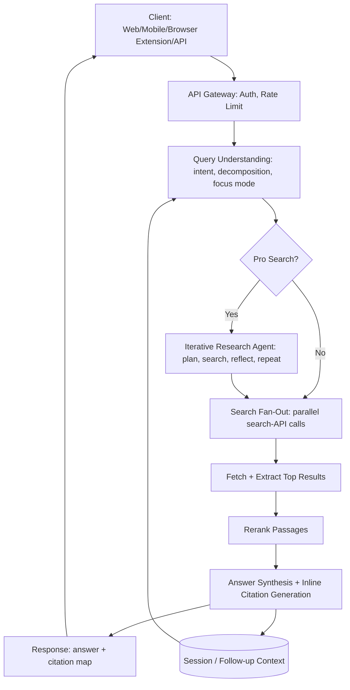
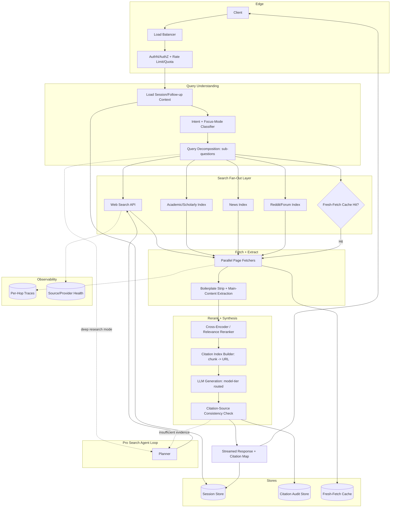
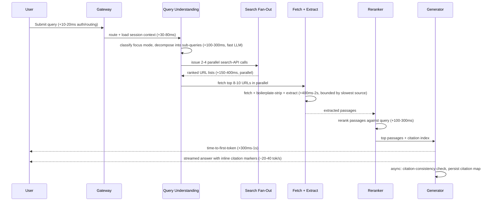
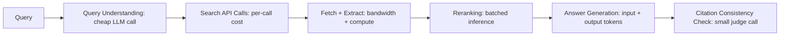
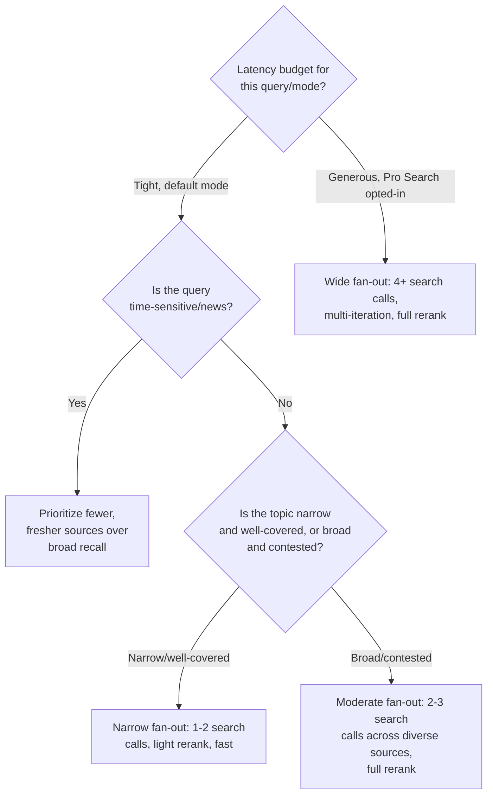

# Perplexity — System Design Case Study

## Requirements

**Functional**
- Answer a natural-language query by retrieving live information from the web and synthesizing a response grounded in retrieved sources, with inline, numbered citations (`[1]`, `[2]`, ...) mapping each claim back to a specific URL.
- Support follow-up questions within a research session, where prior turns and prior retrieved evidence inform query understanding for the next turn (a session is a chat thread, not a one-shot search box).
- "Pro Search" / deep-research mode: a multi-step, iterative retrieval process that plans sub-questions, searches and re-searches based on intermediate findings, and synthesizes a longer report-style answer — distinct from the single-pass default mode.
- Focus modes that constrain or bias the source pool: general web, academic/scholarly (papers, preprints), Reddit/social/forums, and news — each changing which search indexes or APIs are queried and how results are weighted.
- A developer-facing API (search/answer endpoints) exposing the same retrieval-and-citation pipeline for third-party integration.
- Source transparency: the user can see exactly which pages were used, and clicking a citation number takes them to the originating page.

**Non-functional**
- Time-to-first-token in the low seconds for a default query (this is a search product, not a chat product — users tolerate a visible "searching" state that ChatGPT-style chat does not always need).
- Freshness: a query about a same-day event must surface same-day sources; the system cannot rely on a stale or slow-to-update index for time-sensitive queries.
- Citation integrity: every sentence presented as a sourced fact must be traceable to a specific retrieved document; ungrounded filler is a correctness bug, not a style issue.
- Cost-bounded fan-out: each query triggers multiple downstream search/fetch calls, so the fan-out multiplier (not raw query count) is the dominant capacity-planning variable.
- Availability of a degraded-but-honest mode when a search provider or a specific source is unreachable, rather than silently fabricating an answer.

**Explicitly out of scope for this case study**: building and operating a general-purpose web crawler and search index at Google scale (most of the discussion below assumes reliance on third-party search APIs plus a thinner owned index, and that choice is itself analyzed in the Tradeoff Analysis); the underlying foundation model's pretraining (see [Transformer Internals for Systems Engineers](../02-llm-architecture/01-transformer-internals-for-systems-engineers.md)); and general RAG fundamentals, which are covered in depth in [RAG Architecture](../06-rag/01-rag-architecture.md) and only referenced here, not re-derived.

## Capacity Planning

Using the method from [GPU Sizing & Capacity Planning](../16-gpu-systems/02-gpu-sizing-and-capacity-planning.md), with illustrative, order-of-magnitude assumptions (not reported usage figures) to keep the arithmetic concrete:

| Step | Assumption | Result |
|---|---|---|
| Active users | 30M monthly active, ~15% active on a given day | ~4.5M DAU |
| Queries per active user/day | 3 queries/day average (search products see fewer, denser interactions than chat) | ~13.5M queries/day |
| Average QPS | 13.5M / 86,400s | ~155 QPS average |
| Peak-to-average ratio | Search traffic peaks 4-5x average around news cycles and waking hours across time zones | ~700-800 QPS peak |
| Pro Search fraction | ~10% of queries use multi-step deep research mode | ~70-80 QPS peak in deep-research path, ~650-700 QPS in default single-pass path |

**The fan-out multiplier is the number that actually sizes the system**, not query count. A single default-mode query does not make one search call — it typically triggers:

| Sub-step | Calls per query (illustrative) |
|---|---|
| Query understanding / decomposition | 1 LLM call (cheap/fast model) |
| Parallel search-engine/index calls (web + focus-mode-specific index) | 2-4 search API calls |
| Page fetch + extraction | 5-10 page fetches (top results across the search calls) |
| Reranking | 1 batched cross-encoder pass over fetched/extracted content |
| Answer synthesis with citations | 1 LLM generation call |

Taking a midpoint of **8 fetches and 3 search-API calls per query**:

- Search-API call volume: 13.5M queries/day x 3 ≈ **40M search-API calls/day**, or ~470 calls/sec average, ~2,000+/sec at peak.
- Page-fetch volume: 13.5M queries/day x 8 ≈ **108M fetch+extract operations/day**, ~1,250/sec average, ~5,000+/sec at peak — this, not the LLM call, is usually the first thing to fall over under load, because fetch latency is bimodal (fast CDN-backed pages vs. slow/unresponsive long-tail sites).
- Pro Search multiplies this further: a deep-research query runs the search→fetch→synthesize loop for **multiple sub-questions** (commonly 3-8 iterations), so a single Pro Search query can generate the search/fetch load of 5-10 default queries. At 10% of traffic running Pro Search with an average of 5 iterations, Pro Search alone contributes roughly as much downstream search/fetch load as the other 90% of traffic combined.

The takeaway that should drive every downstream architecture decision: **the bottleneck resource is search-API quota and fetch/extract throughput, not GPU tokens/sec**, which is the opposite of a typical chat product and the reason this case study's capacity story looks different from [ChatGPT](01-chatgpt.md)'s.

## Scale Estimation

- **Per-query evidence payload**: 8 fetched pages, extracted down to ~1-2KB of relevant text each after boilerplate stripping ≈ 8-16KB of evidence text per query before it ever reaches the generator. At 13.5M queries/day this is 100-200GB/day of transient extracted-content traffic — almost none of which needs to be durably stored, since it is re-fetched per query rather than served from a persistent index in the default-only-third-party-API design.
- **Owned freshness cache**: even when leaning on third-party search APIs, a thin owned cache of recently fetched-and-extracted pages (keyed by URL, with a short TTL of minutes-to-hours) avoids re-fetching the same trending page thousands of times in a single news cycle. At, say, 5M distinct URLs cached with a 6-hour TTL and ~5KB extracted text each, that's ~25GB resident — small, but it is the highest-leverage cache in the system because viral/trending queries concentrate fetches on a tiny URL set.
- **Citation-to-source mapping store**: every generated answer persists a structured list of `(sentence span, source URL, source snippet, retrieval rank)` tuples for audit, click-through tracking, and quality eval. At a few hundred bytes per citation and ~5 citations/answer average, this is on the order of 1-2KB/answer, or ~15-25GB/day of structured citation-audit data — small relative to the fetch traffic, but it is the artifact that the entire "every claim is sourced" promise depends on, so it gets retention and integrity guarantees disproportionate to its size.
- **Session/follow-up context**: a research session (initial query + follow-ups) keeps prior turns' queries and the citation list (not full page text) in context, growing a few KB per turn — orders of magnitude smaller than the fetch traffic and not a capacity driver.
- **Index freshness, if an owned index exists for any focus mode** (e.g., a curated academic/scholarly index rather than relying purely on a third-party API): freshness lag is the key SLO, not raw size — a same-day-news focus mode needs minute-level freshness; an academic-papers index can tolerate day-level lag, since papers are not breaking news.

## High Level Design



## Detailed Design



## API Design

A simplified view of the core search/answer endpoint — the same contract underlies the consumer app and the developer API:

```
POST /v1/search
{
  "query": "What caused the latest Federal Reserve rate decision?",
  "session_id": "sess_8f2a...",          // optional, ties into follow-up context
  "focus_mode": "news",                   // "web" | "academic" | "news" | "social" | "writing"
  "mode": "default",                      // "default" | "pro_search"
  "max_sources": 8                        // caller-tunable fan-out hint, server may cap
}

Response: a streamed event sequence —
  event: status        data: {"stage": "searching", "detail": "3 queries issued"}
  event: source         data: {"id": 1, "url": "https://...", "title": "...", "published_at": "..."}
  event: source         data: {"id": 2, "url": "https://...", "title": "..."}
  event: token          data: {"text": "The Federal Reserve"}
  event: token          data: {"text": " cited persistent"}
  event: citation       data: {"text_span": [18, 41], "source_ids": [1, 3]}
  event: token          data: {"text": " core inflation"}
  ...
  event: done           data: {
    "sources": [{"id": 1, "url": "...", "rank": 1}, ...],
    "usage": {"search_calls": 3, "fetches": 8, "model": "fast-tier"}
  }
```

Streaming is mandatory, not an optimization: the product surfaces a visible "searching the web" → "reading N sources" → "writing answer" progression, because a multi-second fan-out latency with no visible progress reads as broken. The `source` events are emitted **as soon as search results are known**, before generation begins, so the UI can render source cards while the model is still synthesizing — this decouples retrieval latency from the user's perception of total latency.

## Data Flow



A default-mode query realistically lands total answer time in the **3-6 second range**, dominated by fetch latency (the slowest of 8-10 parallel fetches sets the floor for that stage, not the average) — which is why production systems apply an aggressive per-fetch timeout and proceed with whatever sources returned in time rather than blocking on stragglers. Pro Search repeats the search→fetch→rerank loop per sub-question, so total latency for a 5-iteration deep research query is more realistically **20-60 seconds**, which is why it is presented as a distinct, slower product mode rather than hidden inside the default latency budget.

## Retrieval Layer

This is the core of the product, and it differs from a textbook RAG pipeline (see [RAG Architecture](../06-rag/01-rag-architecture.md)) in one structural way: the corpus is the live, open web rather than a fixed, owned corpus, so "indexing" is partly someone else's problem (a third-party search API) and partly a thin freshness/caching layer owned by the product.

**Index strategy.** Crawling and indexing the entire web from scratch is a multi-billion-dollar infrastructure commitment; the pragmatic default is to **lean on third-party search-API providers** for broad web recall (the same role a lexical/dense hybrid index plays in standard RAG) and to own only:
- A **fresh-fetch cache** (URL → extracted text, short TTL) to avoid re-fetching the same trending page on every one of thousands of concurrent queries about the same event.
- Optionally, a **narrow, curated index** for focus modes where third-party general search is a poor fit — academic/scholarly search benefits from a purpose-built index over arXiv/PubMed/Semantic-Scholar-style sources rather than general web search, because relevance signals (citation count, venue, recency) differ from general-web ranking signals.

**Multi-source fan-out.** A query is not routed to one index but to several in parallel, selected by focus mode:

| Focus mode | Sources fanned out to | Freshness need |
|---|---|---|
| General web (default) | General web search API | Minutes-to-hours |
| Academic | Scholarly index (papers, preprints) | Hours-to-days (papers don't break news) |
| News | News-specific index/API, filtered by recency | Seconds-to-minutes |
| Social/Reddit | Forum/social search API | Minutes |
| Writing | Minimal/no retrieval — closer to pure generation | N/A |

This is the same multi-query-fan-out pattern described generically as "multi-query/RAG-fusion" in [RAG Architecture](../06-rag/01-rag-architecture.md#design-patterns), applied across heterogeneous external indexes rather than across reformulations of one internal index.

**Citation-to-source mapping.** The defining engineering requirement of this product is that every generated sentence must be traceable to a source, which means the citation map has to survive every transformation in the pipeline intact:

1. Each fetched page is assigned a stable `source_id` at fetch time.
2. Extraction preserves provenance at the **passage** level — each extracted chunk carries its `source_id` forward, not just the page as a whole.
3. Reranking re-scores passages but must not drop the `source_id` tag.
4. The generator is prompted with passages **pre-labeled** with citation markers (e.g., `[1]`, `[2]`) so the model emits citation numbers as part of generation rather than a citation step trying to retroactively guess which source supports which sentence.
5. A post-generation **citation-consistency check** samples generated sentences and verifies the cited source's text actually entails the claim (a cheap NLI-style or LLM-judge check, not full formal verification) — this is the guardrail against the single worst failure mode for this product: a confident citation number next to a sentence the source doesn't actually support.

Skipping step 4 (i.e., trying to attribute citations after the fact via similarity search between generated sentences and source text) is a common and costly mistake — it decouples generation from grounding and reintroduces exactly the hallucination risk citations exist to prevent.

## Agent Layer

Default mode is a **single retrieval pass**: decompose, fan out, fetch, rerank, generate once. Pro Search (deep research mode) is a genuinely different architecture — a bounded **iterative retrieval agent** in the sense described in [Agentic RAG Architecture](../08-agentic-rag/01-agentic-rag-architecture.md): the system plans an initial set of sub-questions, retrieves for each, evaluates whether the gathered evidence is sufficient to answer the original query, and if not, generates follow-up sub-questions and retrieves again — repeating for a bounded number of iterations (commonly mid-single-digits) before synthesizing a final, longer report-style answer with citations aggregated across every iteration.

This loop is structurally the same pattern covered for general-purpose research agents in [Multi-Agent Research System](16-multi-agent-research-system.md) and the search-specific variant in [AI Search Engine](15-ai-search-engine.md): a planner, a tool-use step (search + fetch), a sufficiency check, and a loop-or-stop decision. The product-specific wrinkle is that the "tool" being called repeatedly is the same search fan-out used in default mode, just invoked multiple times with sub-queries the planner generates from gaps in prior evidence rather than once with the user's literal query.

The agent loop is bounded on two axes simultaneously: a **max-iteration cap** (prevents unbounded search cost on a query the model can't resolve) and a **time budget** (since this is still a user-facing request, not a background batch job) — when either is hit, the system synthesizes a final answer from whatever evidence has been gathered rather than failing the request, with an explicit note if coverage looks incomplete.

## Model Layer

Two distinct model-tiering decisions exist, and they map to the two modes:

- **Default mode** uses a smaller, fast model for both query decomposition and final synthesis. This works well specifically *because* retrieval quality is high: when the generator is handed well-reranked, directly relevant passages, the generation task collapses to summarization-with-attribution over provided text rather than open-ended reasoning or recall — a task smaller models handle reliably. This is the same principle noted generally in [RAG Architecture](../06-rag/01-rag-architecture.md#key-takeaways) ("retrieval quality is a hard ceiling on generation quality") read in the favorable direction: good retrieval also lowers the *floor* of model capability needed to produce a good answer.
- **Pro Search** uses a larger or longer-reasoning model for the planning/sufficiency-check steps (deciding what's missing and what to search next benefits from stronger reasoning) and can use either tier for per-iteration synthesis, with a more capable model typically reserved for the final report-level synthesis that has to integrate evidence gathered across multiple iterations coherently.

The query-decomposition step itself is also a model call, and it is deliberately kept on the cheapest viable model tier — it runs on every single query (unlike Pro Search's deeper loop) and a slow or expensive decomposition step would tax the entire product's latency and cost floor for marginal quality gain, since decomposition is a comparatively easy classification/rewriting task.

## Observability Layer

- **Per-hop latency tracing** broken out by stage (query understanding, search fan-out, fetch/extract, rerank, generation) at p50/p95/p99 — fetch/extract is the stage most likely to regress unpredictably (third-party site slowness is outside the product's control), so it needs its own dedicated dashboard rather than being folded into a single "retrieval" bucket.
- **Per-source/provider health**: search-API error rate and latency, and fetch success rate **per domain**, not just in aggregate — a handful of slow or blocking domains (paywalled sites, aggressive bot-detection) can quietly degrade a large share of queries if not tracked individually.
- **Citation integrity rate**: the fraction of sampled generated sentences whose cited source actually entails the claim, scored via the citation-consistency check described in the Retrieval Layer section — this is the single most important quality metric for this product, analogous to faithfulness/groundedness scoring in general RAG systems, and is tracked as a trend, not a one-time eval.
- **Search fan-out cost per query**: search-API calls and fetch count per query, tracked as a distribution, not just an average — a long tail of queries that trigger unusually wide fan-out (ambiguous queries, Pro Search edge cases) drives a disproportionate share of cost and is worth alerting on.
- **Answerable rate** and **no-fresh-source-found rate** for time-sensitive queries specifically (news/focus mode), since a stale answer to a "what happened today" query is a much worse failure than a stale answer to a general-knowledge query.

## Security Layer

The dominant product-specific risk is the same one called out generically in [RAG Architecture](../06-rag/01-rag-architecture.md#security) and in [AI Security Architecture](../21-ai-security/01-ai-security-architecture.md), but sharper here because the corpus is the **entire open web, fully attacker-reachable by design**: any page on the internet can contain text engineered to be retrieved and then instruct the model to ignore its task, fabricate a citation, or steer the answer (indirect prompt injection via SEO-optimized or planted content). Mitigations specific to this product:
- Fetched/extracted page content is always wrapped as untrusted data in the generation prompt, with the model instructed never to treat retrieved text as system-level instructions, regardless of how it's phrased on the page.
- The citation-consistency check doubles as an injection tripwire: a generated sentence that doesn't actually follow from its cited source — especially one suspiciously aligned with an injected instruction rather than the page's substantive content — is flagged before it reaches the user.
- Source reputation/trust signals (domain age, known spam/SEO-farm lists, HTTPS validity) feed into reranking, both for relevance and as a coarse defense against content specifically engineered to be retrieved and to manipulate the model.
- Rate limiting and quota enforcement on the fan-out layer prevent a single user (or a scripted attacker) from using a small number of queries to trigger an outsized number of downstream search/fetch calls — a cost-denial-of-service vector unique to fan-out architectures.
- The developer API needs the same per-tenant quota and abuse-detection rigor as any public API, since the search-API and fetch infrastructure are shared, finite-cost resources behind every key.

## Cost Model



| Cost component | Cost driver | Lever |
|---|---|---|
| Query understanding | One small LLM call per query | Use the cheapest viable model; this runs on 100% of traffic |
| Search-API calls | Per-call pricing from third-party provider(s), multiplied by fan-out (2-4 calls/query) | Cap parallel search calls per focus mode; avoid redundant calls across near-duplicate sub-queries |
| Fetch + extract | Bandwidth, fetch-service compute, and the long tail of slow/large pages | Per-fetch timeout, content-size caps, aggressive caching of trending URLs |
| Reranking | Batched cross-encoder pass over 8-10+ fetched passages per query | Cap candidate count fed to reranker; skip reranking for low-stakes/short queries if latency-bound |
| Generation | Input tokens (retrieved passages, often the largest line item) + output tokens | Trim passages to the relevant span rather than whole pages; route to fast model tier by default |
| Citation consistency check | A small judge call per sampled (or every) answer | Sample rather than check every sentence in low-risk focus modes; always check for news/time-sensitive claims |
| Pro Search multiplier | Repeats the entire chain above per iteration (3-8x) | Bound iteration count; reserve for an explicit user-selected mode, never silently auto-escalate default queries into it |

The single highest-leverage cost lever is **fan-out width**: going from, say, 8 fetches to 4 per default-mode query roughly halves the dominant fetch and reranking cost lines for most queries with only a modest recall cost — which is exactly the tension explored in the Tradeoff Analysis below. The second-highest lever is **Pro Search gating**: because it multiplies the entire cost chain by the iteration count, accidentally routing common queries into deep-research mode (rather than reserving it for genuinely complex, user-opted-in research tasks) is the most expensive possible misconfiguration in this system, structurally analogous to the fast/reasoning-tier misrouting risk called out in [ChatGPT](01-chatgpt.md#cost-model).

## Failure Handling

| Failure | Degradation strategy |
|---|---|
| Search-API provider outage or rate-limit exhaustion | Fail over to a secondary search-API provider if configured; if none available, serve from the fresh-fetch cache plus parametric model knowledge with an explicit "limited live search" disclosure rather than blocking the query |
| Slow/unresponsive source during fetch | Per-fetch timeout (low single-digit seconds); proceed with whichever fetches completed in time rather than waiting on the slowest source — a degraded source list beats a stalled request |
| A specific domain consistently fails to fetch (bot blocking, paywall) | Deprioritize that domain in future ranking for a cooldown window rather than retrying it on every query that surfaces it |
| Citation-source mismatch detected (generated claim not supported by cited source) | Strip or flag the unsupported citation before the response reaches the user rather than shipping a confidently wrong attribution; if the whole answer fails the check, regenerate once with stricter grounding instructions before falling back to a hedged response |
| Reranker service overloaded/down | Skip reranking, pass raw search-API ranking order to the generator — degraded relevance beats no answer, consistent with the general RAG fallback in [RAG Architecture](../06-rag/01-rag-architecture.md#reliability) |
| Pro Search iteration loop fails to converge (sufficiency check never passes) | Stop at the iteration cap and synthesize from whatever evidence exists, with an explicit "coverage may be incomplete" note, rather than looping indefinitely or timing out with no answer |
| Empty or low-relevance search results (obscure/ambiguous query) | Surface a low-confidence answer with reduced citation density and an explicit hedge, rather than fabricating sources to fill the citation slots |

## Tradeoff Analysis



The defining architectural fork in this product is **breadth vs. freshness vs. latency in the search fan-out**, because all three compete for the same budget and no configuration wins on all three simultaneously:

- **Breadth** (more search calls, more fetched sources, more diverse focus-mode indexes) improves recall and citation diversity but linearly increases search-API cost, fetch cost, and the latency floor (set by the slowest fetch in the batch).
- **Freshness** (prioritizing the most recently published/crawled sources) matters enormously for news-adjacent queries and is nearly irrelevant for stable factual or academic queries — treating freshness as a universal priority wastes fan-out budget on queries where an older, more authoritative source is actually the better citation.
- **Latency** is the hard constraint that breadth and freshness both spend against; a default-mode product promise of a few seconds to first token caps how wide the fan-out can realistically be, which is precisely why Pro Search exists as a separate, explicitly slower mode rather than the system trying to quietly widen fan-out on hard queries within the default latency budget.

Production resolution: route fan-out width by a combination of **focus mode** (news demands fresh-source bias over breadth; academic tolerates more latency for precision) and **query ambiguity/complexity** (a narrow factual lookup needs 1-2 sources; a broad, contested, or comparative question benefits from deliberately diverse sources to avoid single-source bias) — and reserve genuinely wide, multi-iteration fan-out for the explicit, user-opted-in Pro Search mode rather than trying to silently widen default-mode fan-out per query, which would make latency unpredictable and erode the product's core promise of fast, sourced answers.

## Interview Discussion

This case study gets asked specifically to test whether a candidate can go past "it's a RAG chatbot." A weak answer describes retrieval, generation, and citations as if there's one search call per query and stops there. A strong answer immediately separates the **fan-out problem** (a query becomes several parallel search and fetch calls, not one, and that multiplier — not query volume — is what sizes the system) from the **citation integrity problem** (provenance has to survive extraction, reranking, and generation intact, or the product's core promise is broken) from the **agentic deep-research mode** (Pro Search is architecturally a bounded iterative retrieval agent, not a bigger version of the default pipeline, and deserves the same planner/tool-use/sufficiency-check framing as any agent system — see [Agentic RAG Architecture](../08-agentic-rag/01-agentic-rag-architecture.md) and [Multi-Agent Research System](16-multi-agent-research-system.md)).

A candidate who proactively raises the **breadth/freshness/latency tradeoff in fan-out width**, without being prompted, is demonstrating exactly the kind of judgment this case study is meant to surface — it's the one design decision that simultaneously drives cost, latency, and answer quality, and there is no universally correct fan-out width, only a width appropriate to a given focus mode and latency budget.

Strong Staff-level follow-up probes to expect:
- "A user asks a question and the search results come back contradictory — what does the system do?" (Surface the disagreement explicitly with sources on each side rather than silently picking one and presenting it as settled; this is a citation-integrity question disguised as a retrieval question.)
- "How do you detect that a citation is wrong before the user does?" (The citation-consistency check — an automated entailment/judge pass between generated claim and cited source text, sampled in production and tracked as a first-class quality metric, not a one-time eval.)
- "Why not just always run Pro Search-style multi-step retrieval — wouldn't that always produce a better answer?" (Cost and latency scale with iteration count, and most queries don't need it; the right framing is that default mode and Pro Search are different points on the same breadth/latency tradeoff curve, not that one is strictly better.)
- "How would this change if you owned your own web index instead of calling a third-party search API?" (Tests whether the candidate understands the build-vs-buy tradeoff explored in the Retrieval Layer and Tradeoff Analysis sections — owning the index trades a large fixed infrastructure investment for control over ranking signals and freshness SLOs that a third-party API doesn't expose.)
