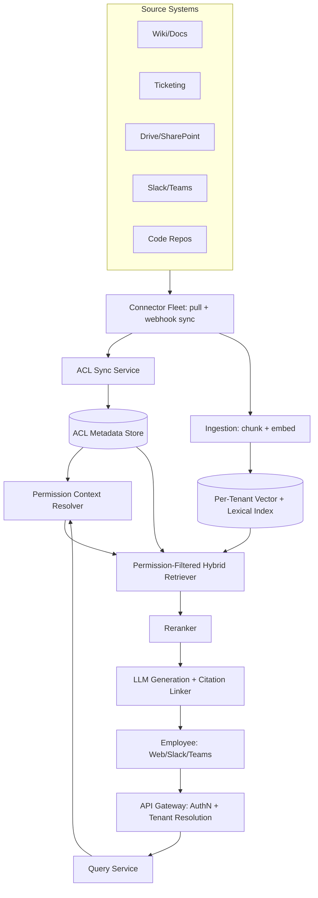
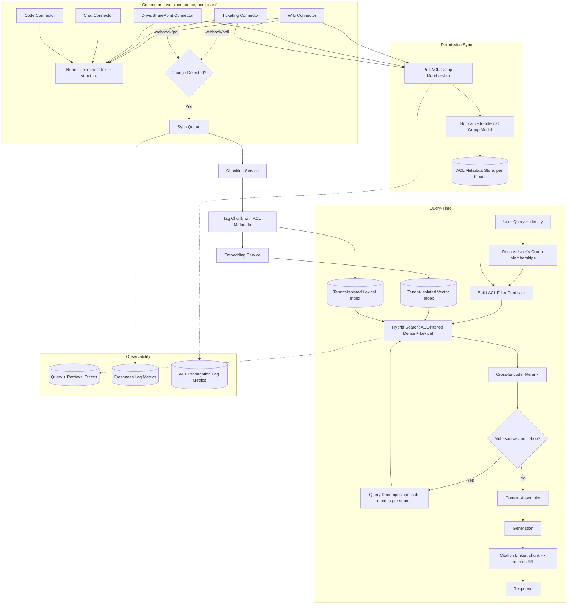
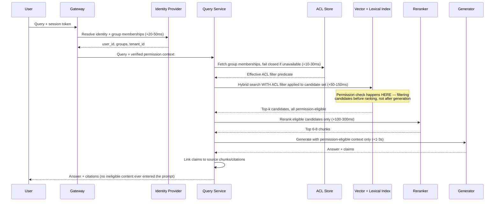
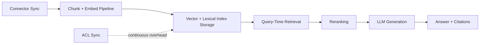
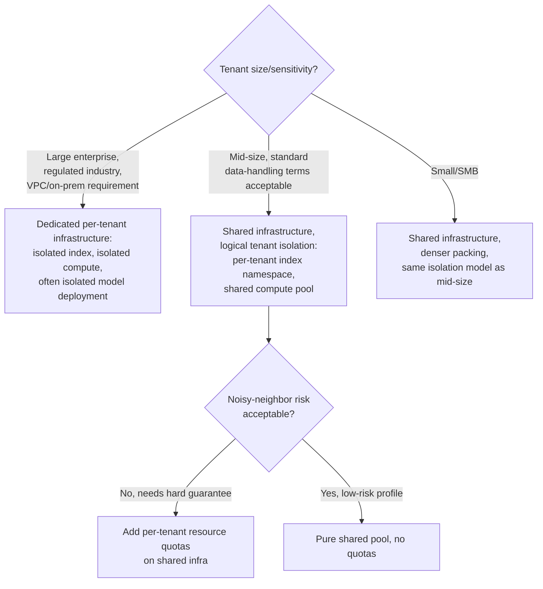

# Enterprise RAG Platform — System Design Case Study

## Requirements

**Functional**
- Connect to a heterogeneous set of internal data sources per customer organization via **connectors**: wikis (Confluence, Notion), ticketing (Jira, Zendesk, ServiceNow), file storage (Google Drive, SharePoint, Box), chat (Slack, Teams), and code (GitHub, GitLab) — typically dozens of connector types, with a given enterprise customer enabling some subset of them.
- Ingest content from every connected source, keep it fresh as source content changes, and make it queryable through a single natural-language interface.
- Answer natural-language questions and produce summaries that synthesize information across multiple sources in one answer (e.g., "what's the status of Project Falcon" pulling from a wiki page, three Jira tickets, and a Slack thread).
- Enforce **per-user, per-group permissions inherited from the source systems** — a user must never see, in a retrieved snippet or generated answer, content they could not already see by logging into the source system directly. This is not a separate permission model bolted onto the product; it is a mirror of each source's native ACLs.
- Multi-tenant SaaS deployment: one platform, one codebase, serving many customer organizations (tenants), each with their own connected sources, users, and data that must never cross tenant boundaries.
- Citations linking every claim in a generated answer back to the specific source document (and ideally the specific paragraph/comment) it came from.

**Non-functional**
- Freshness: a newly created or edited document should be searchable within a bounded window — tight for high-velocity sources (chat, tickets: minutes), looser for low-velocity sources (wiki pages, policy PDFs: hours) is an acceptable, explicit tradeoff.
- Permission correctness is the dominant non-functional requirement of this entire product category: a single instance of a user seeing a document they shouldn't is a severe trust and compliance failure, materially worse than a wrong answer or a slow answer.
- Multi-tenant isolation: no tenant's data, query logs, or embeddings are ever retrievable by another tenant, even under infrastructure sharing.
- Query latency: a few seconds end-to-end is acceptable for a synthesis-style answer (this is a knowledge-work tool, not a low-latency consumer chat surface), but connector sync and ACL propagation latency must be tracked as a first-class SLO, not just query latency.
- Auditability: every answer and every retrieval should be traceable for compliance review (who asked, what was retrieved, what was shown).

**Explicitly out of scope for this case study**: the connector SDK's per-source API integration details (OAuth flows, rate-limit handling per vendor API — a connectors-platform engineering problem in its own right), the underlying foundation model's training, and end-user UI/UX. The sibling case study on [Glean-style enterprise search](20-glean-enterprise-search.md) covers one specific real-world product built on this pattern in more product-level detail; this case study stays at the generic platform-architecture level.

## Capacity Planning

Using the method from [GPU Sizing & Capacity Planning](../16-gpu-systems/02-gpu-sizing-and-capacity-planning.md), with illustrative, order-of-magnitude assumptions:

| Step | Assumption | Result |
|---|---|---|
| Tenants on the platform | 2,000 enterprise customers | 2,000 tenants |
| Employees per tenant | Mix of small (50), mid (500), and large (5,000) orgs, weighted average ~400 | ~800,000 total seats |
| Documents per tenant across all connectors | A mid-size org: ~20K wiki pages, ~100K tickets, ~500K Drive/SharePoint files, ~2M Slack messages, ~50K code files → ~2.7M source items/tenant | ~2.7M items/tenant average |
| Total corpus size across all tenants | 2,000 tenants × 2.7M items | ~5.4B source items platform-wide |
| Chunks per item | Average 2-3 chunks per item after splitting (a Slack message is often 1 chunk; a long wiki page is 10+) | ~3x multiplier → ~16B chunks platform-wide |
| Queries per employee per day | Knowledge workers query an internal search/QA tool a few times a day when they use it; assume 0.5 queries/employee/day platform-wide average (most employees don't use it daily) | ~400,000 queries/day |
| Average QPS | 400,000 / 86,400s, concentrated in working hours across time zones | ~5 QPS raw average, but realistically ~25-40 QPS once concentrated into a ~10-hour overlapping business-hours window per region |
| Peak QPS | Business-hours traffic peaks 3-4x the business-hours average at the start of the day and after lunch | ~100-150 QPS peak platform-wide |
| Tokens per query | ~3,000-5,000 input tokens (retrieved chunks + history + instructions), ~300-500 output tokens | ~500K input tok/s, ~50K output tok/s at peak — modest by consumer-chat standards |

The capacity story here is **not** generation-bound the way a consumer chatbot is — query volume per employee is low relative to consumer chat, and 100-150 QPS peak is a small serving fleet. The dominant cost and engineering load instead comes from two places that have no analogue in single-tenant chat products:

1. **Ingestion/re-indexing load.** Every connector for every tenant runs continuous or polling sync. At ~5.4B source items platform-wide with even a modest 2%/day average change rate (edits, new docs, deletions) across all sources, that's ~108M item changes/day requiring re-chunking and re-embedding — a sustained background workload that, in token terms, dwarfs query-time generation: 108M changed items × ~300 tokens average × embedding cost is a recurring six-figure-token-count daily job, decoupled from and largely independent of query QPS.
2. **ACL sync load.** Permission metadata changes (a user leaves a group, a document is shared/unshared) must propagate on their own freshness SLO, separate from content freshness — and at 800K seats across 2,000 tenants, group/permission membership changes are a continuous, non-trivial stream even when content itself is static.

**Multi-tenant dimension.** Sizing per-tenant matters more than aggregate platform sizing here, because tenant sizes vary by two-plus orders of magnitude (50-seat company vs. 5,000-seat company) and the platform must avoid a single huge tenant's ingestion or query burst degrading every other tenant sharing the same infrastructure — the "noisy neighbor" problem addressed in Failure Handling and Tradeoff Analysis below.

## Scale Estimation

- **Vector index size**: ~16B chunks platform-wide, at ~768-1536 dimensions per embedding (float32 or quantized int8). At 768 dims, int8 quantized: ~768 bytes/vector → ~12 TB of raw vector data platform-wide, before HNSW graph overhead (typically 1.2-2x the raw vector size) — so a realistic working figure is **20-25 TB of index storage** across all tenants, before replication.
- **Per-tenant index size**: a mid-size tenant (2.7M items → ~8M chunks) needs roughly 6-10 GB of index storage — small enough that even a "dedicated index per tenant" strategy is operationally tractable; a large 5,000-seat tenant with proportionally more content might run 10-20x that.
- **Metadata/ACL store**: every chunk carries ACL metadata (owning groups, explicit shares, sensitivity labels). At 16B chunks and ~200 bytes of ACL metadata per chunk, that's ~3.2 TB of metadata — frequently the part of the system most underestimated at design time, because it's small per-chunk but multiplies by the full chunk count, not the document count.
- **Connector sync bandwidth**: a full initial sync for a new 5,000-seat tenant pulling ~25M source items (proportionally larger corpus) at an average 50 KB/item (text-extracted) is over 1 TB of data to pull, parse, and embed during onboarding — onboarding a large tenant is itself a capacity-planning event, not a background task.
- **Fan-out per query**: a single multi-hop question ("compare what Project Falcon's Jira board says vs. what was last discussed in the #falcon Slack channel") can issue 2-5 separate retrieval calls across different source-specific sub-indexes before synthesis, multiplying effective retrieval QPS several-fold relative to raw user-facing query QPS — the same fan-out effect noted in the [RAG Architecture](../06-rag/01-rag-architecture.md) chapter, amplified here because sources are genuinely heterogeneous rather than one corpus.

## High Level Design



## Detailed Design



## API Design

The query endpoint treats the requester's permission context as a mandatory, first-class field — never an optional header bolted on afterward:

```
POST /v1/tenants/{tenant_id}/query
{
  "user": {
    "user_id": "u_48213",
    "auth_token": "<verified session token>",
    "group_memberships": ["eng-all", "project-falcon", "managers"]  // resolved server-side from auth_token, never trusted from client
  },
  "query": "What's the latest status on Project Falcon, and are there any open blockers?",
  "sources_scope": ["wiki", "jira", "slack"],   // optional: restrict which connectors to search
  "max_results": 8
}

Response:
{
  "answer": "Project Falcon is on track for the Q3 release...",
  "citations": [
    {"source": "jira", "doc_id": "FALCON-231", "url": "https://...", "snippet": "...", "permission_scope": "project-falcon"},
    {"source": "slack", "doc_id": "C0123/p1234567", "url": "https://...", "snippet": "..."}
  ],
  "retrieval_meta": {
    "candidates_considered": 47,
    "candidates_after_acl_filter": 12,
    "sources_queried": ["wiki", "jira", "slack"]
  }
}
```

The `group_memberships` field is shown for illustration only — in a real implementation it is **re-resolved server-side from the identity provider on every request** (or from a short-TTL cache), never accepted as client-supplied input, because a client-supplied permission claim is a direct privilege-escalation vector. `candidates_after_acl_filter` in the response metadata is a deliberate observability hook: a large gap between candidates considered and candidates surfaced is a useful signal for both debugging relevance and auditing that filtering is actually happening.

## Data Flow



The load-bearing detail in this sequence is that the ACL filter is applied **as part of the retrieval query itself** — a metadata predicate combined with the ANN/lexical search, not a filter run over results afterward. A document the user cannot see is never retrieved, never reranked, never placed in the LLM's context, and therefore structurally cannot appear in the answer, get logged into a trace alongside the answer, or leak through a caching layer. Checking permissions only on the final answer (e.g., "does this answer mention anything sensitive") is a categorically weaker design: by that point the model has already read the disallowed content, and a bug in the after-the-fact check is silent and total, whereas a bug in retrieval-time filtering is far more likely to fail closed (return nothing) than to leak.

## Retrieval Layer

This is the architectural core of an enterprise RAG platform — more load-bearing than the choice of generation model.

**Permission-aware indexing: metadata-filtered vs. per-group indexes.** Two designs compete:

1. **ACL metadata stored alongside each chunk, filtered at query time.** Every chunk carries a list of group IDs (and/or explicit user IDs) that may see it. The vector DB's metadata filtering capability (most production vector databases support this natively) applies the filter as a pre- or post-filter on the ANN search. This is the dominant production pattern: one index per tenant, ACLs as metadata, filter pushed into the search itself.
2. **Separate index per permission group.** Build one sub-index per distinct ACL combination. This avoids per-query filtering cost but explodes index count combinatorially — real organizations have ACL combinations in the thousands to tens of thousands once nested groups, explicit shares, and per-document overrides are considered, making this approach operationally unworkable past small organizations. It survives only in narrow cases (e.g., a small, fixed number of sensitivity tiers like "public/internal/restricted" layered on top of metadata filtering for the fine-grained part).

Production systems use (1) as the default and reserve a coarse version of (2) — sharding by a small number of broad sensitivity tiers — as a performance optimization layered on top, not a replacement.

**Handling permission changes after indexing.** A document's ACL can change after the chunk is already indexed (a file is shared more broadly, or access is revoked). This creates a **staleness window** between the source-system change and the index reflecting it:

- **Over-permissive staleness** (access was revoked but the index still grants it): the platform serves a document to someone who should no longer see it. This is the dangerous direction.
- **Under-permissive staleness** (access was newly granted but the index hasn't caught up): the platform fails to surface a document the user is now entitled to see. This is an annoyance, not an incident.

The correct default is **fail closed**: ACL sync runs on a tighter, independently monitored SLO than content sync (minutes, not hours), and any chunk whose ACL freshness cannot be confirmed within a bound is excluded from candidate sets rather than included. Concretely: ACL metadata carries its own "last verified" timestamp separate from the content's; if that timestamp is older than the platform's ACL-freshness SLO, the safe behavior is to either re-verify synchronously against the source system before including the chunk (adds latency, used for sensitive sources) or drop it from the candidate set (used for everything else). This makes ACL sync lag a **safety-critical SLO**, not just a UX freshness metric like content lag.

**Freshness sync across heterogeneous connectors.** Different sources have wildly different update cadences and different native change-notification capabilities:

| Source type | Update cadence | Sync mechanism | Practical freshness SLO |
|---|---|---|---|
| Slack/Teams | Continuous, high volume | Webhook/event stream | Minutes |
| Ticketing (Jira) | Frequent, bursty | Webhook where available, else short-poll | Minutes |
| Wiki (Confluence/Notion) | Moderate | Webhook or change-log polling | Tens of minutes to hours |
| Drive/SharePoint | Moderate, large fan-out per edit (shared docs) | Change-token/delta API polling | Tens of minutes to hours |
| Code repos | Bursty (commits, PR merges) | Webhook on push/merge | Minutes, but lower query relevance urgency |

Polling-based connectors (the majority, since not every source vendor offers reliable webhooks) need incremental sync via change tokens or "modified since" cursors — a full re-crawl per sync cycle does not scale past a few thousand documents per tenant, let alone millions. The ingestion pipeline therefore needs the same idempotent, retryable, monitored treatment as any production data-engineering system: a re-run after a partial failure must not duplicate chunks or double-charge embedding cost.

## Agent Layer

Most single-fact queries ("what's our PTO policy") resolve with a single retrieval pass. But a meaningful fraction of real enterprise questions are inherently **multi-hop and multi-source**: "what did we decide about Project Falcon's launch date, and has anything changed since the last planning doc was written" requires retrieving from a wiki (the planning doc), then forming a follow-up retrieval against Slack/Jira scoped to "since [doc's last-updated date]," then synthesizing both. This requires query decomposition — breaking one user question into source-scoped sub-queries — and an iterative retrieve-reason-retrieve loop rather than a single fixed retrieval pass.

This platform layers a bounded agent loop on top of the retrieval layer for queries the system detects as multi-hop (heuristically, or via a lightweight classifier on query structure): decompose into sub-queries, retrieve per sub-query (each sub-query still passes through the same permission filter independently — decomposition must not become a way to bypass per-chunk ACL checks), and synthesize. The general pattern — retrieval as an iterative tool the model calls adaptively rather than a fixed pre-generation step — is covered in [Agentic RAG Architecture](../08-agentic-rag/01-agentic-rag-architecture.md); this platform is one of the more common real-world reasons that pattern exists, since "search five different systems and combine the answer" is a poor fit for single-pass retrieval.

## Model Layer

The generation model choice in enterprise RAG is constrained less by raw capability than by **where the customer's data is allowed to go**. Three tiers of customer requirement are common:

- **Third-party API model acceptable**: the customer is comfortable with retrieved chunks and queries leaving their network boundary to a model provider's API, typically under a data-processing agreement with no-training/no-retention guarantees.
- **VPC-deployed or dedicated-tenant model required**: the customer (often regulated industries — finance, healthcare, government, defense contractors) requires the model to run inside their own cloud VPC or a dedicated single-tenant deployment, so retrieved enterprise data never transits a shared multi-tenant inference endpoint, regardless of contractual guarantees.
- **Fully self-hosted/on-prem model required**: the strictest customers require the model weights themselves to run on infrastructure they control, with no network egress at all for inference traffic.

This is why most mature enterprise RAG platforms maintain a **multi-model serving strategy** rather than committing to a single provider: a default closed-API model for most tenants, and a self-hosted open-weight model option (served per-tenant or per-region) for customers whose data-handling requirements rule out the default path. The retrieval and permission-enforcement architecture stays identical across both — only the generation backend changes — which is precisely the design point argued in [Open Source vs. Closed Models](../23-staff-level-architecture/03-open-source-vs-closed-models.md): the answer for a platform serving many enterprise customers is usually "support both, tiered by customer requirement," not a single global choice.

## Observability Layer

- **Per-query retrieval trace**: candidates considered, candidates surviving the ACL filter, final reranked set, and which connector(s)/sources contributed — the single most useful artifact for both relevance debugging and compliance audit.
- **Freshness lag per connector per tenant**: time between a source-system change and that change being queryable. Tracked per connector type because cadences differ by an order of magnitude (Slack vs. wiki), so a single platform-wide freshness number hides real regressions.
- **ACL propagation lag**, tracked separately from and with a tighter alerting threshold than content freshness lag — this is the metric that pages someone, not just informs a dashboard, because a regression here is a security incident in waiting, not a quality blemish.
- **Connector sync failure rate and backlog depth** per tenant per source — a stuck connector is invisible to users until staleness becomes obvious, so it needs its own alert before that happens.
- **Permission-filter effectiveness**: rate of (candidates considered) vs. (candidates after ACL filter) — a sudden drop toward "filter removes nothing" for a tenant known to have restricted content is a strong signal the filter itself broke, not that permissions loosened.
- **Per-tenant cost and query volume**, since both ingestion and query cost should map back to a tenant for usage-based billing and for catching one tenant's runaway connector sync before it becomes a platform-wide incident.

## Security Layer

The single most catastrophic failure mode for this entire product category is **permission leakage**: surfacing, in a retrieved snippet, a citation, or a generated answer, content the requesting user is not authorized to see in the source system. Unlike a wrong answer or an outage, this failure mode is a trust and compliance event that can end a customer relationship and trigger regulatory exposure, and it is uniquely dangerous in this product because the entire pitch of the platform is "search everything" — the bigger and more useful the corpus, the larger the blast radius of a permission bug. See [SSO, Permissions & RAG ACL Enforcement](../22-enterprise-ai/04-sso-permissions-and-rag-acl-enforcement.md) for the general enforcement architecture; the platform-specific points worth calling out explicitly:

- **Permission checks belong at retrieval time, not at the UI or post-hoc answer-filtering layer.** A UI-layer redaction or an answer-level "does this look sensitive" check both leave a window where disallowed content already reached a log, a cache, or the model's context — any of which is itself a leak surface independent of what the user ultimately sees on screen.
- **ACL staleness is the recurring, structural version of this risk**, not a one-time bug class — every connector's permission sync has nonzero lag, so the system must be designed assuming that lag exists permanently and bounding the blast radius (fail-closed on uncertain freshness) rather than assuming sync will eventually be "fast enough" to ignore.
- **Cross-tenant isolation is a second, independent failure mode**: a bug that lets tenant A's query touch tenant B's index is categorically worse than an intra-tenant permission leak, because the blast radius spans organizations with no relationship to each other. Tenant ID must be a mandatory, server-resolved dimension on every index lookup, never an optional or client-suppliable parameter.
- **Retrieved content is still untrusted input** for prompt-injection purposes, same as general RAG (see [RAG Architecture](../06-rag/01-rag-architecture.md)) — a malicious actor with write access to even a low-sensitivity internal wiki page can attempt to plant instructions a later query's generation step might follow, compounding the permission problem with a content-integrity problem.
- **Audit logging itself needs ACL awareness**: an audit log that records full retrieved content for every query becomes its own permission-leakage surface if the audit tooling's access controls are weaker than the product's.

## Cost Model



| Cost component | Cost driver | Lever |
|---|---|---|
| Connector sync/ingestion | Volume of changed content per day across all tenants (~108M items/day in the worked estimate above) | Incremental/delta sync instead of full re-crawl; batch embedding calls |
| Embedding compute | Tokens embedded per changed item, repeated continuously, not just at onboarding | Skip re-embedding unchanged content; batch at ingestion |
| Index storage | ~16B chunks platform-wide, ACL metadata adding ~20% on top of vector storage | Tiered storage (hot tenants vs. cold/inactive tenants), quantized embeddings |
| ACL sync | Continuous group-membership/permission polling across all tenants and sources | Event-driven (webhook) sync over polling wherever the source supports it |
| Retrieval (query-time) | QPS x candidate set size x index size per tenant | Per-tenant index sharding keeps each query touching a small index, not the platform-wide corpus |
| Reranking | Candidates per query x model cost | Skip/lighten reranking for low-stakes or cached query patterns |
| Generation | Input tokens (retrieved context) dominate over output tokens at typical k=6-8 chunk retrieval | Context trimming to the minimum chunk count an eval shows is sufficient; model tiering by customer data-handling requirement (see Model Layer) |

The cost shape here differs from a consumer chat product in one important way: **ingestion and ACL sync are continuous background costs that scale with content and organization size, not with query volume** — a tenant that rarely queries the system still costs the platform money every day in connector polling and re-indexing. This is why enterprise RAG pricing models are typically seat-based or source/connector-based rather than purely query-metered: query-based pricing would undercharge for the dominant cost driver.

## Failure Handling

| Failure | Degradation strategy |
|---|---|
| Connector sync failure (a source API is down or rate-limited) | Serve from the last successfully synced index state with a visible "as of" freshness indicator — **stale but available beats blocking the whole product**; alert on backlog depth, don't fail user queries |
| ACL sync lag creating an over-permissive window (access was revoked, index hasn't caught up) | Fail closed: exclude any chunk whose ACL freshness exceeds the platform's verified-freshness SLO from candidate sets, even at the cost of under-retrieving. **Under-permissive is the safe default direction**, not over-permissive |
| ACL sync lag creating an under-permissive window (access was newly granted, index hasn't caught up) | Acceptable, bounded UX annoyance — surface a "some recently shared content may not appear yet" notice rather than synchronously blocking on a full re-verify for every query |
| One tenant's load spike (e.g., a bulk connector onboarding or a query-volume burst) degrading other tenants on shared infrastructure | Per-tenant rate limiting and resource quotas at the connector-sync, embedding, and query layers; a noisy tenant should exhaust its own quota, not the platform's shared capacity |
| Vector DB or index shard outage for a tenant | Fall back to lexical-only retrieval for that tenant rather than failing all queries; other tenants' shards are unaffected if isolation is done correctly |
| Generation model provider outage | Fall back to a secondary model/region; retrieval and citations remain intact even if generation degrades to a shorter or templated response |
| Bulk permission change (e.g., an org-wide reorg revokes a large group's access) | Treat as a priority re-sync event, not standard-cadence polling — large blast-radius ACL changes deserve faster-than-default propagation specifically because the cost of staleness scales with how many documents are affected |

## Tradeoff Analysis



The defining architectural fork in this platform is **per-tenant dedicated infrastructure vs. shared multi-tenant infrastructure with logical isolation**, and it is not a single platform-wide choice — it is a per-tenant decision driven by tenant size, regulatory sensitivity, and contractual data-handling requirements (see [Multi-Tenancy for AI Platforms](../22-enterprise-ai/02-multi-tenancy-for-ai-platforms.md)).

- **Dedicated infrastructure** (isolated vector index, isolated compute, sometimes an isolated model deployment in the customer's own VPC) gives the strongest isolation guarantee and is usually mandatory for large, regulated, or contractually demanding customers, at meaningfully higher fixed cost per tenant — operationally, it also means N separate things to monitor, patch, and scale instead of one shared fleet.
- **Shared infrastructure with logical isolation** (one platform, per-tenant index namespaces enforced by mandatory tenant-ID filtering on every query, shared compute pool) is dramatically cheaper per tenant and is the right default for the long tail of small-to-mid customers, but it concentrates blast radius: a tenant-isolation bug or a noisy-neighbor resource spike risks affecting many customers from one root cause, which is why per-tenant quotas on shared infrastructure are not optional hardening — they are the mechanism that makes "shared" an honest claim rather than "shared until someone's bulk sync starves everyone else."

Most production platforms run both models simultaneously, segmented by customer tier, rather than picking one — which is itself the Staff-level insight: the question is never "which model is correct" but "where is the line, and what decides which side of it a given customer falls on."

## Interview Discussion

This case study gets asked specifically because it looks, on the surface, like a restatement of generic RAG — and the gap between candidates who treat it that way and candidates who don't is large and immediately visible to an interviewer. A **weak answer** describes connectors, chunking, embeddings, and a reranker, essentially repeating the generic [RAG Architecture](../06-rag/01-rag-architecture.md) pipeline with "enterprise" prepended, and mentions permissions only if directly prompted, usually as a vague "we'd add an access check."

A **strong answer** leads with permission enforcement as the hardest and most distinguishing problem in this product category — before describing chunking strategy or model choice — and is explicit that the permission model is not the platform's invention but a **mirror of each source system's native ACLs**, synced and kept fresh independently of content. A strong answer also reasons concretely about the **ACL staleness window**: that it always exists (sync lag is structural, not a bug to be eliminated), that the two staleness directions have asymmetric consequences, and that the system should default to fail-closed (under-permissive) rather than fail-open (over-permissive) — and can explain *why* in one sentence: under-permissive costs a missed document; over-permissive costs a trust and compliance incident.

Staff-level follow-up probes to expect: "A document's permissions just got more restrictive — walk me through exactly what happens to a chunk that's already indexed, second by second, until the index catches up." (Tests whether the candidate has a concrete mechanism — a freshness timestamp and a filter threshold — rather than a hand-wave.) "How would you design the system differently for a customer who refuses to let their data leave their own cloud account?" (Tests whether the candidate separates the retrieval/permission architecture, which stays constant, from the generation backend, which becomes VPC-deployed or self-hosted — see [Open Source vs. Closed Models](../23-staff-level-architecture/03-open-source-vs-closed-models.md).) "One tenant just connected a source with 10 million documents overnight — what breaks first?" (Tests whether the candidate anticipates onboarding as a capacity-planning event and has a per-tenant quota story, not just a platform-wide autoscaling answer, tying back to the [Multi-Tenancy for AI Platforms](../22-enterprise-ai/02-multi-tenancy-for-ai-platforms.md) isolation tradeoff.) A candidate who raises multi-hop query decomposition across sources unprompted, and correctly notes that each decomposed sub-query must independently pass the same permission filter, is demonstrating exactly the depth this case study is designed to surface.
