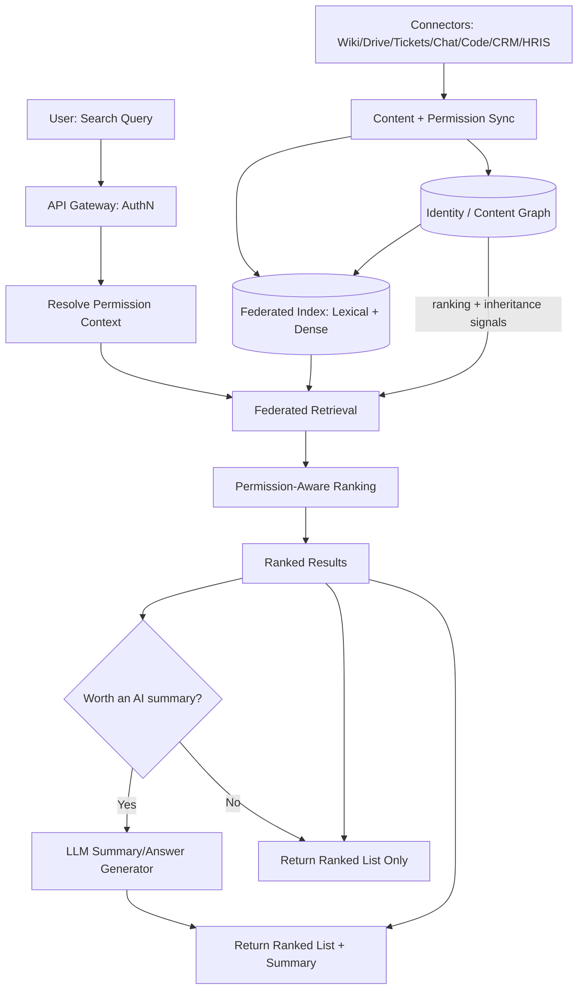
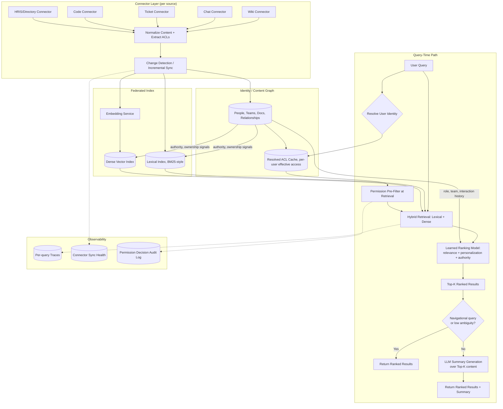
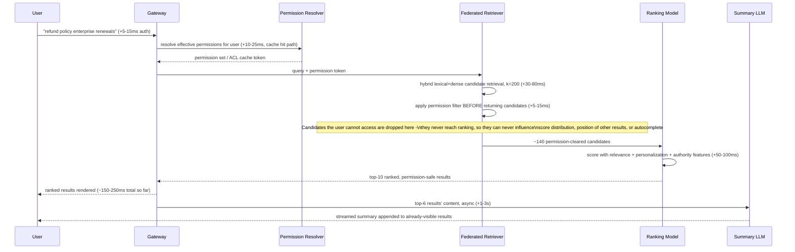
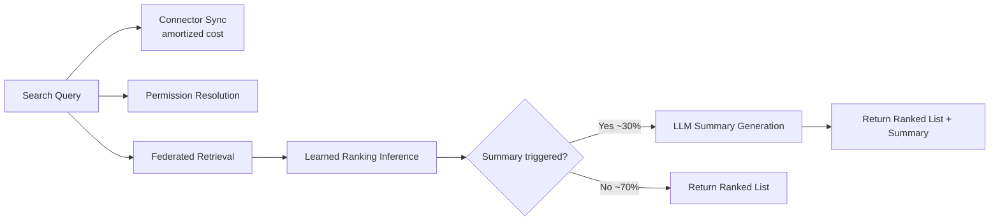
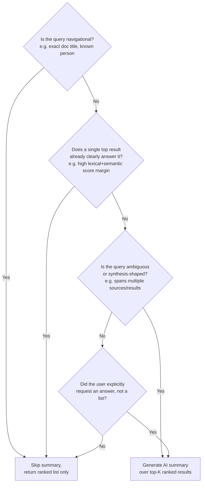

# Glean-Style Enterprise Search — System Design Case Study

This case study describes the publicly known shape of Glean's product category — unified, permission-aware enterprise search with an AI-generated answer layered on top — not Glean's confirmed internal architecture. All numbers below are illustrative, order-of-magnitude assumptions used to make the capacity-planning arithmetic concrete, not reported usage figures.

## Requirements

**Functional**
- A single search bar that federates results across dozens of connected enterprise tools: wikis (Confluence, Notion), document stores (Google Drive, SharePoint), ticketing (Jira, Zendesk), chat (Slack, Teams), code (GitHub, GitLab), CRM (Salesforce), and people/org-chart data (HRIS, directory services).
- Ranked results as the primary response — a classic "ten blue links" experience, returned fast, across heterogeneous content types (documents, messages, tickets, code, people profiles).
- An optional AI-generated summary/answer synthesized from the top-ranked results, displayed above or alongside the ranked list, not instead of it.
- Personalized ranking: a result's position depends on the searching user's role, team, recent activity, and past interaction history, not just global relevance.
- People search and org-chart navigation as first-class query types ("who owns the billing service," "who is my skip-level's skip-level").
- Permission-aware results: a user only sees, and only ever gets a hint of the existence of, content they are authorized to access in the source system.
- Autocomplete/typeahead suggestions that respect the same permission boundary as full search results.
- An admin surface for connector configuration, sync health, and content-source coverage reporting.

**Non-functional**
- Search latency: ranked results in well under a second (sub-300-500ms server-side is the realistic target for a snappy "as-you-type" feel); the optional AI summary is allowed a separately budgeted few extra seconds since it streams in after the ranked list is already visible.
- Permission correctness is the dominant non-functional requirement: a false negative (hiding something the user can see) is an annoyance; a false positive (showing or hinting at something the user cannot see) is a security incident. The system must fail closed.
- Freshness varies enormously by source: a Slack message should be searchable within seconds to low minutes; a wiki page edit within minutes; a rarely-changing HRIS org-chart record within hours is acceptable.
- Multi-tenant isolation: one customer's content, query logs, and learned ranking signals must never cross into another tenant's index or model.
- Horizontal scalability across a long tail of connector types, each with its own API rate limits, pagination quirks, and permission models — the system must be operable when 60 connector types exist, not just the 5 a single team builds first.

**Explicitly out of scope for this case study**: building the source systems themselves (Slack, Jira, etc.), the embedding/foundation model's pretraining (see [Transformer Internals for Systems Engineers](../02-llm-architecture/01-transformer-internals-for-systems-engineers.md)), and general enterprise SSO/identity-provider setup beyond what is needed to resolve a searching user's effective permissions (see [SSO, Permissions & RAG ACL Enforcement](../22-enterprise-ai/04-sso-permissions-and-rag-acl-enforcement.md)).

## Capacity Planning

Using the conversion-chain method from [GPU Sizing & Capacity Planning](../16-gpu-systems/02-gpu-sizing-and-capacity-planning.md), with illustrative, labeled assumptions:

| Step | Assumption | Result |
|---|---|---|
| Tenants | 1,500 enterprise customers on the platform | 1,500 tenants |
| Employees per tenant | Average 2,000 licensed seats (small startups to 50K-employee enterprises blended) | 3M total licensed users |
| Connectors per tenant | Average 12 connectors live per tenant (wiki, drive, tickets, chat, code, CRM, directory, plus a long tail) | 18,000 active connector instances platform-wide |
| Documents/items indexed per tenant | ~50K items per connector on average (a Slack workspace alone can contribute hundreds of thousands of messages; a small wiki contributes a few thousand pages) × 12 connectors | ~600K indexed items per tenant |
| Total index size | 600K items × 1,500 tenants | ~900M indexed items platform-wide |
| Searches per employee per day | 4 searches/day average (enterprise search is far less frequent per-user than consumer chat) | 12M searches/day across the platform |
| Average QPS | 12M / 86,400s | ~140 QPS average |
| Peak-to-average ratio | Business-hours-concentrated traffic across many time zones smooths this out versus consumer traffic; ~3x at the busiest overlapping hour | ~400-450 QPS peak |
| Fraction of searches that trigger an AI summary | Roughly 30% — navigational queries ("the Q3 OKR doc") skip it; ambiguous/synthesis queries ("what's our refund policy exception process") trigger it | ~120-135 QPS of AI-summary generation at peak |

The ranking-compute line is the part that differs structurally from classic search capacity planning. A traditional BM25/keyword search query costs low-single-digit milliseconds of CPU per query regardless of corpus size, because scoring is a sparse dot product. A learned ranking model that blends classic signals (term match, recency, source authority) with embedding similarity and personalization features costs meaningfully more per query:

| Step | Assumption | Result |
|---|---|---|
| Candidates retrieved pre-rank | Hybrid lexical + dense retrieval returns ~200 candidates per query before permission filtering | 200 candidates/query |
| Candidates surviving permission filter | Assume 70% survive (varies wildly by tenant's access-control strictness) | ~140 candidates/query |
| Re-ranking cost per candidate | A learned ranking model (gradient-boosted trees or a small cross-encoder over features, not a full LLM) scoring each candidate at ~0.3-1ms/candidate on CPU/small-GPU inference | 140 × ~0.5ms ≈ 70ms of ranking compute per query |
| Ranking compute at peak | 450 QPS × 70ms of ranking work | ~31.5 "ranking-seconds" of compute demand per second → roughly 30-40 always-on ranking-inference replicas sized for continuous-batching throughput, before headroom |
| AI summary generation cost | LLM call over the top 5-8 ranked results' content, ~1,500-2,500 input tokens (snippets + query + system prompt), ~150-300 output tokens, at ~125 QPS peak | This is a separate, LLM-serving sizing problem identical in shape to the chain in [GPU Sizing & Capacity Planning](../16-gpu-systems/02-gpu-sizing-and-capacity-planning.md) — at this QPS it is a modest fleet (low tens of GPU-equivalents), not the dominant cost driver, because absolute query volume is far lower than consumer chat |

The headline takeaway: **enterprise search QPS is low relative to consumer AI products** (hundreds, not tens of thousands), but **cost-per-query is structurally higher than classic search** because every query now pays for permission filtering, a learned ranking pass, and — for roughly a third of queries — a full LLM generation call. Sizing this system on "it's just search, it's cheap" undercounts by ignoring the ranking and generation layers stacked on top of retrieval.

## Scale Estimation

- **Index size**: 900M indexed items platform-wide, each carrying a lexical posting-list entry, a dense embedding (assume 768-1024 dimensions, ~3-4KB per vector at float32, less with quantization), and an ACL/metadata record. At ~5KB all-in per item, that is ~4.5PB of raw index data before replication — sharded by tenant, since cross-tenant index merging is never required and tenant-sharding is also the natural permission boundary.
- **Identity/content graph**: separate from the document index, a graph mapping ~3M users to teams, managers, document ownership, and cross-tool references (a Jira ticket linking to a Slack thread linking to a design doc). This graph is much smaller per-node than the document index but has high edge density — a single active document can have dozens of inbound/outbound relationship edges, so edge count materially exceeds node count, often by 10-20x.
- **Connector sync volume**: chat connectors dominate ingestion volume by raw event count (a single active Slack workspace can emit tens of thousands of messages/day) but contribute small payloads each; document connectors emit far fewer events but larger payloads. Total platform-wide ingestion is on the order of hundreds of millions of change events/day once 1,500 tenants' connectors are summed.
- **Permission sync fan-out**: a single group-membership change in a source system (someone joins a team) can require re-evaluating effective access for every document that group can reach — for a large team with access to a shared drive of thousands of documents, one HR system event can fan out into thousands of ACL-cache invalidations. This fan-out, not raw content volume, is the more dangerous scale dimension for the identity/content graph.
- **Autocomplete index**: a much smaller, latency-critical structure (titles, names, recent/frequent queries) kept largely in memory per tenant shard, since typeahead has a tighter latency budget than full search and cannot afford a cold lookup against the full 900M-item index.

## High Level Design



## Detailed Design



The identity/content graph sits between ingestion and indexing rather than beside it — it is consumed by both the ACL cache (permission inheritance) and the ranking model (authority and personalization signals), which is the structural difference from a flat document-index RAG system.

## API Design

```
POST /v1/search
{
  "query": "what's our refund policy for enterprise renewals",
  "requesting_user": {
    "user_id": "u_48213",
    "tenant_id": "t_0091",
    "groups": ["finance-readers", "sales-eng"]
  },
  "options": {
    "result_types": ["document", "ticket", "message", "person"],
    "want_summary": "auto",      // "auto" | "always" | "never"
    "page_size": 10
  }
}

Response:
{
  "results": [
    {
      "id": "doc_8831",
      "source": "confluence",
      "title": "Enterprise Renewal Refund Policy v3",
      "snippet": "...exceptions are granted only when...",
      "url": "https://...",
      "score": 0.91,
      "score_components": {"lexical": 0.62, "semantic": 0.78, "authority": 0.85, "personalization": 0.40},
      "permission_checked": true
    }
    // ... up to page_size results, all already permission-filtered
  ],
  "summary": {
    "generated": true,
    "text": "Enterprise renewal refunds are granted as exceptions, approved by Finance, when... [1][3]",
    "citations": ["doc_8831", "doc_4410"],
    "model_tier": "fast",
    "latency_ms": 1840
  },
  "query_id": "q_77a1f0",
  "permission_context_version": "2026-06-24T03:00:00Z"
}
```

Two contract choices matter. First, `want_summary: "auto"` exists because forcing a summary on every query is the wrong default — the server, not the client, should decide whether the query is ambiguous/synthesis-shaped enough to merit the extra latency (see Tradeoff Analysis). Second, `permission_checked: true` on every result and a `permission_context_version` on the response are there so a downstream audit can prove which permission snapshot a given response was filtered against — necessary for incident forensics when the identity graph lags behind a real-world access change.

## Data Flow



The detail that distinguishes permission-aware **ranking** from permission-aware **filtering** is the note in the diagram: filtering that happens *after* scoring is too late, because a restricted document's relevance score can still leak information — for example, if a query's top result is suppressed post-hoc, the remaining results' relative ranking, snippet text, or even autocomplete suggestions derived from the same candidate pool can hint that something more relevant exists and is being withheld. The permission filter must run on the candidate set *before* the scoring and ranking stage touches it, and autocomplete must be served from a permission-pre-filtered suggestion index, not a global one with display-time suppression.

## Retrieval Layer

Retrieval here has two co-equal halves, and treating the identity/content graph as a second-class metadata sidecar to a vector store is the most common design mistake in this category.

**The federated index** is a hybrid lexical + dense index, identical in spirit to general [RAG retrieval](../06-rag/01-rag-architecture.md), but federated across connector-specific schemas: a Slack message, a Jira ticket, and a Confluence page have different native structures (author, channel/thread, status field, page hierarchy) that must be normalized into a common scoring schema without losing the source-specific signals that make each one rankable (a recently-resolved ticket ranks differently than an open one; a frequently-edited wiki page ranks differently than a stale one).

**The identity/content graph** is the first-class component that distinguishes this category from generic document RAG. It models:

- **People and org structure** — manager chains, team membership, role — feeding both "people search" queries directly and personalization signals (a result authored or recently touched by someone on your team ranks higher).
- **Document ownership and authority** — who created/owns a piece of content, how often it's been viewed or linked to internally — analogous to a private, enterprise-scoped PageRank.
- **Cross-tool relationships** — a design doc linked from a Slack thread linked from a Jira epic — used both to enrich ranking (a document referenced from many active tickets is probably more relevant than an orphaned one) and to power permission inheritance (a comment thread on a restricted document inherits that document's restriction even if the comment system has its own, looser native ACL model).

**Freshness** is connector-specific by necessity, not by accident: chat messages need near-real-time indexing (seconds to low minutes) because conversations are the medium people search expecting yesterday's message to already be there; wiki/document content tolerates minutes to low hours; HRIS/org-chart data, which changes rarely, can sync on an hourly-to-daily cadence without users noticing. The system exposes per-source freshness as an explicit SLO rather than a single global "index freshness" number, because a single number hides which connector is actually behind.

## Agent Layer

The primary surface is search, not a chat agent — the model layer's job is to rank and summarize, not to plan multi-step tool use. An optional secondary capability layers multi-source question-answering on top of the ranked index: a query like "summarize everything related to Project Atlas across docs, tickets, and Slack" can trigger an agentic loop that issues several federated searches, reconciles overlapping/contradictory results, and synthesizes an answer (see [Agentic RAG Architecture](../08-agentic-rag/01-agentic-rag-architecture.md) for the general pattern of retrieval-as-a-tool-call rather than a fixed pre-generation step). This capability is intentionally kept secondary and clearly distinct in the product surface from core search: it has a materially higher latency budget (multiple retrieval rounds, several seconds to tens of seconds) and is invoked deliberately (an explicit "ask" mode or a follow-up question), never silently substituted for a fast ranked-list response to an ordinary query.

## Model Layer

Two structurally different models serve two parts of the same response, with different latency budgets and different failure consequences:

| Model | Job | Typical latency budget | What happens on failure |
|---|---|---|---|
| Learned ranking model | Score permission-cleared candidates using relevance, recency, authority, and personalization features (role, team, interaction history) | Tens of milliseconds, on the critical path of every query | Fall back to a simpler/cheaper ranking signal (e.g., lexical score alone) — degraded ranking still beats no results |
| Summary/answer LLM | Generate a natural-language summary citing the top-ranked results | One to a few seconds, off the critical path for the ranked list itself | Skip the summary entirely and show only ranked results — this is always an acceptable degraded state, never a hard failure |

The ranking model is deliberately *not* an LLM in most of these systems — it is typically a gradient-boosted tree or a small learned model over engineered features (term overlap, embedding similarity, recency, click/interaction history, organizational proximity), because it must run on every candidate of every query at a cost and latency budget an LLM forward pass cannot hit at this candidate-set size. The LLM only ever runs once per query, over a handful of already-ranked results, which is why its cost is bounded regardless of how large the index gets — index growth scales the ranking model's candidate count, not the summary model's input size. See [Multi-Model Serving & Routing](../15-model-serving/05-multi-model-serving-and-routing.md) for the general pattern of routing different request phases to differently-sized models.

## Observability Layer

- **Per-source sync health**: lag (time since last successful sync) and error rate, broken out by connector type and tenant — a single tenant's misconfigured Jira OAuth token must page differently than a platform-wide ingestion outage.
- **Permission decision audit log**: every query logs which candidates were filtered out and why (ACL cache entry, source system response, inheritance rule), retained for security review — this is the system's single most important compliance artifact, since "prove no unauthorized access occurred" is a recurring audit question in regulated tenants.
- **Ranking quality signals**: click-through and dwell-time on results, sampled and correlated against ranking model score, to catch ranking regressions independent of permission correctness.
- **Summary trigger rate and faithfulness**: the fraction of queries that get an AI summary, and sampled groundedness scoring of the summary against the cited results (see [LLM-as-Judge](../19-evaluation/03-llm-as-judge.md)) — a rising rate of ungrounded summaries is a leading indicator independent of user complaints.
- **Per-tenant index freshness lag**, broken down by connector — the same reason a single global freshness number is a poor SLO for retrieval, it is also a poor on-call signal.

## Security Layer

The threat model specific to this product is **information leakage through ranking and autocomplete signals, which is a strictly harder problem than permission-aware filtering.** Filtering asks "should this result be shown." Ranking-aware leakage asks a subtler question: "does anything about how results are scored, ordered, or suggested reveal that restricted content exists, even if it is never displayed." Concrete failure modes:

- **Autocomplete leakage**: a typeahead suggestion built from a global (not permission-filtered) frequent-query or title index can suggest the title of a document the user cannot open — the existence of the title alone can be sensitive (e.g., an unreleased acquisition codename).
- **Ranking-position leakage**: if permission filtering happens after scoring, the absence of an expected top result, or unusual demotion of adjacent results, can signal to an attentive user that something was withheld.
- **Timing/cache side-channels**: differential response latency between "found and filtered" and "never existed" can be measurable; the permission resolver should not be distinguishable from a cache miss by timing alone in the common case.
- **Aggregate/people-search leakage**: org-chart and people search can leak sensitive HR information (recent reporting-line changes, reorg-in-progress team membership) if HRIS sync and document permissions are not treated as the same governed surface.

The mitigations follow directly from the architecture, not from a bolt-on filter: permission resolution happens before retrieval candidates are scored (not after), autocomplete is served from a per-permission-context suggestion index rather than a global one with display-time suppression, and the identity/content graph — not a per-document flag — is the source of truth for inherited permissions across connected tools, since a comment, a linked ticket, or a derived summary must inherit the most restrictive permission of anything it was derived from. The full architectural treatment of this is covered in [SSO, Permissions & RAG ACL Enforcement](../22-enterprise-ai/04-sso-permissions-and-rag-acl-enforcement.md); the general indirect-injection and untrusted-retrieved-content risk shared with all RAG systems is covered in [AI Security Architecture](../21-ai-security/01-ai-security-architecture.md) and applies here too, since summary generation reads from the same federated content.

## Cost Model



| Cost component | Cost driver | Lever |
|---|---|---|
| Connector sync / ingestion | Per-source API call volume, polling vs. webhook cadence, content volume per tenant | Prefer webhook/event-driven sync over polling; throttle low-value connectors (rarely-searched sources) to a cheaper sync tier |
| Identity/content graph maintenance | Fan-out from group/permission changes, graph storage | Incremental graph updates, not full rebuilds; cap fan-out batch size with async processing |
| Federated index storage | Index size (documents × embedding dimension × replication factor) | Quantize embeddings, prune stale/deleted-source content promptly rather than retaining it indefinitely |
| Permission resolution | Per-query ACL cache lookups, cache miss rate against source systems | Cache effective permissions aggressively with short, explicit TTLs rather than calling source systems per query |
| Ranking inference | Candidates per query × per-candidate scoring cost, run on every query | Cap candidate set size pre-ranking (200 is a reasonable ceiling); use a lightweight learned model, not a heavy cross-encoder, for this stage |
| Summary LLM generation | Only ~30% of queries; input tokens (snippets), output tokens | Trigger selectively (see Tradeoff Analysis), cap snippet length per cited result, route to a fast/cheap model tier since summaries are short |

The cost shape inverts the typical consumer-AI-product assumption: at the QPS levels in this Capacity Planning section (hundreds, not thousands, of QPS), **ranking inference and permission resolution running on every single query are the steady, always-on cost floor**, while LLM generation — usually the dominant cost line in chat products — is here a conditional cost incurred on a minority of queries, and bounded in size regardless of index growth since it only ever reads the top handful of already-ranked results.

## Failure Handling

| Failure | Degradation strategy |
|---|---|
| A single connector goes down (e.g., Jira API outage) | That source's results are dropped from the federated result set; search continues serving all other sources, with a visible "Jira results may be incomplete" indicator rather than failing the whole query |
| Identity/content graph sync lag (a permission revocation hasn't propagated yet) | **Fail closed**: when in doubt about a user's current access, exclude the candidate rather than include it — a brief false negative (hiding something the user can now see) is acceptable; a false positive (showing something already revoked) is not. This is the one place in the system where "available over correct" is the wrong default |
| Ranking model service degraded/unavailable | Fall back to lexical-only scoring of the permission-filtered candidate set — a worse-but-safe ranked list beats no results |
| Summary LLM unavailable or times out | Omit the summary, return the ranked list only; this path must already be a normal, frequent code path (the ~70% of queries that skip summary by design), not a rare emergency branch |
| Permission resolver (ACL cache) unavailable | Fail the query closed entirely for affected tenants rather than serving unfiltered results — a visible "search temporarily unavailable" beats a silent leak |
| Bulk re-permissioning event (e.g., company-wide reorg, mass offboarding) | Throttle and prioritize the resulting ACL-cache invalidation fan-out by tenant risk/size rather than processing strictly FIFO, and degrade affected tenants to fail-closed search until their graph catches up |

The throughline across every row is that **search-coverage degradation is an acceptable, visible product state, and permission-correctness degradation is not** — the system has many acceptable ways to serve a worse list of results, and exactly one acceptable response to permission uncertainty (exclude and fail closed).

## Tradeoff Analysis



The central architectural fork in this system is **how much of the fixed per-query latency budget goes to richer classic ranking signals versus AI-summary generation**, because both compete for the same budget and both are real, separately-tunable investments. Richer ranking (more personalization features, a heavier learned model, more graph signals) improves every query, including the majority that never trigger a summary, at a cost paid on every request. A better summary model or longer context for the summary step only improves the minority of queries that reach that stage, at a cost paid only there.

The decision of *whether to generate a summary at all* is the most consequential instance of this fork, and it should not default to "always summarize." Purely navigational queries — a known document title, a person's name, an exact ticket ID — are better served by an instant ranked list than by a list that arrives instantly but is followed by a multi-second wait for a summary nobody needed; forcing a summary here actively degrades UX by introducing a visible, pointless delay or a distracting loading state. The decision tree above formalizes that: skip generation when the top result's score margin already signals a confident, singular answer or the query pattern is navigational; generate when the query is ambiguous, spans multiple sources, or the user has explicitly asked a question rather than typed a lookup term.

## Interview Discussion

This case study gets asked as "design enterprise search" or "design a Glean/internal-knowledge-search system," and it is one of the easiest prompts to answer shallowly, which is exactly why interviewers like it. A weak answer says "it's RAG over the company's documents" and proceeds straight to a vector database and an LLM — that answer would also describe a generic internal chatbot, and misses what's actually hard about this product.

A strong answer leads with two distinctions before touching the model layer. First: **permission-aware ranking is a harder problem than permission-aware filtering**, and the candidate should explain why — filtering after scoring can leak the existence of restricted content through ranking position, snippet generation, or autocomplete, so permission resolution has to happen on the candidate set before scoring, not as a post-hoc display check. Second: **the AI-generated summary is an enhancement layered on top of classic ranked search, not the core architecture** — the primary surface is a fast, federated, ranked list across heterogeneous content types, and the candidate should be able to articulate why forcing a summary on every query (rather than triggering it selectively) is bad product design, not just a cost optimization.

Staff-level follow-up probes to expect: "Walk me through what happens when a user's access to a shared drive is revoked at 9:00am — when does search stop showing those documents, and what's the failure mode if your permission graph is 10 minutes behind?" (tests whether the candidate defaults to fail-closed and understands graph sync lag as a first-class risk, not an edge case). "How would you rank a Slack message against a wiki page against a Jira ticket for the same query — what signals even make these comparable?" (tests whether the candidate has thought about federating fundamentally different content types into one scoring space, versus assuming a single embedding model solves it). "Your AI summary is technically grounded in the top results but users say it's *wrong* — what's your hypothesis?" (a strong answer separates ranking-quality bugs — the wrong documents were retrieved — from generation-quality bugs — the right documents were retrieved but summarized poorly — because the fix for each is in a completely different layer). A candidate who, unprompted, distinguishes the learned ranking model from the summary LLM and explains why they have different latency budgets and different failure-tolerance is demonstrating the layered thinking this case study is designed to surface, consistent with [Anatomy of an AI System](../01-fundamentals/03-anatomy-of-an-ai-system.md).
