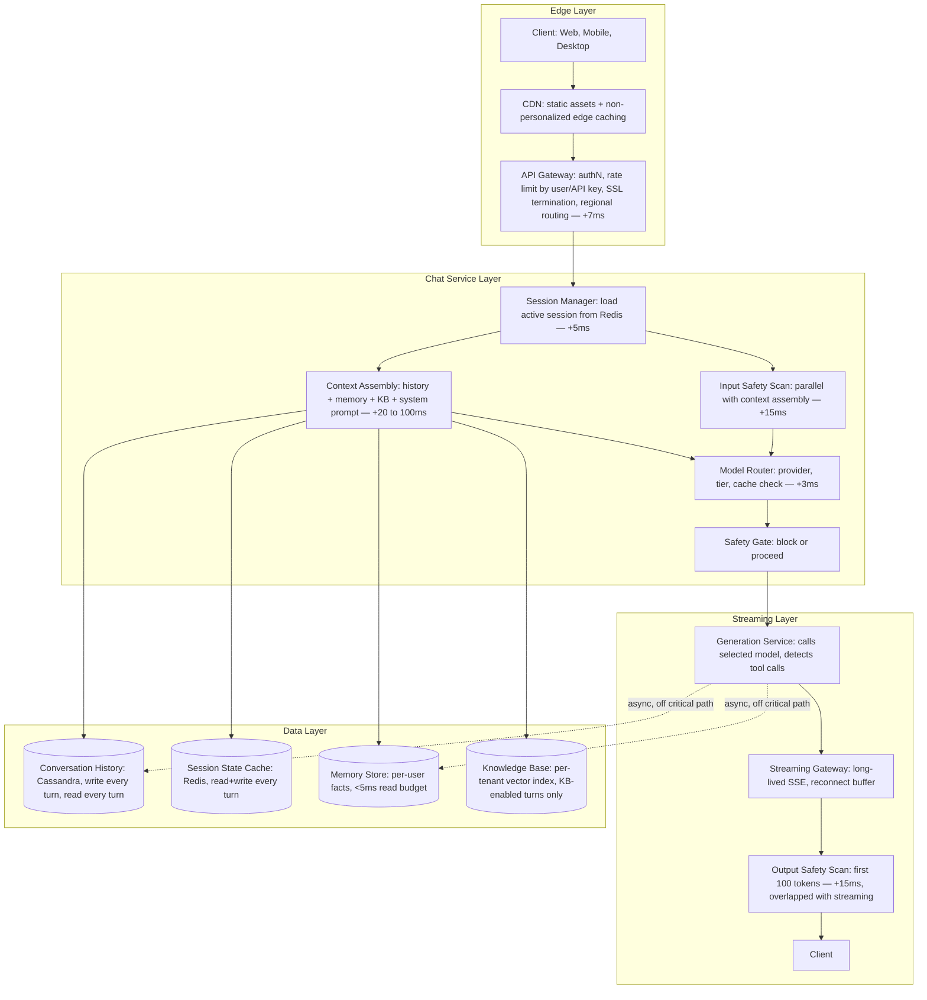
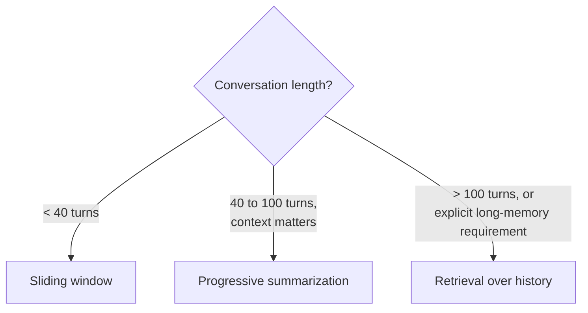
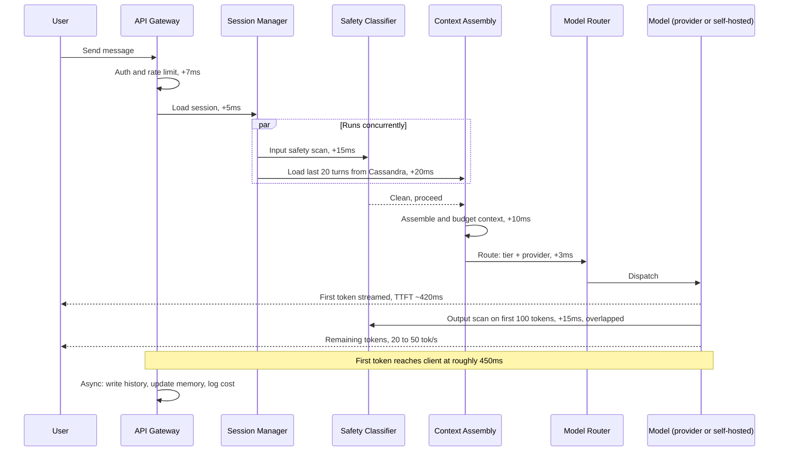

# AI Chat Application — System Design Case Study

This case study is the application-builder's counterpart to the [ChatGPT](01-chatgpt.md) chapter, and reading the two back to back is the point. ChatGPT covers the internal system design of an AI *provider*: the GPU fleet, KV-cache-bound reasoning-tier concurrency, speculative decoding, and Constitutional-AI-style output classifiers that sit inside the serving stack. None of that is available to the team in this chapter. Here, the engineering team is building a chat product — a customer service bot, a consumer companion app, a developer-facing chat API — **on top of** a managed foundation-model API (plus, at scale, a self-hosted fleet for the cheapest traffic tier). They call a model; they do not build one. What they own instead is everything around the call: conversation persistence, context assembly, streaming delivery, provider routing, application-layer safety, and the cost model that determines whether the product's unit economics close. This is the canonical shape of "design a customer service chatbot," "design a consumer AI companion," or "design a chat feature for [product]" — a distinct interview question from "design ChatGPT," and one most candidates answer poorly because they reach for the provider's architecture instead of the builder's.

## Requirements

**Functional — three deployment surfaces**

The same core architecture serves three surfaces whose requirements diverge in specific, named ways, and covering all three up front is what prevents the most common design mistake on this question: designing only for the consumer surface and bolting enterprise and developer requirements on as an afterthought.

- **Consumer surface** (e.g., a 5M-DAU emotional-support or companion app): multi-turn chat with conversation history persisted across sessions, multi-modal text and image input, optional voice input with speech-to-text preprocessing, session-level memory of user facts (name, preferences, past topics) that persists across conversations, content safety tuned for a general audience, and streaming that feels interactive on a mobile connection. The defining NFR here is UX-driven, not correctness-driven: TTFT must feel responsive on a 4G connection and the token rate must feel fluid, because the product's core value proposition collapses the moment either threshold is missed.
- **Enterprise surface** (e.g., a customer-service bot for 50,000 agents): everything above, plus per-tenant data isolation (tenant A's conversation logs must never be reachable from tenant B's infrastructure path, even under shared serving), SSO integration (agents authenticate against their own IdP, not a bespoke account system), an admin audit log covering every session and model invocation, a contractual no-training guarantee on enterprise conversation data, and custom-knowledge-base integration (a standard RAG pipeline over the company's product catalog, policies, and ticket history).
- **Developer API surface** (third-party developers building their own chatbots on the platform): stateless by default (the developer manages history client-side), with an opt-in stateful mode (the service stores history on the developer's behalf), token-bucket rate limiting by API key rather than by end user, streaming as the default response mode, and per-request cost exposed in response metadata so a developer can attribute spend to their own customers.

**Non-functional**

- **TTFT**: < 600ms P99 for the standard path; < 2,500ms P99 when a knowledge-base retrieval step is on the critical path. These are tracked as two separate SLOs, not blended — a blended target hides a retrieval-path regression behind a healthy standard-path average.
- **Streaming rate**: ≥ 15 tok/s sustained from first token. Below this, users perceive the assistant as "thinking too slowly" mid-response — a distinct, separately-alarmed complaint from a slow TTFT.
- **Availability**: 99.9% per tenant (< 9 hours/year downtime). A single provider's API outage must trigger a graceful fallback at the application layer, never a bare 503 surfaced to the user — see Model Layer.
- **Context correctness**: the assembled context for every turn must include the correct conversation history, in the correct order, and must never truncate the last 3 turns — older turns may be compressed or dropped, but recency within the active thread is a correctness guarantee, not a best-effort one.
- **Safety latency budget**: input + output safety checks add no more than 50ms at P99, combined. Safety is a hard requirement, but it is explicitly budgeted rather than treated as unbounded overhead — a classifier regression to 200ms is a latency incident.
- **Cost ceiling**: at 5M DAU, per-message inference cost must stay low enough that a free tier is viable. Concretely, an average 8-turn conversation at ~500 tokens/turn must not cost more than $0.05–$0.10 total to serve, or the free-tier unit economics do not close — see Cost Model.

**Explicitly out of scope**: the foundation model's training and serving infrastructure (that's the provider's system — see [ChatGPT](01-chatgpt.md)), billing and payments, and native mobile client implementation.

## Capacity Planning

Three scale tiers, because the architecture this chapter is worth reading for is the one that *evolves* — a design that's correct at 50K DAU is wrong (over-engineered) and a design that's correct at 5M DAU is wrong (under-provisioned) if applied at the other tier. The [ChatGPT](01-chatgpt.md) chapter assumes a single mature scale throughout; this chapter's value is showing the path.

**Tier 1 — Early-stage (50K DAU)**

50K DAU × 8 messages/session × 1 session/day = 400K messages/day ÷ 86,400s ≈ **5 QPS average**, peak at 3× ≈ **15 QPS**. This fits on a single provider API key with no special routing. Infrastructure: one application server cluster, one Postgres instance for conversation history, one Redis cache for active sessions. No GPU fleet — every call goes to the managed API. No dedicated streaming gateway — responses stream from the provider API through the application server directly to the client.

**Tier 2 — Growth-stage (500K DAU)**

500K × 8 × 1 session = 4M messages/day = **46 QPS average, 185 QPS peak**. This is where three things stop being optional: a persistent connection pool to the provider API (opening a fresh HTTPS connection per request at 185 QPS burns TCP connections and adds handshake latency to every turn), a dedicated streaming gateway (the application server's connection-per-request model saturates under hundreds of concurrent long-lived SSE connections), and basic model-tier routing (routing simple turns to a cheaper model to keep API spend proportional to growth rather than linear-times-price). The history database now needs read replicas for the "load last N turns" path, which runs on every single turn, separated from the write path that only fires once per turn.

**Tier 3 — Mature product (5M DAU)**

5M × 8 × 1.2 sessions/day (accounting for users with multiple sessions) = 48M messages/day = **556 QPS average, 2,224 QPS peak** (4× peak-to-average, consistent with consumer chat's pronounced waking-hours concentration). This tier requires:

- **Multi-region active-active deployment.** Consumer usage peaks sharply within each region's waking hours; three active-active regions flatten each region's effective peak to roughly 900 QPS instead of one region absorbing the full 2,224 QPS peak.
- **A dedicated streaming gateway cluster**, operated separately from application logic and scaled purely on concurrent-connection count, not request rate.
- **A self-hosted model cluster for the cheapest tier.** At 556 QPS average × 500 input tokens/message = 278K input tok/s, the managed-API cost at ~$3/M input tokens is ≈ $835/second ≈ **$72M/day in input tokens alone** — a strong enough signal on its own to justify self-hosting the cheapest traffic tier on an open-weight model (see the GPU sizing below and the Tradeoff Analysis crossover math).
- **Full safety-classifier infrastructure** running per-request at 2,224 peak QPS.
- **Conversation history at real scale**: 48M messages/day × 1.5KB ≈ 72GB/day raw, growing at roughly **25TB/month**.

**Self-hosted cheap-tier GPU sizing.** 556 QPS average × 500 output tokens/message = 278K output tok/s to serve. A Llama 3.1 8B model on a single H100 with continuous batching sustains roughly 3,000 output tok/s. Fleet size: 278K / 3,000 ≈ **93 H100s at average load, ~370 at peak provisioning**. At $3/H100-hour: 370 × $3 × 24 = **$26,640/day** for peak-provisioned self-hosted serving of the cheap tier, against roughly $72M/day for the same traffic at managed-API pricing — a **~2,700× gap** that makes self-hosting the cheap tier an economic near-certainty once volume clears this threshold, with the premium-quality tier deliberately left on the managed API where quality, not cost, is the binding constraint.

## Scale Estimation

Five storage and data systems specific to an application-layer chat product — distinct from a provider's KV-cache and GPU-memory concerns, because this layer never touches model weights.

**1. Conversation history store.** 48M messages/day × 1.5KB average ≈ 72GB/day raw, ~25GB/day after LZ4 compression. Durable footprint (replication + secondary indexes) grows at roughly **25TB/month**. Access pattern: the hot path reads the last ~20 turns of a conversation on every new message — this sits in the latency-critical path and must complete in under 20ms. The cold path serves scroll-back and compression-summarization reads. Architecture: recent history (last 90 days) in a write-optimized distributed store (Cassandra or DynamoDB); anything older cold-tiered to object storage with an on-demand retrieval path.

**2. Active session state (in-memory).** At 5M DAU with ~5% simultaneously in-session, that's **250K active sessions**. Each session's state — current conversation ID, last assembled context (if caching across rapid turns), streaming connection ID — is roughly 5KB, for a **1.25GB total footprint**: trivially small, held in Redis with a 30-minute TTL. This is the "hot brain" of the chat service and the first lookup on every new turn.

**3. Streaming connection capacity.** SSE holds one HTTP connection open per active user per conversation: 250K concurrent long-lived connections per region. Each connection costs roughly 8KB of kernel TCP-socket memory + 2KB of SSE state ≈ 2.5GB of kernel memory across the streaming gateway cluster. At ~3,000 connections per 2-core gateway instance, that's **~84 gateway instances per region** with ~20% headroom. These instances hold zero conversation state — only the connection and a relay of token chunks — so they scale up or down without state migration.

**4. Safety classifier throughput.** Two passes per message (input, output) at peak 2,224 QPS = **4,448 classifier calls/second**. Lightweight (~100M parameter) classifiers achieve 500–1,000 calls/sec per instance on CPU or a quantized GPU: a **5–9 instance fleet at peak**, run and monitored separately from the model-serving fleet because its availability SLO matches the chat service's own — a classifier outage must degrade gracefully, not crash the whole path (see Failure Handling).

**5. Knowledge base (enterprise surface only).** A 1,000-employee tenant with 200,000 documents × 5 chunks × 1536-d embeddings × 4 bytes ≈ **6GB of vector data** — comfortably a single Qdrant collection or Pinecone index. At ~15 QPS peak per tenant and a < 100ms retrieval target, a standard ANN index handles the load without special infrastructure. Multi-tenant isolation: per-tenant namespacing in a shared cluster for smaller tenants, dedicated collections once a tenant exceeds ~500K vectors.

## High Level Design

Four logical layers, each labeled with its position in the per-turn latency budget:



Critical path from message receipt to first token: API Gateway (7ms) → Session Manager (5ms) → Context Assembly, including knowledge-base retrieval when applicable (20–100ms) → Model Router (3ms) → input safety scan (15ms, run in parallel with context assembly, not serialized after it) → model generation to first token (200–500ms) → output safety scan on the first chunk (15ms, overlapped with the start of streaming) → first token reaches the client. **Total TTFT target: < 600ms on the standard path.**

## Detailed Design

**1. Context assembly pipeline — the mechanism that makes multi-turn chat work at scale.**

Every turn's context is assembled from four layers, in priority order: (1) system prompt (fixed, loaded per product surface — consumer, enterprise, developer), (2) user memory facts (retrieved by embedding similarity to the current message — the most topically relevant facts, not just the most recent), (3) knowledge-base results (retrieved by ANN search over the tenant's KB, when enabled), (4) conversation history (recent turns, newest-first, until the token budget runs out). This priority order **is** the truncation order: if the assembled context exceeds the model's limit, history is trimmed first, then KB results, then memory facts — the system prompt is never trimmed.

The token budget: `available_history_tokens = context_limit − len(system_prompt) − len(memory_facts) − len(kb_results) − max_output_tokens − safety_buffer(200)`. The 200-token safety buffer exists because the token counter used at assembly time can drift slightly from the model's own tokenizer — without it, a small mismatch produces a hard "context too long" error at inference time instead of a clean truncation decision made ahead of the call. The budget is filled newest-turn-first, so the turns that matter most for coherence are the ones guaranteed to survive.

**2. History compression when the budget runs out.**

As a conversation passes 20–40 turns, the history budget admits fewer and fewer old turns. Three strategies, each right for a different product shape:

- **Sliding window** (simplest, lowest latency): keep only the last N turns, full stop. O(1), zero added cost, but loses early context permanently. Right for task-completion bots (customer service, short coding tasks) where each task is largely self-contained.
- **Progressive summarization** (best context preservation): once the window fills, a background job reads the oldest M turns and produces a single "summary turn" — *"Earlier in this conversation, the user and assistant discussed X, Y, and Z"* — that replaces them at the head of history. The turn that triggers summarization responds normally at full latency; the summary becomes available starting the *next* turn, so summarization adds **zero latency to the turn that triggers it**. Cost: one extra LLM call per N turns, amortized across the rest of the conversation. Right for therapy, tutoring, coaching, or extended research threads, where early context is load-bearing for the relationship or the topic.
- **Retrieval over history** (best for very long threads): past a configurable length (e.g., > 100 turns), build a vector index over the conversation's own history. Each new turn retrieves the top-K most relevant past turns by embedding similarity and includes them alongside the last 5 verbatim turns — "RAG over a conversation's own history." Supports effectively unlimited conversation length at the cost of ~50ms retrieval latency and one embedding call per turn. Right for AI-native productivity tools (coding assistants, writing tools) where a specific past turn is often exactly what the current turn needs.



**3. Streaming delivery architecture — SSE at scale.**

The streaming gateway is what makes the product feel like a conversation rather than a form submission. Its job: hold the long-lived HTTP/2 SSE connection, receive token chunks from the generation service, format them as SSE events, and relay them in order with no duplication. It is deliberately **stateless** — no conversation data lives on the gateway, only the TCP connection and an in-flight relay — which is what lets it scale horizontally by adding instances without any state migration.

**SSE, not WebSocket.** The traffic is fundamentally asymmetric — one client request, many server-pushed tokens — and SSE fits that shape natively, including built-in reconnect via `Last-Event-ID`. WebSocket's bidirectional channel buys nothing here and adds real cost: it isn't cacheable by CDNs, needs special load-balancer configuration, and is a second protocol to operate. The one case where WebSocket earns its keep is a voice assistant where the user can interrupt mid-stream; standard text chat should default to SSE.

**Reconnect replay window.** The gateway buffers the last 30 seconds of unacknowledged events per connection ID, in Redis, shared across gateway instances so any instance can serve a reconnect. On reconnect, the client sends its last-seen event ID and the gateway replays from that point — no regenerated tokens, no lost content. Events older than 30 seconds age out of the buffer; a reconnect after that window restarts the response from the top, a visible loss the user can see. The tradeoff is direct: a longer buffer costs more Redis memory linearly, and 30 seconds already covers north of 99% of mobile network hiccups.

**Connection draining on deploy.** A gateway instance being taken out of service stops receiving new connections immediately but keeps serving existing ones until they finish naturally (typically 30–120 seconds per turn) or a 90-second drain timeout forces closure. The client's next reconnect lands on a fresh instance, which reads session state from Redis and resumes — no special-casing needed because the gateway was already stateless.

**4. Model routing for application builders — decisions the provider never sees.**

An application builder's routing problem has three layers, none of which exist inside the provider's own serving stack:

- **Layer 1 — which provider?** At maturity, the application may call several providers (e.g., Anthropic for the premium tier, a self-hosted Llama for the cheap tier). Provider selection is health-weighted round-robin: each provider carries a health score from recent P99 latency and error rate, and traffic is shifted away automatically once a provider's score crosses a threshold (P99 > 4s, or error rate > 1%). This application-layer failover is what makes the 99.9% availability SLO achievable at all — no single provider's uptime is good enough on its own.
- **Layer 2 — which model tier?** A lightweight complexity classifier scores each incoming message. 0.0–0.3 → cheapest tier (self-hosted 8B, or the provider's cheapest model). 0.3–0.8 → standard tier. 0.8–1.0 → premium tier. Users can also override explicitly by plan tier or by invoking an explicit "deep think" mode. Precision matters less here than throughput: a misroute costs answer quality, not system correctness, so a heuristic (message length, presence of code or math) is often good enough.
- **Layer 3 — should this turn use a cached response?** Semantic caching: embed the assembled context, query a cache of prior context embeddings, and return the cached response above a 0.95 cosine-similarity threshold. Effective for FAQ-style and onboarding questions where many users ask nearly the same thing; ineffective — and actively wrong to use — for personalized or creative turns where the exact wording matters. Typical hit rate in a consumer chat product: 5–15%, a real cost reduction with no quality cost on the cached slice.

**5. Content safety integration at the application layer.**

The application enforces safety at two points — input, before the model call, and output, before delivery — and this enforcement must **supplement, not depend on** the provider's built-in safety, because no provider's safety is 100% effective and the application often has domain-specific requirements the provider's default policy doesn't know about (a children's education app needs stricter filtering than a general-purpose default).

**Input safety.** A lightweight (~100M param) classifier scans the message for hate speech, self-harm content, explicit content, and prompt-injection attempts (instructions embedded in the user's message trying to override the system prompt). It runs in parallel with the first step of context assembly, since it needs only the raw message, not the assembled context. High-confidence flags skip the model call entirely and return a templated refusal. Uncertain scores (0.3–0.7) let the turn proceed but flag it for a stricter secondary check on the output.

**Output safety.** A second classifier, tuned for output rather than input, scans the first 100 tokens before they stream to the client — adding ~15ms to TTFT, but catching the most severe violations before the user ever sees them. If those tokens are clean, streaming begins and the rest of the output is scanned asynchronously; a mid-stream violation terminates the stream and appends a redirect ("I can't continue in that direction. Let me try a different approach.") rather than a hard error — the user keeps the clean beginning of the response.

**PII detection (enterprise surface only).** Enterprise deployments add a PII scan on both directions. Detected PII — emails, phone numbers, SSNs, card numbers — is pseudonymized before it reaches the model and before the response reaches the user; the pseudonymization map lives in session state and is reversed only at display time. The model reasons over pseudonyms, the user sees real values, and the logs contain only pseudonyms.

## API Design

The application's own API — not the underlying provider's. Four endpoints:

```
POST /v1/conversations
{
  "user_id": "u123",
  "surface": "consumer" | "enterprise" | "developer",
  "system_prompt_override": null   // optional
}
Response: { "conversation_id": "cv456", "created_at": "..." }

POST /v1/conversations/{conversation_id}/messages
{
  "content": "What are my options for upgrading?",
  "attachments": [{"type": "image", "url": "..."}],
  "model_preference": "auto" | "cheap" | "standard" | "premium",
  "stream": true
}

Response (streaming SSE):
  event: turn_start     data: {"turn_id": "t789", "model_tier": "standard"}
  event: safety_clear   data: {"input_check": "clean"}
  event: retrieval_done data: {"chunks_retrieved": 3, "latency_ms": 45}
  event: token          data: {"text": "You"}
  event: token          data: {"text": " have"}
  ...
  event: turn_end       data: {
    "usage": {"input_tokens": 812, "output_tokens": 234},
    "cost_usd": 0.0041
  }

GET /v1/conversations/{conversation_id}/messages?limit=20&before_turn_id=t700
Response: { "turns": [...], "has_more": true, "oldest_turn_id": "t680" }

DELETE /v1/conversations/{conversation_id}
Response: 204 No Content
  // cascades to history store, session state, KB retrieval cache
```

The `turn_end` event's `cost_usd` field is application-level cost tracking, separate from the provider's own billing, and it's what three downstream systems build on: per-user cost budgets (rate-limiting on spend, not just message count, so one message that asks for a 50,000-word essay doesn't slip past a naive per-message quota), per-tenant cost attribution on the enterprise surface, and the developer API's cost-transparency headers.

## Data Flow

**Path 1 — Standard turn, no knowledge base, history fits in context (< 20 turns):**



**Path 2 — Long conversation triggering history compression (50 turns):**

Same as Path 1 up to the history load, which returns 50 turns while the budget calculation shows only 15 turns fit. Context assembly then checks whether an async summary is already available (generated after turn 40): if so, it injects the summary message plus the last 15 verbatim turns; if not, it falls back to a plain sliding window for this turn and triggers the summary job to run in the background. The summary job writes its result to the history store after the response has already been delivered, marking turns 1–35 as "summarized." **The compression step adds zero latency to the current turn** — the user never waits on summarization; the benefit shows up starting on the next turn.

## Retrieval Layer

Two retrieval surfaces exist in a generic chat application:

**History retrieval** (for the "retrieval over history" compression strategy). Once a conversation exceeds 100 turns, every new turn embeds the current message and searches a per-conversation index built from embeddings of every past turn (computed and stored alongside each turn as it's written). The top-3 most relevant past turns join the last 5 verbatim turns in context, holding the retrieved-history budget to roughly 2,500 tokens regardless of total conversation length. Latency cost: one embedding call (~20ms) plus one ANN search over the per-conversation index (~10ms). Infrastructure: per-conversation indexes are updated incrementally as new turns arrive, not rebuilt from scratch; conversations past ~500 turns migrate their index from in-memory to SSD-backed storage.

**Knowledge-base retrieval** (enterprise and developer surfaces). Standard hybrid retrieval — sparse BM25 + dense ANN + reranker — over a per-tenant vector index, run during context assembly at +30–80ms depending on index size and whether reranking is enabled. The system prompt instructs the model to answer from retrieved context first and fall back to parametric knowledge only when retrieval is insufficient. Every response includes a `retrieval_done` SSE event with chunk count and latency, giving developers and admins a way to separate retrieval latency from generation latency when debugging a slow response. A retrieval failure (index unavailable) degrades to answering from parametric knowledge with a visible caveat — *"I couldn't access the knowledge base for this question — answering from general knowledge"* — rather than a hard error. See [RAG Architecture](../06-rag/01-rag-architecture.md).

## Agent Layer

Tool use is optional but common on the enterprise and developer surfaces, and the application layer's role is the orchestration around the model's tool-call decisions, not the tool-calling capability itself (that lives in the provider's model). The application registers available tools in the system prompt using the provider's function-calling schema. When the model returns a tool call instead of a final answer, the generation service detects it, pauses the client-facing stream (sending a `tool_call_start` event instead of a token event), executes the tool, and injects the result back into context for the next generation pass.

**Bounded loop.** A per-turn cap of 5 tool calls is the default, configurable by surface — 3 for consumer, 10 for the developer API. If the model requests more than the cap, the loop terminates with a `max_tools_reached` signal injected into context, prompting the model to synthesize from what it already has rather than being cut off mid-thought. A wall-clock timer (30s consumer, 120s enterprise) enforces an upper bound independent of step count, so a slow individual tool call can't stall the turn indefinitely even under the step cap.

**Tool execution isolation.** Tools run in a worker pool separate from the main chat service process, with a per-call timeout (5s default). A hung call times out and returns an error the model can reason about and retry, rather than hanging the turn. Tool results are treated as untrusted input, exactly like retrieved content — they pass through the input safety classifier before being injected into context, because a malicious external service is a live indirect-prompt-injection vector, same as a malicious web page in [ChatGPT](01-chatgpt.md)'s browsing tool. See [Tool Use Architecture](../09-agents/03-tool-use-architecture.md) and [Prompt Injection & Jailbreaks](../21-ai-security/02-prompt-injection-and-jailbreaks.md).

## Model Layer

For an application builder, the model layer is a provider-selection and cost-governance problem, not a serving-infrastructure problem — that half of the stack belongs to the provider (see [ChatGPT](01-chatgpt.md) for what it looks like from the other side).

| Provider tier | Example models | Approx. cost (input/output per M tok) | Typical TTFT P99 | Use case |
|---|---|---|---|---|
| Self-hosted cheap | Llama 3.1 8B on H100 | ~$0.05 / $0.08 | 200–400ms | High-volume, low-complexity turns; free tier |
| Managed cheap | Claude Haiku, GPT-4o-mini | $0.25 / $1.25 | 300–600ms | Mid-volume, simple-to-moderate turns |
| Managed standard | Claude Sonnet, GPT-4o | $3 / $15 | 500ms–1.5s | Complex queries, knowledge synthesis |
| Managed premium | Claude Opus, GPT-4 | $15 / $75 | 1s–3s | Hardest queries, high-value users |

The routing policy is the intersection of two signals: the complexity classifier's score maps to a tier, and the user's plan caps the maximum tier they can reach (free users capped at managed-cheap, paid users unlocked to managed-standard, enterprise users unlocked to premium). Neither signal alone decides the route.

**Multi-provider fallback.** At 2,224 peak QPS, a single provider's partial outage degrades a meaningful fraction of users, so the fallback chain is primary provider → secondary provider (a different company, not a different region of the same one) → self-hosted model, which is always available inside the application's own infrastructure. The failover threshold: primary error rate over 2% in a 60-second window shifts traffic to the secondary. This requires a provider-abstraction layer in the generation service that translates between each provider's message-format conventions, since they aren't wire-compatible.

**Prompt caching integration.** For providers that support prompt caching (Anthropic, OpenAI), contexts should be structured with the most-reusable prefix first — system prompt, then stable knowledge-base content — and the per-turn conversation history as the suffix that changes every turn. This ordering maximizes cache hits. At 5M DAU with many users sharing the same enterprise tenant's knowledge base, the KB-prefix cache hit rate can reach 70–80%, cutting input-token cost by roughly 70% on knowledge-base-heavy queries.

## Observability Layer

- **TTFT by tier and by path (knowledge-base vs. no-knowledge-base)**, tracked as separate P50/P99 SLOs. A rising TTFT on the KB path with a flat standard path points at the retrieval service, not the model.
- **Streaming jank rate**: the fraction of turns where the token stream pauses > 500ms after starting. Users read this as "the assistant stalled mid-sentence" — qualitatively different from a slow TTFT, and caused by provider throttling, network congestion, or the output safety scanner blocking the stream. Alarm above 2% of turns.
- **Context overflow rate**: the fraction of turns where context assembly ran out of budget before including the last 3 turns of history. A rising rate signals conversations growing faster than the compression strategy handles — investigate whether the system prompt has crept in length, or whether the KB is returning too many chunks.
- **History compression trigger rate**: how often progressive summarization or retrieval-over-history fires. A rising rate with no corresponding rise in conversation length signals a regression in the token budget calculation itself.
- **Provider error rate, per provider**: tracked separately to catch a partial outage and trigger fallback before it degrades the user-facing error rate.
- **Semantic cache hit rate**, on a 1-hour rolling window. A sudden drop may reflect a genuine topic shift in user behavior or a regression in cache-key computation; a sustained rate above 10% is a real cost saving worth protecting.
- **Safety trigger rate, by surface and by classifier pass** (input vs. output). A spike on the enterprise surface's output classifier right after a model update points at a model regression specific to that surface's domain, not a generic safety issue.
- **Cost per conversation, by tier** (free, paid, enterprise), tracked as a daily trend. A rising cost per conversation with no corresponding rise in conversation length means tier routing is sending more traffic to expensive tiers than intended.

## Security Layer

**Session isolation.** Every request carries a session token mapped to a user ID, and the session manager validates that the conversation ID in the request belongs to the authenticated user — a user cannot read or continue someone else's conversation even by guessing its ID. This check happens in the session manager, before any history data loads, not as an afterthought in the history-store query — defense-in-depth means the check happens before the data is reachable, not after.

**Enterprise tenant isolation (application-layer enforcement).** Unlike a provider's internal multi-tenancy, which the application builder doesn't control, the application must enforce isolation at every data access it makes: conversation-history queries carry a mandatory `tenant_id` filter before hitting the index, knowledge-base queries are scoped to the tenant's own collection, and Redis session keys follow a `tenant:{tenant_id}:session:{session_id}` structure with IAM-level restrictions on cross-tenant key access. A query-builder abstraction makes `tenant_id` a required argument, turning an accidental omission into a compile error rather than a silent data leak. See [SSO, Permissions & RAG ACL Enforcement](../22-enterprise-ai/04-sso-permissions-and-rag-acl-enforcement.md).

**Prompt injection from user input and tool results.** The system prompt explicitly frames user messages and tool results as untrusted content to analyze and respond to, never as instructions to follow. The application's injection classifier scans for known patterns — instructions to ignore the system prompt, role-switching attempts, base64-encoded instructions — and tool results are re-scanned by the same classifier before entering context, since an external tool is exactly as trustworthy as an arbitrary web page. See [Prompt Injection & Jailbreaks](../21-ai-security/02-prompt-injection-and-jailbreaks.md).

**Rate limiting for abuse prevention.** Beyond per-user message-rate limits, the application enforces per-IP **cost-based** rate limits: a user generating 100,000 output tokens/day is either an unexpected high-volume legitimate use or someone probing for sensitive outputs, and either way warrants investigation. A cost-based limit catches abuse a message-count limit misses entirely, since a single "write me a 50,000-word novel" message costs roughly 1,000× a normal message in both compute and dollars.

**Data retention and deletion.** Consumer conversation history is retained 90 days (visible to the user, then cold-archived); on a deletion request, all conversation history, memory facts, and session state are queued for deletion within 30 days, and cold-archived data is purged within 60 days. A deletion log recording what was deleted and when is kept as a compliance artifact.

## Cost Model

**The context accumulation tax.** The single most important cost dynamic in a multi-turn chat product is that every additional turn increases the input-token count of every subsequent turn. In a 10-turn conversation where each turn adds ~200 tokens of history, input token counts run turn 1: 500, turn 2: 700, turn 3: 900 ... turn 10: 2,300 — a total of ~14,000 input tokens across 10 messages. A naive estimate that multiplies message count by a single average per-turn cost undercounts by roughly 1.5–2× for a typical conversation, because it misses that cost grows with conversation length, not just message count.

| Turn # | Input tokens (cumulative) | Output tokens | Cost per turn (managed standard, $3/$15 per M) |
|---|---|---|---|
| 1 | 500 | 300 | $0.0060 |
| 3 | 900 | 300 | $0.0072 |
| 5 | 1,300 | 300 | $0.0084 |
| 8 | 1,900 | 300 | $0.0102 |
| 10 | 2,300 | 300 | $0.0114 |
| **10-turn total** | **14,000** | **3,000** | **$0.087** |

At 5M DAU × 8 turns/day average × $0.087 per 8-turn conversation on the managed-standard tier alone: 5M × $0.087 ≈ **$435,000/day**. Tier routing is the primary lever against this: routing 70% of traffic to the managed-cheap tier (~$0.009/conversation) drops the blended cost to 5M × (0.7 × $0.009 + 0.3 × $0.087) = 5M × $0.032 ≈ **$160,000/day — a 63% reduction from routing accuracy alone.**

| Lever | Mechanism | Estimated impact |
|---|---|---|
| Model tier routing | Complexity classifier + user-plan cap | 40–65% cost reduction |
| Context budgeting | Trim history to the minimum that preserves coherence | 15–25% reduction on input tokens |
| Prompt caching | Structure context so system prompt + KB prefix is reused | 30–70% reduction on cached-prefix tokens |
| Semantic response caching | Cache and replay responses for near-duplicate queries | 5–15% reduction on FAQ-heavy products |
| Progressive history summarization | Replace old turns with compressed summaries | 10–20% reduction on long conversations |
| Self-hosting the cheap tier | vLLM + open-weight model for free-tier traffic | 80–95% reduction vs. managed API for that tier |

## Failure Handling

| Failure mode | Detection | Degradation strategy | User experience |
|---|---|---|---|
| Primary model provider API error (5xx) | Error rate > 2% over 60s | Shift traffic to secondary provider; fall back to self-hosted model if both are down | Transparent; latency may increase slightly |
| Provider API latency spike (TTFT > 3s) | P99 TTFT > 3s for 60s | Shift to secondary provider or downgrade to a faster, cheaper tier | Mostly transparent; a small fraction get a lower-quality response |
| Streaming connection drop mid-stream | SSE connection close event | Buffer last 30s of tokens in Redis; client reconnects with `Last-Event-ID`; replay from last acknowledged position | Response resumes where it left off; no content loss |
| History store read timeout (> 50ms) | Per-request latency alarm | Return last 5 turns from the in-process session cache; proceed with a shorter context | May lack older context; no hard failure |
| Safety classifier service unavailable | Health check failure | Fail closed: hold the request up to 5s for recovery, then reject | Retry-able error; no unsafe content ever ships unclassified |
| Context overflow (assembled context exceeds limit) | Token count check at assembly | Progressive truncation — history oldest-first, inject summary if available, sliding window as fallback; system prompt and last 3 turns never truncated | Response proceeds; very long conversations may show "forgotten" early context |
| Knowledge base retrieval failure | ANN search timeout or index unavailable | Proceed without KB results, prepend a visible caveat to the system prompt | Less specific answer; user is informed |
| Runaway tool-use loop | Step counter or per-turn timer | Terminate the loop, inject a synthesis prompt ("summarize what you found") | Response concludes from partial results; no infinite loop |

The safety-classifier row is the one worth dwelling on: it fails **closed**, exactly as in [ChatGPT](01-chatgpt.md)'s equivalent, even though that means an occasional user-visible error instead of an answer. Shipping an unclassified response because the classifier happened to be down has no acceptable frequency; a brief, retriable error does.

## Tradeoff Analysis

**1. Managed API vs. self-hosted model.** Below ~500K DAU, the managed API wins unconditionally — faster to ship, zero serving infrastructure, instant access to model improvements. Above ~2M DAU on the cheap tier, self-hosting an open-weight model becomes cost-superior by 10–50×. The crossover math: one H100 running Llama 3.1 8B serves ~3,000 output tok/s. At managed-cheap pricing (~$15/M for a comparable tier), that throughput costs $15/M × 3,000 tok/s × 86,400s/day ÷ 1M ≈ $3,888/day at managed pricing, versus $3/hr × 24 = $72/day self-hosted — a break-even utilization of roughly 1.85%, trivially low. The real gating question isn't "does it pay off" (it almost always does past this scale) but "do we have the team to operate a GPU fleet" — in practice, that's usually once the AI platform team exceeds ~5 engineers.

**2. Sliding window vs. progressive summarization for long conversations.** Sliding window costs nothing beyond the truncation itself. Progressive summarization costs one extra LLM call per N turns (~$0.002 on a cheap model for a 2,000-token summary) and 500ms–2,000ms of added latency on the triggering turn if done synchronously — which is exactly why it's done asynchronously instead, at the cost of the summary lagging by one turn. The real decision is product, not engineering: does forgetting context past 40 turns break the product? For task-completion bots, no. For companion or coaching apps, forgetting the user's name or long-term goal breaks the core value proposition, and progressive summarization becomes mandatory rather than optional.

**3. Single provider vs. multi-provider routing.** A single provider is simpler — one SDK, one billing relationship, one rate-limit budget to reason about. Multi-provider routing adds a message-format abstraction layer, a health-based routing algorithm, and the operational cost of maintaining multiple vendor relationships. The payoff is resilience: both major provider APIs have had multi-hour production outages, and a 99.9% availability SLO is unachievable on a single provider whose own uptime the application doesn't control. Multi-provider routing decouples the application's SLO from any single vendor's.

**4. SSE vs. WebSocket for streaming.** Covered in Detailed Design above — SSE is the correct default for the asymmetric traffic shape of chat, with WebSocket earning its complexity only when the client needs to send rapid messages *while* a response streams, e.g., a voice assistant handling barge-in.

**5. Stateless vs. stateful conversation API for developers.** Stateless (the developer sends full history every request) is simpler to build and shifts history management to the developer, who implements it inconsistently across integrations. Stateful (the application stores and manages history) is more work up front but produces a consistent experience and unlocks application-level features — compression, semantic caching, per-conversation cost tracking — that a stateless design can't offer, since the application never sees the same conversation twice in a stable form. The right call: stateless as the default for developers who want full control, stateful as an explicit opt-in.

## Interview Discussion

This case study tests something neither the [ChatGPT](01-chatgpt.md) chapter (provider-side serving infrastructure) nor the [Claude](02-claude.md) chapter (long-context and prompt-caching architecture) tests: the **application builder's** perspective — the decisions a team makes when it consumes a model API rather than building the model. It is the direct system behind "design a customer service chatbot" or "design a chat AI product for [company]."

**What separates a weak answer from a strong one.** A weak answer describes "an LLM API call in a loop" — treats the model as a stateless function, never mentions context accumulation, and has no answer for what happens once a conversation outgrows the context window. It usually also skips the streaming gateway and reconnect logic entirely, skips the context-accumulation cost model, and assumes the provider handles safety completely (it doesn't, and the application must supplement it — see Detailed Design). A strong answer, within the first five minutes, names the four-layer context assembly (system prompt, memory, retrieved content, history) and its truncation priority order, states the context accumulation tax explicitly, and picks among the three history-compression strategies with a reason tied to the product. It then covers the streaming architecture (SSE, reconnect, stateless gateway) and the two-pass application-layer safety enforcement without being prompted.

**Mid-level probes:**

- "A user has a 50-turn conversation and the model starts 'forgetting' early context. Walk me through the options." — tests breadth on history management.
- "The streaming response disconnects 5 seconds in. What happens?" — tests SSE reconnect mechanics specifically, not just "we retry."

**Senior probes:**

- "Your cost model shows 3% of users are responsible for 40% of your inference cost due to very long conversations. What do you do?" — tests cost governance and fairness, not just raw cost reduction.
- "You're routing to two providers for reliability. Both have different rate limits. How does the routing logic handle a burst that exceeds both simultaneously?" — tests real depth on provider routing, not just "we have a fallback."
- "How does context assembly handle a conversation where the user uploaded a file 30 turns ago and the current turn references it?" — tests whether context assembly handles non-trivial cross-turn references, or just recency.

**Staff probes:**

- "Your team wants to add real-time voice to this chat application. What changes in the serving architecture, and what stays the same?" — tests architectural generalization: the context assembly, safety, and provider-routing layers stay largely intact; the streaming transport and TTFT budget change materially.
- "At 10M DAU, self-hosting the cheap tier is clearly cost-positive by a wide margin — why might a team still choose not to?" — tests whether the candidate reasons past the cost math to operational readiness (see Tradeoff Analysis #1) and team capacity, not just unit economics.
- "A single enterprise tenant's usage spikes 50× overnight. What breaks first, and how do you contain it?" — tests whether tenant isolation extends to resource isolation, not just data isolation.

A candidate who leads with the context-accumulation cost model, distinguishes the three history-compression strategies with a product reason for each, and treats provider selection and safety as things *the application* must own rather than assume — that candidate has demonstrated the specific breadth this case study exists to surface. The candidates who fail this question are rarely the ones with a weak happy path; they're the ones who, asked "what happens on turn 200 of a conversation," have never thought about it.

---

*Part of [Case Studies](index.md) in the [AI System Design Notes](../index.md).*
