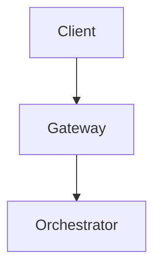
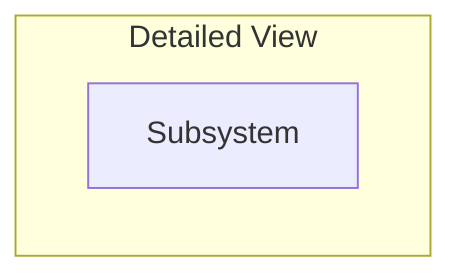
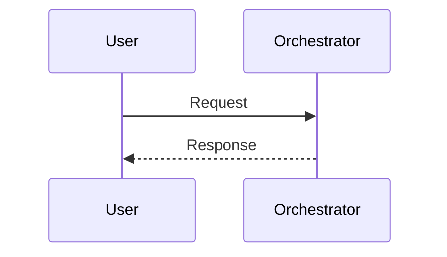
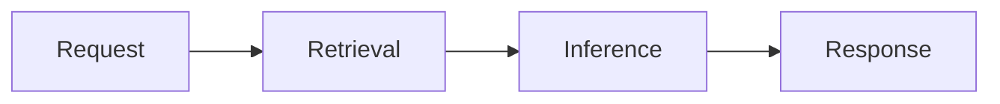
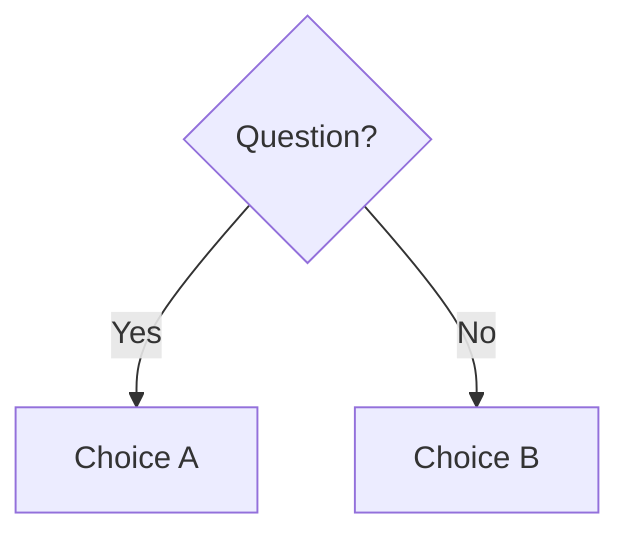

<!--
CASE STUDY TEMPLATE — AI System Design Notes
Copy this file, do not edit it in place. Delete every HTML comment once the
section is written. Target length: 3,000-5,000 words. This should read like
the writeup a Staff Engineer would produce after a design review, not a
product description.

Non-negotiables for every case study:
  - All 5 Mermaid diagrams below must be present and must render: high-level
    architecture, detailed architecture, sequence diagram, workflow diagram,
    decision tree.
  - Capacity Planning and Scale Estimation must show the actual arithmetic
    (assumptions -> formula -> result), not just a final number.
  - Cost Model must show $ per 1K/1M requests or per active user per month,
    broken down by component (model inference, retrieval, storage, etc).
  - Treat all company-specific numbers as illustrative / order-of-magnitude,
    grounded in public information — never present invented specifics as
    confirmed confidential internals.
-->

# {{Product}} — System Design Case Study

## Requirements

<!-- Functional + non-functional requirements. Explicitly state what's out of scope. -->

## Capacity Planning

<!-- Show the math: DAU/MAU -> requests/day -> QPS (avg and peak) -> tokens/sec -> GPU-seconds. -->

## Scale Estimation

<!-- Storage growth, index size, bandwidth, fan-out multipliers. Show the arithmetic. -->

## High Level Design

<!-- High-level architecture diagram (Diagram 1 of 5). -->

## Detailed Design

<!-- Detailed architecture diagram (Diagram 2 of 5) — every major subsystem and the data stores between them. -->

## API Design

<!-- Key endpoints/contracts. Request/response shape for the 1-2 endpoints that matter most. -->

## Data Flow

<!-- Sequence diagram (Diagram 3 of 5) — a single user request end-to-end with a latency budget per hop. -->

## Retrieval Layer

<!-- What's indexed, how, freshness requirements, ranking. "N/A, this product does not retrieve" is an acceptable, explicit answer. -->

## Agent Layer

<!-- Planning/tool-use/orchestration if applicable. "N/A" is acceptable and should be justified. -->

## Model Layer

<!-- Model tiering/routing, fine-tuning vs prompting, fallback strategy. -->

## Observability Layer

<!-- What's traced, what's measured, what pages someone on-call. -->

## Security Layer

<!-- Threat model specific to this product (not a generic security chapter recap). -->

## Cost Model

<!-- Workflow diagram (Diagram 4 of 5) showing where cost accrues across the request path. -->

<!-- Then a $ breakdown table per component. -->

## Failure Handling

<!-- Top failure modes for this specific product and the degradation strategy for each. -->

## Tradeoff Analysis

<!-- Decision tree (Diagram 5 of 5) for the single biggest architectural fork in this product. -->

## Interview Discussion

<!-- How this case study actually gets asked in an interview, what a strong vs weak answer sounds like, and 2-3 Staff-level follow-up probes. -->
