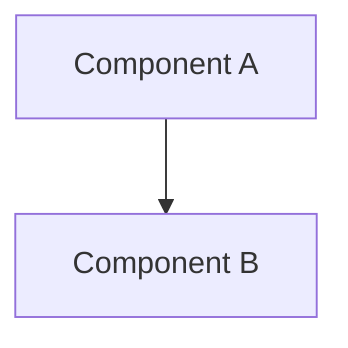
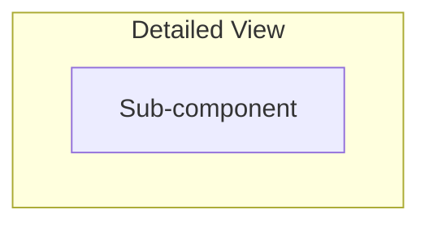
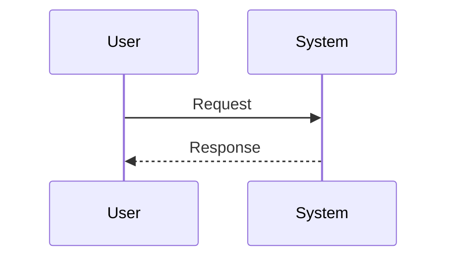
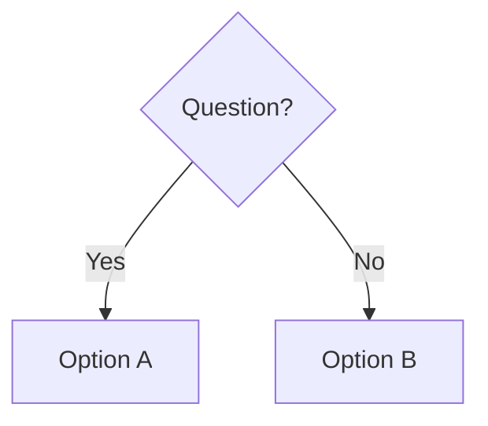

<!--
CHAPTER TEMPLATE — AI System Design Notes
Copy this file, do not edit it in place. Delete every HTML comment once the
section is written. Target length: 2,500-4,000 words. Target depth: a Staff
Engineer should be able to use this page as interview prep AND as a design
reference for a real production decision.

Non-negotiables for every chapter:
  - All 5 Mermaid diagrams below must be present and must render (test with
    `mkdocs serve`): high-level architecture, detailed architecture, sequence
    diagram, workflow diagram, decision tree.
  - At least 3 concrete numbers (latency, throughput, $ cost, token counts,
    GPU counts) somewhere in the chapter — vague qualitative claims ("it's
    fast", "it scales well") are not acceptable on their own.
  - "Real World Examples" must be framed as illustrative / order-of-magnitude,
    grounded in public talks, papers, or blog posts — never stated as leaked
    confidential internals.
  - Interview Questions must actually be answered, not just listed.
-->

# {{Chapter Title}}

## Overview

<!-- 2-3 sentences: what is this, in plain language, before any jargon. -->

## Definition

<!-- A precise, citable definition. One paragraph. -->

## Problem Statement

<!-- What breaks, or what becomes impossibly expensive/slow/unreliable, without this? -->

## Why This Architecture Exists

<!-- The historical/technical pressure that produced this pattern. What did people try first, and why did it fail or fall short? -->

## Core Concepts

<!-- The vocabulary and mental models a reader needs before the architecture makes sense. Use subheadings per concept. -->

## Architecture

<!-- High-level architecture diagram (Diagram 1 of 5). -->

<!-- Detailed architecture diagram (Diagram 2 of 5) — internals, data stores, queues, fan-out. -->

## Components

<!-- One subsection per component: responsibility, interface, what it owns, what it explicitly does not own. -->

## Request Lifecycle

<!-- Sequence diagram (Diagram 3 of 5) — a single request, start to finish, with latency budget per hop. -->

## Design Patterns

<!-- Workflow diagram (Diagram 4 of 5) — the common implementation patterns industry uses for this architecture. -->

## Tradeoffs

<!-- Decision tree (Diagram 5 of 5) — when to pick this pattern vs. its main alternative(s). -->

<!-- Then a tradeoffs table: Advantages | Disadvantages -->

## Scalability

<!-- Concrete scaling levers, bottlenecks, and at what scale (QPS/tokens/users) each lever stops working. -->

## Reliability

<!-- Failure modes specific to this architecture, blast radius, degradation strategy, SLO targets. -->

## Security

<!-- Threat model specific to this architecture. -->

## Cost Optimization

<!-- Concrete cost levers with rough $ impact. -->

## Monitoring

<!-- The metrics that would actually catch this system breaking, and the dashboards/alerts a team would run. -->

## Production Best Practices

<!-- Field-tested recommendations, phrased as "do X, not Y, because Z". -->

## Real World Examples

<!-- One short subsection each, where genuinely known: Google, OpenAI, Anthropic, Meta, Perplexity, Cursor, Glean. Skip any company with no public information rather than inventing specifics. -->

## Interview Questions

### Beginner
<!-- 2-3 questions, answered. -->

### Intermediate
<!-- 2-3 questions, answered. -->

### Senior
<!-- 2-3 questions, answered. -->

### Staff
<!-- 2-3 questions, answered. -->

## Google-Level Follow-Ups

<!-- 2-4 open-ended, adversarial follow-up questions an interviewer escalates to, with discussion of what a strong answer covers. -->

## Common Mistakes

<!-- 4-6 concrete mistakes engineers make with this pattern, and why each one bites. -->

## Key Takeaways

<!-- 5-8 bullet points, dense, no fluff. -->
